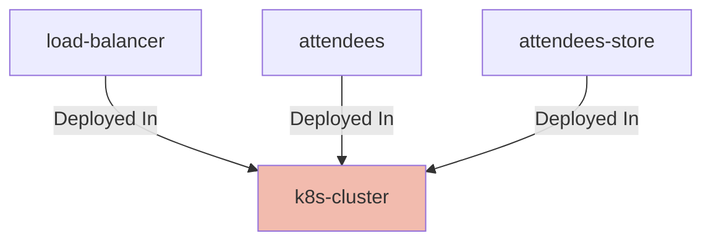

# Kubernetes Cluster

## Details

    <table>
        <tbody>
        <tr>
            <th>Unique Id</th>
            <td>k8s-cluster</td>
        </tr>
        <tr>
            <th>Name</th>
            <td>Kubernetes Cluster</td>
        </tr>
        <tr>
            <th>Description</th>
            <td>Kubernetes Cluster with network policy rules enabled</td>
        </tr>
        <tr>
            <th>Node Type</th>
            <td>system</td>
        </tr>
        </tbody>
    </table>

## Interfaces

No interfaces defined.

## Related Nodes

## Controls
### Security

Security requirements for the Kubernetes cluster

    <table>
        <thead>
        <tr>
            <th>Key</th>
            <th>Value</th>
        </tr>
        </thead>
        <tbody>
        <tr>
            <td><b>Security 001</b></td>
            <td>
                <table class="nested-table">
                        <tbody>
                        <tr>
                            <td><b>Requirement Url</b></td>
                            <td>
                                https://calm.finos.org/getting-started/controls/micro-segmentation.requirement.json
                                    </td>
                        </tr>
                        <tr>
                            <td><b>$schema</b></td>
                            <td>
                                https://calm.finos.org/getting-started/controls/micro-segmentation.requirement.json
                                    </td>
                        </tr>
                        <tr>
                            <td><b>$id</b></td>
                            <td>
                                https://calm.finos.org/getting-started/controls/micro-segmentation.config.json
                                    </td>
                        </tr>
                        <tr>
                            <td><b>Control Id</b></td>
                            <td>
                                security-001
                                    </td>
                        </tr>
                        <tr>
                            <td><b>Name</b></td>
                            <td>
                                Micro-segmentation of Kubernetes Cluster
                                    </td>
                        </tr>
                        <tr>
                            <td><b>Description</b></td>
                            <td>
                                Micro-segmentation in place to prevent lateral movement outside of permitted flows
                                    </td>
                        </tr>
                        <tr>
                            <td><b>Permit Ingress</b></td>
                            <td>
                                true
                                    </td>
                        </tr>
                        <tr>
                            <td><b>Permit Egress</b></td>
                            <td>
                                false
                                    </td>
                        </tr>
                        </tbody>
                    </table>
            </td>
        </tr>
        </tbody>
    </table>

## Metadata

No metadata defined.

