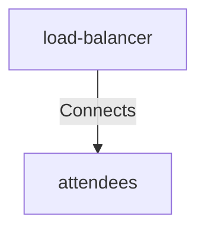

## Details

| Field               | Value                    |
|---------------------|--------------------------|
| **Unique ID**       | load-balancer-attendees                   |
| **Description**      |  Forward   |

## Related Nodes

## Controls

        ### Security

        Security Controls for the connection

        

            <table>
                <thead>
                <tr>
                    <th>Requirement URL</th>
                    <th>Config</th>
                </tr>
                </thead>
                <tbody>
                    <tr>
                        <td>
                                <a href="https://calm.finos.org/getting-started/controls/permitted-connection.requirement.json" target="_blank">
                                    https://calm.finos.org/getting-started/controls/permitted-connection.requirement.json
                                </a>
                        </td>

                        <td>
                                <a href="https://calm.finos.org/getting-started/controls/permitted-connection-http.config.json" target="_blank">
                                    https://calm.finos.org/getting-started/controls/permitted-connection-http.config.json
                                </a>

                        </td>
                    </tr>
                </tbody>
            </table>
        

## Metadata
  _No Metadata defined._
