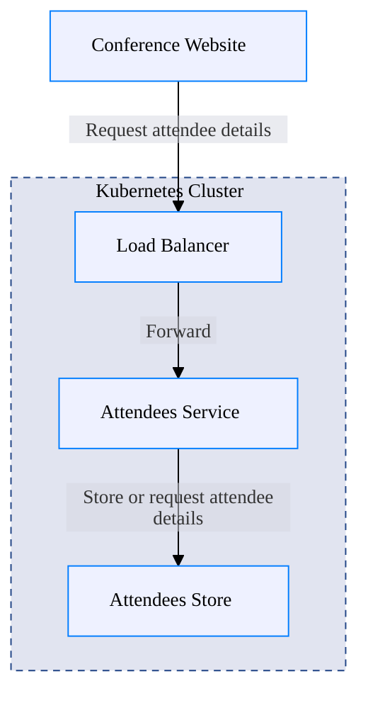
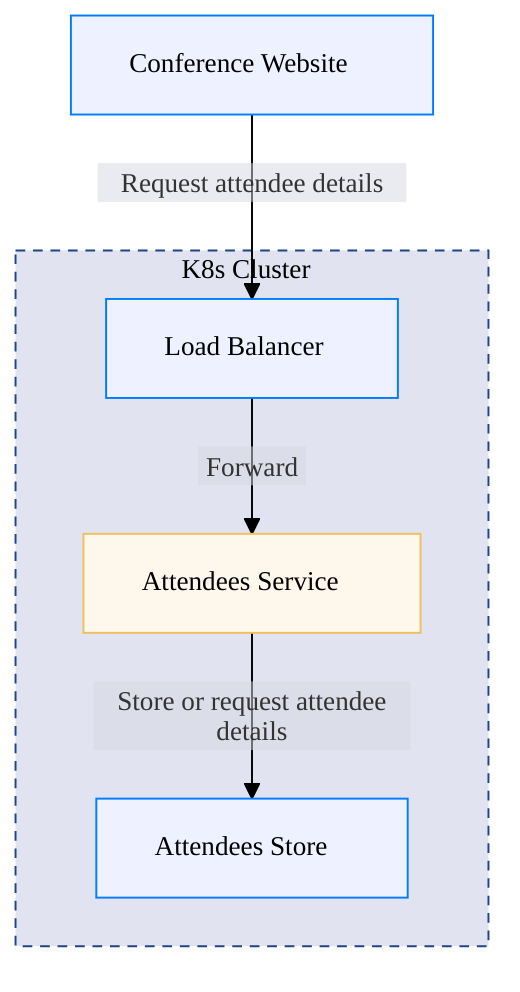
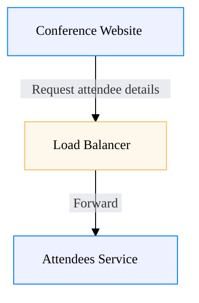
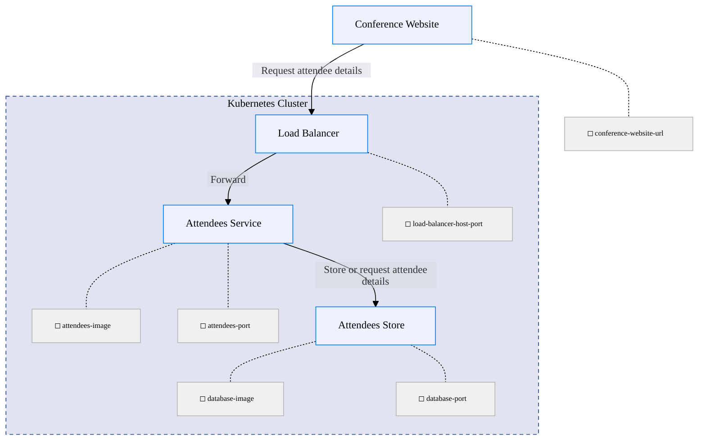

# Conference Registration System - Block Architecture

This diagram shows the system components and their relationships in a block architecture view.

## Full System View

## Flow-based View

## Focus on One Load Balancer

## Full View with Interfaces
