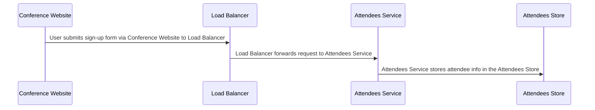

```mermaid
sequenceDiagram
    Conference Website ->> Load Balancer: User submits sign-up form via Conference Website to Load Balancer
    Load Balancer ->> Attendees Service: Load Balancer forwards request to Attendees Service
    Attendees Service ->> Attendees Store: Attendees Service stores attendee info in the Attendees Store
```

