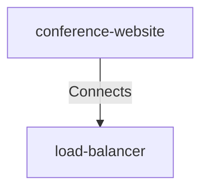
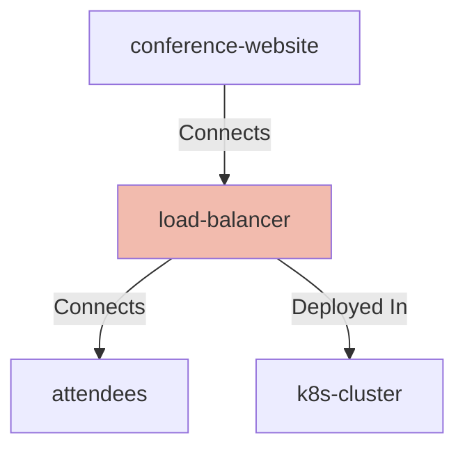
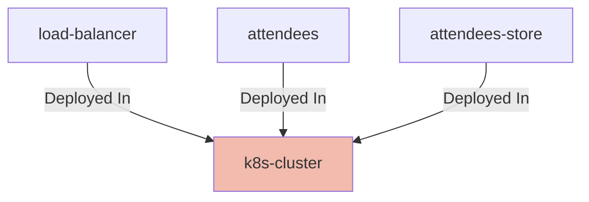

### Show relationships for a specific relationship ID

```mermaid
graph TD;
conference-website -- Connects --> load-balancer;
classDef highlight fill:#f2bbae;
```

### Show relationships for a specific node ID

```mermaid
graph TD;
load-balancer[load-balancer]:::highlight;
conference-website -- Connects --> load-balancer;
load-balancer -- Connects --> attendees;
load-balancer -- Deployed In --> k8s-cluster;
classDef highlight fill:#f2bbae;
```

### Show relationships for a container node

```mermaid
graph TD;
k8s-cluster[k8s-cluster]:::highlight;
load-balancer -- Deployed In --> k8s-cluster;
attendees -- Deployed In --> k8s-cluster;
attendees-store -- Deployed In --> k8s-cluster;
classDef highlight fill:#f2bbae;
```

