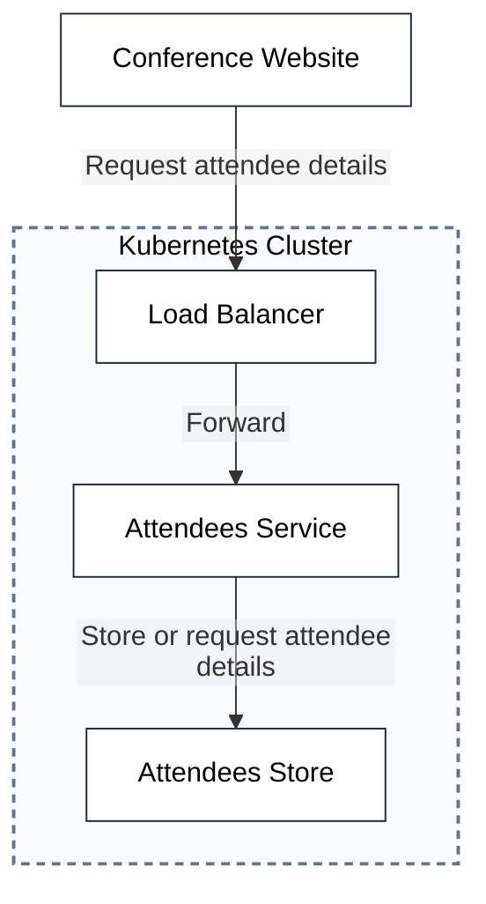
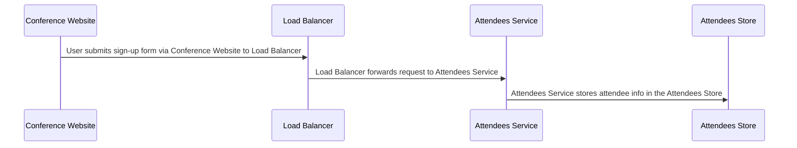
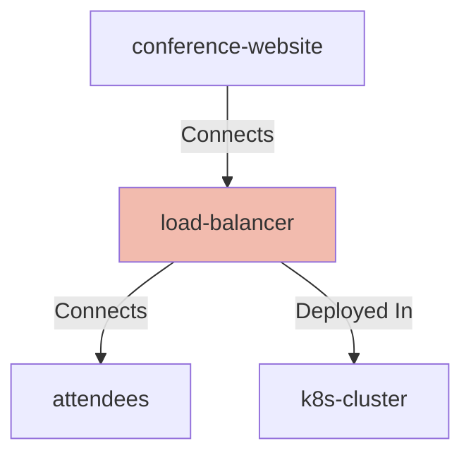

# Conference Registration System - Solution Architecture

## 🎯 System Goals & Objectives

The Conference Registration System is designed to provide a scalable, secure, and user-friendly platform for managing conference attendee registrations. This system enables seamless user registration while maintaining data integrity and supporting high-volume traffic during peak registration periods.

### Primary Goals
- **User Experience**: Provide an intuitive, responsive web interface for conference registration
- **Scalability**: Handle thousands of concurrent registrations during peak periods
- **Security**: Protect user data with industry-standard security practices
- **Reliability**: Ensure 99.9% uptime during critical registration windows
- **Compliance**: Meet data protection requirements for handling personal information

## 🏗️ Architecture Overview

The system follows a microservices architecture pattern deployed on Kubernetes, providing scalability, fault tolerance, and easy maintenance. The architecture separates concerns between presentation, business logic, and data persistence layers.

---

## 🌐 System Components & Functions

    <table>
        <thead>
        <tr>
            <th>Key</th>
            <th>Value</th>
        </tr>
        </thead>
        <tbody>
        <tr>
            <td><b>Conference Website</b></td>
            <td>
                

                    <table>
                        <tbody>
                        <tr>
                            <td><b>Unique Id</b></td>
                            <td>
                                conference-website
                                    </td>
                        </tr>
                        <tr>
                            <td><b>Node Type</b></td>
                            <td>
                                webclient
                                    </td>
                        </tr>
                        <tr>
                            <td><b>Name</b></td>
                            <td>
                                Conference Website
                                    </td>
                        </tr>
                        <tr>
                            <td><b>Description</b></td>
                            <td>
                                Website to sign up for a conference
                                    </td>
                        </tr>
                        <tr>
                            <td><b>Interfaces</b></td>
                            <td>
                                

                                    <table>
                                        <tbody>
                                        <tr>
                                            <td><b>Unique Id</b></td>
                                            <td>
                                                conference-website-url
                                                    </td>
                                        </tr>
                                        <tr>
                                            <td><b>Url</b></td>
                                            <td>
                                                [[ URL ]]
                                                    </td>
                                        </tr>
                                        </tbody>
                                    </table>
                                
    </td>
                        </tr>
                        </tbody>
                    </table>
                

            </td>
        </tr>
        <tr>
            <td><b>Load Balancer</b></td>
            <td>
                

                    <table>
                        <tbody>
                        <tr>
                            <td><b>Unique Id</b></td>
                            <td>
                                load-balancer
                                    </td>
                        </tr>
                        <tr>
                            <td><b>Node Type</b></td>
                            <td>
                                network
                                    </td>
                        </tr>
                        <tr>
                            <td><b>Name</b></td>
                            <td>
                                Load Balancer
                                    </td>
                        </tr>
                        <tr>
                            <td><b>Description</b></td>
                            <td>
                                The attendees service, or a placeholder for another application
                                    </td>
                        </tr>
                        <tr>
                            <td><b>Interfaces</b></td>
                            <td>
                                

                                    <table>
                                        <tbody>
                                        <tr>
                                            <td><b>Unique Id</b></td>
                                            <td>
                                                load-balancer-host-port
                                                    </td>
                                        </tr>
                                        <tr>
                                            <td><b>Host</b></td>
                                            <td>
                                                [[ HOST ]]
                                                    </td>
                                        </tr>
                                        <tr>
                                            <td><b>Port</b></td>
                                            <td>
                                                -1
                                                    </td>
                                        </tr>
                                        </tbody>
                                    </table>
                                
    </td>
                        </tr>
                        </tbody>
                    </table>
                

            </td>
        </tr>
        <tr>
            <td><b>Attendees</b></td>
            <td>
                

                    <table>
                        <tbody>
                        <tr>
                            <td><b>Unique Id</b></td>
                            <td>
                                attendees
                                    </td>
                        </tr>
                        <tr>
                            <td><b>Node Type</b></td>
                            <td>
                                service
                                    </td>
                        </tr>
                        <tr>
                            <td><b>Name</b></td>
                            <td>
                                Attendees Service
                                    </td>
                        </tr>
                        <tr>
                            <td><b>Description</b></td>
                            <td>
                                The attendees service, or a placeholder for another application
                                    </td>
                        </tr>
                        <tr>
                            <td><b>Interfaces</b></td>
                            <td>
                                

                                    <table>
                                        <tbody>
                                        <tr>
                                            <td><b>Unique Id</b></td>
                                            <td>
                                                attendees-image
                                                    </td>
                                        </tr>
                                        <tr>
                                            <td><b>Image</b></td>
                                            <td>
                                                [[ IMAGE ]]
                                                    </td>
                                        </tr>
                                        </tbody>
                                    </table>
                                
        

                                    <table>
                                        <tbody>
                                        <tr>
                                            <td><b>Unique Id</b></td>
                                            <td>
                                                attendees-port
                                                    </td>
                                        </tr>
                                        <tr>
                                            <td><b>Port</b></td>
                                            <td>
                                                -1
                                                    </td>
                                        </tr>
                                        </tbody>
                                    </table>
                                
    </td>
                        </tr>
                        </tbody>
                    </table>
                

            </td>
        </tr>
        <tr>
            <td><b>Attendees Store</b></td>
            <td>
                

                    <table>
                        <tbody>
                        <tr>
                            <td><b>Unique Id</b></td>
                            <td>
                                attendees-store
                                    </td>
                        </tr>
                        <tr>
                            <td><b>Node Type</b></td>
                            <td>
                                database
                                    </td>
                        </tr>
                        <tr>
                            <td><b>Name</b></td>
                            <td>
                                Attendees Store
                                    </td>
                        </tr>
                        <tr>
                            <td><b>Description</b></td>
                            <td>
                                Persistent storage for attendees
                                    </td>
                        </tr>
                        <tr>
                            <td><b>Interfaces</b></td>
                            <td>
                                

                                    <table>
                                        <tbody>
                                        <tr>
                                            <td><b>Unique Id</b></td>
                                            <td>
                                                database-image
                                                    </td>
                                        </tr>
                                        <tr>
                                            <td><b>Image</b></td>
                                            <td>
                                                [[ IMAGE ]]
                                                    </td>
                                        </tr>
                                        </tbody>
                                    </table>
                                
        

                                    <table>
                                        <tbody>
                                        <tr>
                                            <td><b>Unique Id</b></td>
                                            <td>
                                                database-port
                                                    </td>
                                        </tr>
                                        <tr>
                                            <td><b>Port</b></td>
                                            <td>
                                                -1
                                                    </td>
                                        </tr>
                                        </tbody>
                                    </table>
                                
    </td>
                        </tr>
                        </tbody>
                    </table>
                

            </td>
        </tr>
        <tr>
            <td><b>K8s Cluster</b></td>
            <td>
                

                    <table>
                        <tbody>
                        <tr>
                            <td><b>Unique Id</b></td>
                            <td>
                                k8s-cluster
                                    </td>
                        </tr>
                        <tr>
                            <td><b>Node Type</b></td>
                            <td>
                                system
                                    </td>
                        </tr>
                        <tr>
                            <td><b>Name</b></td>
                            <td>
                                Kubernetes Cluster
                                    </td>
                        </tr>
                        <tr>
                            <td><b>Description</b></td>
                            <td>
                                Kubernetes Cluster with network policy rules enabled
                                    </td>
                        </tr>
                        <tr>
                            <td><b>Controls</b></td>
                            <td>
                                

                                    <table>
                                        <tbody>
                                        <tr>
                                            <td><b>Security</b></td>
                                            <td>
                                                

                                                    <table>
                                                        <tbody>
                                                        <tr>
                                                            <td><b>Description</b></td>
                                                            <td>
                                                                Security requirements for the Kubernetes cluster
                                                                    </td>
                                                        </tr>
                                                        <tr>
                                                            <td><b>Requirements</b></td>
                                                            <td>
                                                                

                                                                    <table>
                                                                        <tbody>
                                                                        <tr>
                                                                            <td><b>Requirement Url</b></td>
                                                                            <td>
                                                                                https://calm.finos.org/getting-started/controls/micro-segmentation.requirement.json
                                                                                    </td>
                                                                        </tr>
                                                                        <tr>
                                                                            <td><b>$schema</b></td>
                                                                            <td>
                                                                                https://calm.finos.org/getting-started/controls/micro-segmentation.requirement.json
                                                                                    </td>
                                                                        </tr>
                                                                        <tr>
                                                                            <td><b>$id</b></td>
                                                                            <td>
                                                                                https://calm.finos.org/getting-started/controls/micro-segmentation.config.json
                                                                                    </td>
                                                                        </tr>
                                                                        <tr>
                                                                            <td><b>Control Id</b></td>
                                                                            <td>
                                                                                security-001
                                                                                    </td>
                                                                        </tr>
                                                                        <tr>
                                                                            <td><b>Name</b></td>
                                                                            <td>
                                                                                Micro-segmentation of Kubernetes Cluster
                                                                                    </td>
                                                                        </tr>
                                                                        <tr>
                                                                            <td><b>Description</b></td>
                                                                            <td>
                                                                                Micro-segmentation in place to prevent lateral movement outside of permitted flows
                                                                                    </td>
                                                                        </tr>
                                                                        <tr>
                                                                            <td><b>Permit Ingress</b></td>
                                                                            <td>
                                                                                true
                                                                                    </td>
                                                                        </tr>
                                                                        <tr>
                                                                            <td><b>Permit Egress</b></td>
                                                                            <td>
                                                                                false
                                                                                    </td>
                                                                        </tr>
                                                                        </tbody>
                                                                    </table>
                                                                
    </td>
                                                        </tr>
                                                        </tbody>
                                                    </table>
                                                

                                            </td>
                                        </tr>
                                        </tbody>
                                    </table>
                                

                            </td>
                        </tr>
                        </tbody>
                    </table>
                

            </td>
        </tr>
        </tbody>
    </table>

### Component Functions

- **Conference Website**: React-based single-page application providing user registration forms, event information, and real-time availability updates
- **Load Balancer**: High-availability NGINX load balancer distributing traffic across service instances and providing SSL termination
- **Attendees Service**: Core business logic service handling registration validation, duplicate detection, and attendee management workflows
- **Attendees Store**: PostgreSQL database with optimized schemas for attendee data, supporting ACID transactions and data consistency
- **Kubernetes Cluster**: Container orchestration platform providing auto-scaling, health monitoring, and zero-downtime deployments

---

## 🔗 System Relationships & Data Flow

    <table>
        <thead>
        <tr>
            <th>Key</th>
            <th>Value</th>
        </tr>
        </thead>
        <tbody>
        <tr>
            <td><b>Conference Website Load Balancer</b></td>
            <td>
                

                    <table>
                        <tbody>
                        <tr>
                            <td><b>Unique Id</b></td>
                            <td>
                                conference-website-load-balancer
                                    </td>
                        </tr>
                        <tr>
                            <td><b>Relationship Type</b></td>
                            <td>
                                

                                    <table>
                                        <tbody>
                                        <tr>
                                            <td><b>Connects</b></td>
                                            <td>
                                                

                                                    <table>
                                                        <tbody>
                                                        <tr>
                                                            <td><b>Source</b></td>
                                                            <td>
                                                                

                                                                    <table>
                                                                        <tbody>
                                                                        <tr>
                                                                            <td><b>Node</b></td>
                                                                            <td>
                                                                                conference-website
                                                                                    </td>
                                                                        </tr>
                                                                        </tbody>
                                                                    </table>
                                                                

                                                            </td>
                                                        </tr>
                                                        <tr>
                                                            <td><b>Destination</b></td>
                                                            <td>
                                                                

                                                                    <table>
                                                                        <tbody>
                                                                        <tr>
                                                                            <td><b>Node</b></td>
                                                                            <td>
                                                                                load-balancer
                                                                                    </td>
                                                                        </tr>
                                                                        </tbody>
                                                                    </table>
                                                                

                                                            </td>
                                                        </tr>
                                                        </tbody>
                                                    </table>
                                                

                                            </td>
                                        </tr>
                                        </tbody>
                                    </table>
                                

                            </td>
                        </tr>
                        <tr>
                            <td><b>Controls</b></td>
                            <td>
                                

                                    <table>
                                        <tbody>
                                        <tr>
                                            <td><b>Security</b></td>
                                            <td>
                                                

                                                    <table>
                                                        <tbody>
                                                        <tr>
                                                            <td><b>Description</b></td>
                                                            <td>
                                                                Security Controls for the connection
                                                                    </td>
                                                        </tr>
                                                        <tr>
                                                            <td><b>Requirements</b></td>
                                                            <td>
                                                                

                                                                    <table>
                                                                        <tbody>
                                                                        <tr>
                                                                            <td><b>Requirement Url</b></td>
                                                                            <td>
                                                                                https://calm.finos.org/getting-started/controls/permitted-connection.requirement.json
                                                                                    </td>
                                                                        </tr>
                                                                        <tr>
                                                                            <td><b>$schema</b></td>
                                                                            <td>
                                                                                https://calm.finos.org/getting-started/controls/permitted-connection.requirement.json
                                                                                    </td>
                                                                        </tr>
                                                                        <tr>
                                                                            <td><b>Control Id</b></td>
                                                                            <td>
                                                                                security-002
                                                                                    </td>
                                                                        </tr>
                                                                        <tr>
                                                                            <td><b>Name</b></td>
                                                                            <td>
                                                                                Permitted Connection
                                                                                    </td>
                                                                        </tr>
                                                                        <tr>
                                                                            <td><b>Description</b></td>
                                                                            <td>
                                                                                Permits a connection on a relationship specified in the architecture
                                                                                    </td>
                                                                        </tr>
                                                                        <tr>
                                                                            <td><b>Reason</b></td>
                                                                            <td>
                                                                                Required to enable flow between architecture components
                                                                                    </td>
                                                                        </tr>
                                                                        <tr>
                                                                            <td><b>Protocol</b></td>
                                                                            <td>
                                                                                HTTP
                                                                                    </td>
                                                                        </tr>
                                                                        </tbody>
                                                                    </table>
                                                                
    </td>
                                                        </tr>
                                                        </tbody>
                                                    </table>
                                                

                                            </td>
                                        </tr>
                                        </tbody>
                                    </table>
                                

                            </td>
                        </tr>
                        <tr>
                            <td><b>Description</b></td>
                            <td>
                                Request attendee details
                                    </td>
                        </tr>
                        <tr>
                            <td><b>Protocol</b></td>
                            <td>
                                HTTPS
                                    </td>
                        </tr>
                        </tbody>
                    </table>
                

            </td>
        </tr>
        <tr>
            <td><b>Load Balancer Attendees</b></td>
            <td>
                

                    <table>
                        <tbody>
                        <tr>
                            <td><b>Unique Id</b></td>
                            <td>
                                load-balancer-attendees
                                    </td>
                        </tr>
                        <tr>
                            <td><b>Relationship Type</b></td>
                            <td>
                                

                                    <table>
                                        <tbody>
                                        <tr>
                                            <td><b>Connects</b></td>
                                            <td>
                                                

                                                    <table>
                                                        <tbody>
                                                        <tr>
                                                            <td><b>Source</b></td>
                                                            <td>
                                                                

                                                                    <table>
                                                                        <tbody>
                                                                        <tr>
                                                                            <td><b>Node</b></td>
                                                                            <td>
                                                                                load-balancer
                                                                                    </td>
                                                                        </tr>
                                                                        </tbody>
                                                                    </table>
                                                                

                                                            </td>
                                                        </tr>
                                                        <tr>
                                                            <td><b>Destination</b></td>
                                                            <td>
                                                                

                                                                    <table>
                                                                        <tbody>
                                                                        <tr>
                                                                            <td><b>Node</b></td>
                                                                            <td>
                                                                                attendees
                                                                                    </td>
                                                                        </tr>
                                                                        </tbody>
                                                                    </table>
                                                                

                                                            </td>
                                                        </tr>
                                                        </tbody>
                                                    </table>
                                                

                                            </td>
                                        </tr>
                                        </tbody>
                                    </table>
                                

                            </td>
                        </tr>
                        <tr>
                            <td><b>Controls</b></td>
                            <td>
                                

                                    <table>
                                        <tbody>
                                        <tr>
                                            <td><b>Security</b></td>
                                            <td>
                                                

                                                    <table>
                                                        <tbody>
                                                        <tr>
                                                            <td><b>Description</b></td>
                                                            <td>
                                                                Security Controls for the connection
                                                                    </td>
                                                        </tr>
                                                        <tr>
                                                            <td><b>Requirements</b></td>
                                                            <td>
                                                                

                                                                    <table>
                                                                        <tbody>
                                                                        <tr>
                                                                            <td><b>Requirement Url</b></td>
                                                                            <td>
                                                                                https://calm.finos.org/getting-started/controls/permitted-connection.requirement.json
                                                                                    </td>
                                                                        </tr>
                                                                        <tr>
                                                                            <td><b>$schema</b></td>
                                                                            <td>
                                                                                https://calm.finos.org/getting-started/controls/permitted-connection.requirement.json
                                                                                    </td>
                                                                        </tr>
                                                                        <tr>
                                                                            <td><b>Control Id</b></td>
                                                                            <td>
                                                                                security-002
                                                                                    </td>
                                                                        </tr>
                                                                        <tr>
                                                                            <td><b>Name</b></td>
                                                                            <td>
                                                                                Permitted Connection
                                                                                    </td>
                                                                        </tr>
                                                                        <tr>
                                                                            <td><b>Description</b></td>
                                                                            <td>
                                                                                Permits a connection on a relationship specified in the architecture
                                                                                    </td>
                                                                        </tr>
                                                                        <tr>
                                                                            <td><b>Reason</b></td>
                                                                            <td>
                                                                                Required to enable flow between architecture components
                                                                                    </td>
                                                                        </tr>
                                                                        <tr>
                                                                            <td><b>Protocol</b></td>
                                                                            <td>
                                                                                HTTP
                                                                                    </td>
                                                                        </tr>
                                                                        </tbody>
                                                                    </table>
                                                                
    </td>
                                                        </tr>
                                                        </tbody>
                                                    </table>
                                                

                                            </td>
                                        </tr>
                                        </tbody>
                                    </table>
                                

                            </td>
                        </tr>
                        <tr>
                            <td><b>Description</b></td>
                            <td>
                                Forward
                                    </td>
                        </tr>
                        <tr>
                            <td><b>Protocol</b></td>
                            <td>
                                mTLS
                                    </td>
                        </tr>
                        </tbody>
                    </table>
                

            </td>
        </tr>
        <tr>
            <td><b>Attendees Attendees Store</b></td>
            <td>
                

                    <table>
                        <tbody>
                        <tr>
                            <td><b>Unique Id</b></td>
                            <td>
                                attendees-attendees-store
                                    </td>
                        </tr>
                        <tr>
                            <td><b>Relationship Type</b></td>
                            <td>
                                

                                    <table>
                                        <tbody>
                                        <tr>
                                            <td><b>Connects</b></td>
                                            <td>
                                                

                                                    <table>
                                                        <tbody>
                                                        <tr>
                                                            <td><b>Source</b></td>
                                                            <td>
                                                                

                                                                    <table>
                                                                        <tbody>
                                                                        <tr>
                                                                            <td><b>Node</b></td>
                                                                            <td>
                                                                                attendees
                                                                                    </td>
                                                                        </tr>
                                                                        </tbody>
                                                                    </table>
                                                                

                                                            </td>
                                                        </tr>
                                                        <tr>
                                                            <td><b>Destination</b></td>
                                                            <td>
                                                                

                                                                    <table>
                                                                        <tbody>
                                                                        <tr>
                                                                            <td><b>Node</b></td>
                                                                            <td>
                                                                                attendees-store
                                                                                    </td>
                                                                        </tr>
                                                                        </tbody>
                                                                    </table>
                                                                

                                                            </td>
                                                        </tr>
                                                        </tbody>
                                                    </table>
                                                

                                            </td>
                                        </tr>
                                        </tbody>
                                    </table>
                                

                            </td>
                        </tr>
                        <tr>
                            <td><b>Controls</b></td>
                            <td>
                                

                                    <table>
                                        <tbody>
                                        <tr>
                                            <td><b>Security</b></td>
                                            <td>
                                                

                                                    <table>
                                                        <tbody>
                                                        <tr>
                                                            <td><b>Description</b></td>
                                                            <td>
                                                                Security Controls for the connection
                                                                    </td>
                                                        </tr>
                                                        <tr>
                                                            <td><b>Requirements</b></td>
                                                            <td>
                                                                

                                                                    <table>
                                                                        <tbody>
                                                                        <tr>
                                                                            <td><b>Requirement Url</b></td>
                                                                            <td>
                                                                                https://calm.finos.org/getting-started/controls/permitted-connection.requirement.json
                                                                                    </td>
                                                                        </tr>
                                                                        <tr>
                                                                            <td><b>$schema</b></td>
                                                                            <td>
                                                                                https://calm.finos.org/getting-started/controls/permitted-connection.requirement.json
                                                                                    </td>
                                                                        </tr>
                                                                        <tr>
                                                                            <td><b>Control Id</b></td>
                                                                            <td>
                                                                                security-003
                                                                                    </td>
                                                                        </tr>
                                                                        <tr>
                                                                            <td><b>Name</b></td>
                                                                            <td>
                                                                                Permitted Connection
                                                                                    </td>
                                                                        </tr>
                                                                        <tr>
                                                                            <td><b>Description</b></td>
                                                                            <td>
                                                                                Permits a connection on a relationship specified in the architecture
                                                                                    </td>
                                                                        </tr>
                                                                        <tr>
                                                                            <td><b>Reason</b></td>
                                                                            <td>
                                                                                Permitted to allow the connection between application and database
                                                                                    </td>
                                                                        </tr>
                                                                        <tr>
                                                                            <td><b>Protocol</b></td>
                                                                            <td>
                                                                                JDBC
                                                                                    </td>
                                                                        </tr>
                                                                        </tbody>
                                                                    </table>
                                                                
    </td>
                                                        </tr>
                                                        </tbody>
                                                    </table>
                                                

                                            </td>
                                        </tr>
                                        </tbody>
                                    </table>
                                

                            </td>
                        </tr>
                        <tr>
                            <td><b>Description</b></td>
                            <td>
                                Store or request attendee details
                                    </td>
                        </tr>
                        <tr>
                            <td><b>Protocol</b></td>
                            <td>
                                JDBC
                                    </td>
                        </tr>
                        </tbody>
                    </table>
                

            </td>
        </tr>
        <tr>
            <td><b>Deployed In K8s Cluster</b></td>
            <td>
                

                    <table>
                        <tbody>
                        <tr>
                            <td><b>Unique Id</b></td>
                            <td>
                                deployed-in-k8s-cluster
                                    </td>
                        </tr>
                        <tr>
                            <td><b>Relationship Type</b></td>
                            <td>
                                

                                    <table>
                                        <tbody>
                                        <tr>
                                            <td><b>Deployed In</b></td>
                                            <td>
                                                

                                                    <table>
                                                        <tbody>
                                                        <tr>
                                                            <td><b>Container</b></td>
                                                            <td>
                                                                k8s-cluster
                                                                    </td>
                                                        </tr>
                                                        <tr>
                                                            <td><b>Nodes</b></td>
                                                            <td>
                                                                load-balancer
                                                                attendees
                                                                attendees-store
                                                            </td>
                                                        </tr>
                                                        </tbody>
                                                    </table>
                                                

                                            </td>
                                        </tr>
                                        </tbody>
                                    </table>
                                

                            </td>
                        </tr>
                        <tr>
                            <td><b>Description</b></td>
                            <td>
                                Components deployed on the k8s cluster
                                    </td>
                        </tr>
                        </tbody>
                    </table>
                

            </td>
        </tr>
        </tbody>
    </table>

### Data Flow Patterns

The system implements a layered communication pattern:
1. **External Layer**: HTTPS connections from users through the web interface
2. **Service Layer**: mTLS-secured internal service communication
3. **Data Layer**: Encrypted database connections with connection pooling

---

## 🔁 Registration Flow: Conference Signup

The core user journey follows a three-tier processing model ensuring data validation and consistency:

### Flow Details
<ol>
        <li>
                relationship-unique-id: conference-website-load-balancer, sequence-number: 1, description: User submits sign-up form via Conference Website to Load Balancer, direction: source-to-destination
        </li>
        <li>
                relationship-unique-id: load-balancer-attendees, sequence-number: 2, description: Load Balancer forwards request to Attendees Service, direction: source-to-destination
        </li>
        <li>
                relationship-unique-id: attendees-attendees-store, sequence-number: 3, description: Attendees Service stores attendee info in the Attendees Store, direction: source-to-destination
        </li>
</ol>

---

## 🚀 Deployment Architecture

The system is deployed across a Kubernetes cluster with the following deployment strategy:

### Container Deployment

### Deployed Components
<ol>
        <li>
                load-balancer
        </li>
        <li>
                attendees
        </li>
        <li>
                attendees-store
        </li>
</ol>