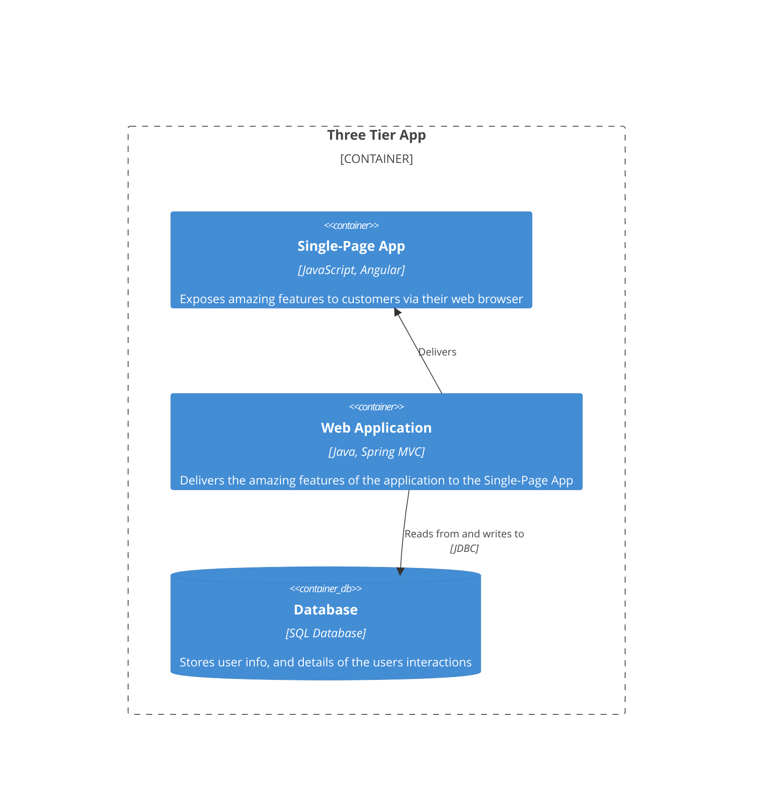

# Getting Started
As we discussed in the [Fast Track](/#fast-track) the CALM Core Manifest is structured around **nodes** and **relationships**. In this section we're going to look at how to model a super simple three tier application using the CALM Core Manifest.

Let's look at the following simple C4 Container Diagram.

