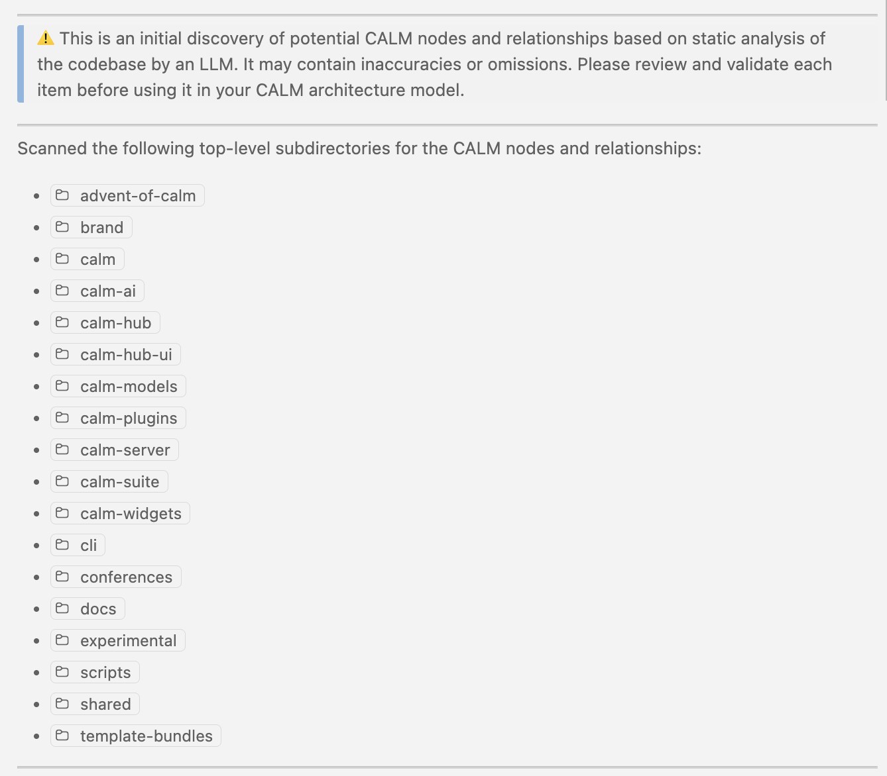
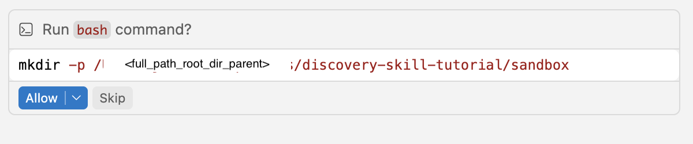
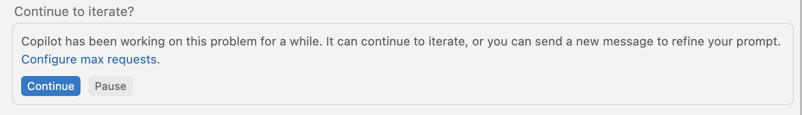
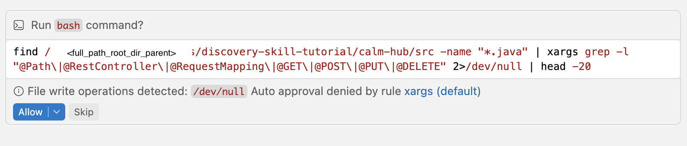
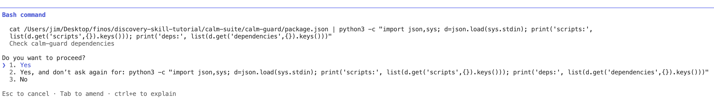
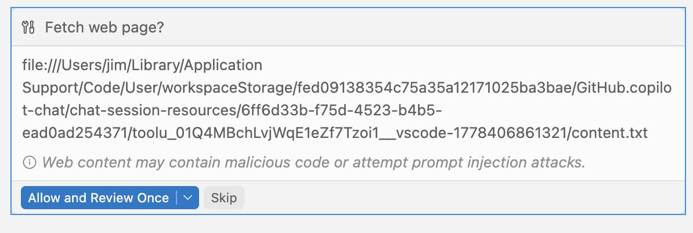
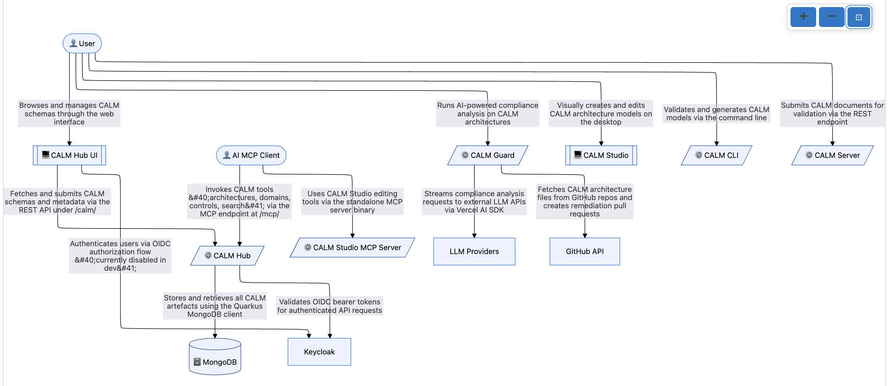
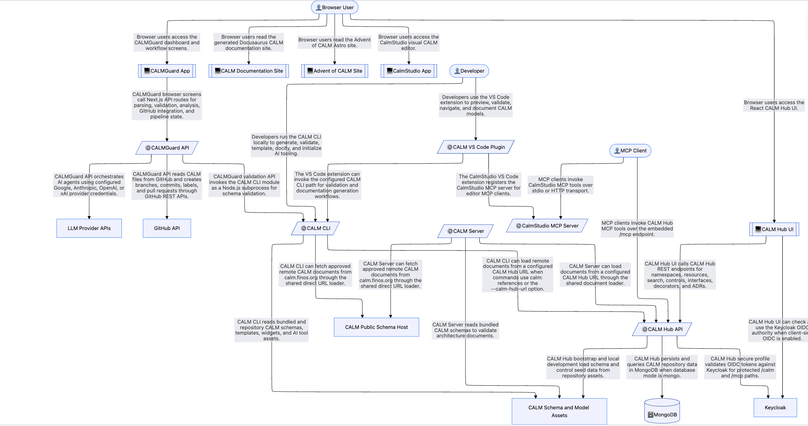

import Tabs from '@theme/Tabs';
import TabItem from '@theme/TabItem';

# Architecture Discovery Skill


## Introduction

This lesson demonstrates a practical approach to using agent skills with the CALM AI Assistant for architecture discovery. By leveraging these skills, architects can quickly generate an initial CALM architecture model directly from source code, accelerating the modeling process for legacy or unfamiliar systems. The approach is intentionally flexible and not prescriptive—its purpose is to provide a strong draft (typically 80–90% complete) that architects and engineers can collaboratively review, validate, and refine.

It is important to recognize that source code alone rarely captures the full architectural picture. The discovered model may contain mistakes or omissions, especially regarding runtime behavior, external dependencies, business intent, security controls, operational ownership, or infrastructure defined outside the repository. Some relationships may be inferred by the AI Assistant and require human validation. Treat the generated CALM architecture as a starting point: review it with your team, validate it against the running system, and iteratively refine it to reflect your organization’s unique context and requirements.

This tutorial also provides Field Notes and Troubleshooting, documenting practical fixes and real-world issues encountered during the discovery process—such as handling preview errors, permission prompts, and the probabilistic nature of LLM output—so you can avoid common pitfalls and make the most of the CALM AI Assistant’s capabilities. Experimenting with and refining the skill definition itself is encouraged, enabling you to tailor the discovery process to your technology stack and organizational needs.

A full tutorial about agent skills is beyond the scope of this tutorial.  The interested reader can find an [explanation of agent skills at this site](https://agentskills.io/home).

## Skill Setup

A pre-requisite is to setup up the CALM AI Assistant support.  See [here](../../working-with-calm/calm-ai-tools.md) for instructions on how to do this.

Click here to copy the <a href="/calm-skills/architecture-discovery-skill.md" target="_blank">architecture discovery skill</a> to the clipboard. Follow instructions in the next part for your specific CALM AI Assistant on where to save the skill definition in the clipboard.

Click on the tab for your CALM AI Assistant.

<Tabs>
  <TabItem value="copilot" label="Copilot" default>

### Copilot Skill Setup

1. Create this subdirectory structure `.github/skills/calm-architecture-discovery`

2. Create a file `.github/skills/calm-architecture-discovery/SKILL.md`

3. Paste copied skill definition from clipboard into `SKILL.md` and save the file.

4. Restart VSCode.

For additional information see [VSCode Agent Skills](https://code.visualstudio.com/docs/copilot/customization/agent-skills).

  </TabItem>
  <TabItem value="kiro" label="KIRO">

### KIRO Skill Setup

1. Create this subdirectory structure `.kiro/skills/calm-architecture-discovery`

2. Create a file `.kiro/skills/calm-architecture-discovery/SKILL.md`

3. Paste copied skill definition from clipboard into `SKILL.md` and save the file.

4. Restart KIRO.

For additional information see [KIRO Agent Skills](https://kiro.dev/docs/skills/).

  </TabItem>
  <TabItem value="claude" label="Claude">

### Claude Skill Setup

1. Create this subdirectory structure `.claude/skills/calm-architecture-discovery`

2. Create a file `.claude/skills/calm-architecture-discovery/SKILL.md`

3. Paste copied skill definition from clipboard into `SKILL.md` and save the file.


For additional information see [Claude Agent Skills](https://platform.claude.com/docs/en/agents-and-tools/agent-skills/overview).

  </TabItem>
  <TabItem value="codex" label="Codex">

### Codex Skill Setup

1. Create this subdirectory structure `.agents/skills/calm-architecture-discovery`

2. Create a file `.agents/skills/calm-architecture-discovery/SKILL.md`

3. Paste copied skill definition from clipboard into `SKILL.md` and save the file.

4. If you are using Codex within an IDE, restart the IDE.

For additional information see [Codex Agent Skills](https://developers.openai.com/codex/skills).

  </TabItem>
</Tabs>

After saving `SKILL.md` the beginning part of the file should look like this....


:::tip
Architects are encouraged to experiment with revising the skill definition itself. By adjusting the prompts, parameters, or logic in the skill, you can influence the discovery process and tailor the generated architecture to better fit your organization's needs. Iterative refinement of the skill can lead to more accurate and useful architecture models.
:::

## Using the Skill

Within your particular CALM AI Assistant setup, designate the model you want to use with architecture discovery skill. 

:::note
During development of this tutorial, Claude Sonnet 4.6 and GPT-5.5 were used successfully.   These models support different levels of "reasoning" effort.  This tutorial used "Medium" or higher settings.  Higher reasoning models will increase run time for the discovery process.

Since other models could support discovery, the reader is encouraged to experiment with different models.
:::

The skill requires two parameters:

- `root_dir` is the top-level directory for the source code.  The CALM AI Assistant will scan all contents within this top-level directory for source code.  A single dot, i.e., "`.`" will indicate to use the current working directory as the top-level directory.
- `arch_file` specifies the file to save the discovered CALM architecture.

:::warning
If both parameters are not provided, the CALM AI Assistant will ask for values.
:::

Click on the tab for you CALM AI Assistant.

<Tabs>
  <TabItem value="copilot" label="Copilot" default>

### Using the Copilot Skill

1. Select `CALM` for the agent mode.

2. In the chat type in `/calm-architecture-discovery <root_dir> <arch_file>`

  </TabItem>
  <TabItem value="kiro" label="KIRO">

### Using the KIRO Skill

1. Select `Vibe` Coding

2. Enable the CALM agent mode by typing in the chat prompt `#CALM.chatmode.md`

2. In the chat type in `#calm-architecture-discovery <root_dir> <arch_file>`

  </TabItem>
  <TabItem value="claude" label="Claude">

### Using the Claude Skill

Start Claude CLI

1. Enable CALM support by typing in `/calm`

2. Once the CALM support is enabled, type `/calm-architecture-discovery <root_dir> <arch_file>`

  </TabItem>
  <TabItem value="codex" label="Codex">

### Using the Codex Skill

Either in command line or via VSCode Codex Chat function:

1. Enable CALM support by typing in `$calm`

2. Once the CALM support is enabled, type `$calm-architecture-discovery <root_dir> <arch_file>`

  </TabItem>
</Tabs>

## Example Discovery Run

For this example, we will use the agent skill to discover the CALM architecture for CALM itself, i.e., we will be doing discovery on the [CALM project's `architecture-as-code` repo](https://github.com/finos/architecture-as-code). 

Since the CALM project has an official CALM architecture, as a representation of our desired architecture representation.

This run uses VSCode with Github Copilot and the Claude Sonnet 4.6 Model.

### Invoke the agent skill to discover the architecture

**Prompt**: `/calm-architecture-discovery . sandbox/copilot-discovered-calm-architecture.json`

This prompt says to run architecture discovery on the current working directory ("`.`") and to save the discovered architecture in "`sandbox/copilot-discovered-calm-architecture.json`".

Skill execution time will be several minutes.  For Github Copilot, with default settings, you may be asked allow continued execution of the agent skill run and prompted to allow creating two output files:
- `sandbox/copilot-discovered-calm-architecture.json`: the discovered CALM architecture for the repo
- `sandbox/copiliot-discovered-calm-architecture-key-observations.md`: Markdown report of the key observations noted during discovery of the nodes and relationships.  This is informational.  The architect can use this help in understanding the discovered architecture.

:::warning
During the discovery process the agent may want to run OS commands to discover content.  When prompted for permission to run these commands, make sure to review the command to ensure it is not going to modify content.   Some commands will write to `/dev/null`, which is OK because it is not affecting any repo content.
:::


The following chat log was edited to remove repetitive messages.

#### Start discovery process
```
GitHub Copilot: Loading FINOS CALM instructions...  

Ran terminal command:  find /Users/jim/Desktop/finos/discovery-skill-tutorial -maxdepth 1 -mindepth 1 -type d | sort

Fetched 4 resources

Ran terminal command:  
# Scan key source directories for architecture signals
echo "=== PACKAGE.JSON FILES ===" && find /Users/jim/Desktop/finos/discovery-skill-tutorial -name "package.json" -not -path "*/node_modules/*" -not -path "*/.git/*" | sort | head -40

echo "=== POM FILES ===" && find /Users/jim/Desktop/finos/discovery-skill-tutorial -name "pom.xml" -not -path "*/node_modules/*" | sort | head -20

echo "=== DOCKER FILES ===" && find /Users/jim/Desktop/finos/discovery-skill-tutorial -name "Dockerfile*" -o -name "docker-compose*.yml" | grep -v node_modules | sort | head -20


Ran terminal command:  
echo "=== calm-guard pipeline route ===" && cat /Users/jim/Desktop/finos/discovery-skill-tutorial/calm-suite/calm-guard/src/app/api/pipeline/route.ts | head -40
echo ""
echo "=== calm-guard .env or .env.example ===" && find /Users/jim/Desktop/finos/discovery-skill-tutorial/calm-suite/calm-guard -name ".env*" | head -5 && cat /Users/jim/Desktop/finos/discovery-skill-tutorial/calm-suite/calm-guard/.env.example 2>/dev/null || cat /Users/jim/Desktop/finos/discovery-skill-tutorial/calm-suite/calm-guard/.env.local.example 2>/dev/null | head -30

<<<DELETED LINES>>>

Fetched [resource](file:///Users/jim/Library/Application Support/Code/User/workspaceStorage/fed09138354c75a35a12171025ba3bae/GitHub.copilot-chat/chat-session-resources/f259f57c-4346-4c6d-a83f-028043f58f09/toolu_01X4yEsZGHziDtqKmGCoWZj3__vscode-1778406861372/content.txt)

Ran terminal command:  
echo "=== calm-guard AI orchestrator ===" && cat /Users/jim/Desktop/finos/discovery-skill-tutorial/calm-suite/calm-guard/src/lib/agents/orchestrator.ts 2>/dev/null | head -40

echo ""
echo "=== calm-guard lib github client ===" && cat /Users/jim/Desktop/finos/discovery-skill-tutorial/calm-suite/calm-guard/src/lib/github/client.ts 2>/dev/null | head -30

echo ""
echo "=== calm-guard lib ai streaming ===" && cat /Users/jim/Desktop/finos/discovery-skill-tutorial/calm-suite/calm-guard/src/lib/ai/streaming.ts 2>/dev/null | head -30

echo ""
echo "=== docs/package.json ===" && cat /Users/jim/Desktop/finos/discovery-skill-tutorial/docs/package.json | head -20


Ran terminal command:  
echo "=== calm-guard AI agent - which LLM? ===" && grep -r "openai\|anthropic\|claude\|gpt\|llm\|OPENAI\|ANTHROPIC" /Users/jim/Desktop/finos/discovery-skill-tutorial/calm-suite/calm-guard/src --include="*.ts" --include="*.tsx" -l | head -10
echo ""
echo "=== calm-guard AI agent detail ===" && grep -r "openai\|anthropic\|claude\|gpt\|OPENAI_API_KEY\|ANTHROPIC_API_KEY" /Users/jim/Desktop/finos/discovery-skill-tutorial/calm-suite/calm-guard/src --include="*.ts" --include="*.tsx" | head -20

echo ""
echo "=== calm-guard next.config ===" && cat /Users/jim/Desktop/finos/discovery-skill-tutorial/calm-suite/calm-guard/next.config.* 2>/dev/null | head -30


I now have enough information to produce the full output. Let me create the sandbox directory and write the files.

---
```

#### Report discovered nodes and relationships with Key Observations

Once discovery is completed, the AI Assistant display this warning...



```

> ⚠️ This is an initial discovery of potential CALM nodes and relationships based on static analysis of the codebase by an LLM. It may contain inaccuracies or omissions. Please review and validate each item before using it in your CALM architecture model.

---

**Scanned the following top-level subdirectories for the CALM nodes and relationships:**

- .devcontainer
- .flox
- .github
- .husky
- .mvn
- advent-of-calm
- brand
- calm
- calm-ai
- calm-hub
- calm-hub-ui
- calm-models
- calm-plugins
- calm-server
- calm-suite
- calm-widgets
- cli
- conferences
- docs
- experimental
- scripts
- shared
- template-bundles

---

## Nodes

| `unique-id` | `node-type` | `name` | `description` |
|---|---|---|---|
| `architect` | `actor` | Architect / Developer | Software architect or developer who uses CALM tooling to model, validate, and manage architectural artifacts. |
| calm-hub | `service` | CALM Hub | Quarkus/Java REST API backend for storing, retrieving, and serving CALM namespaces, architectures, patterns, flows, standards, and controls; also exposes an embedded MCP endpoint at `/mcp`. |
| calm-hub-ui | `webclient` | CALM Hub UI | React SPA for browsing, visualizing, and managing CALM architectures; built and served as static resources embedded inside CALM Hub. |
| calm-server | `service` | CALM Server | Express/Node.js REST API exposing CALM document validation (`POST /calm/validate`) and a health check (`GET /health`) as a standalone service. |
| `calm-cli` | `service` | CALM CLI | Node.js command-line tool providing `generate`, `validate`, `template`, `docify`, and `init-ai` commands for working with CALM architecture files. |
| `mongodb` | `database` | MongoDB | Document database storing CALM namespaces, architectures, patterns, standards, flows, controls, decorators, and user-access records. |
| `keycloak` | `ecosystem` | Keycloak | Keycloak OIDC/OAuth2 identity provider that issues and signs JWT tokens for authenticating users of CALM Hub. |
| `calm-guard` | `service` | CALM Guard | Next.js DevSecOps compliance web application that fetches CALM architectures from GitHub, validates them via calm-cli, and runs parallel AI analysis agents for compliance mapping, pipeline generation, and risk scoring. |
| `calm-studio` | `service` | CALM Studio | Tauri-based cross-platform desktop application for authoring and visualizing CALM architecture models with a graphical editor. |
| `calm-studio-mcp-server` | `service` | CALM Studio MCP Server | Standalone Model Context Protocol (MCP) server exposing CALM node, relationship, and architecture tools to AI agent clients via stdio or HTTP. |
| `vscode-extension` | `service` | CALM VS Code Extension | VS Code extension providing CALM architecture authoring, live validation, diagnostics, and graph visualization within the editor. |
| `github-api` | `ecosystem` | GitHub API | External GitHub REST API (`api.github.com`) used by CALM Guard to fetch CALM architecture JSON files from repositories and create pull requests. |
| `anthropic-claude` | `ecosystem` | Anthropic Claude | External Anthropic AI API providing the Claude Sonnet language model for AI-powered CALM architecture analysis in CALM Guard. |
| `openai-gpt` | `ecosystem` | OpenAI GPT | External OpenAI API providing GPT-4o as an alternative AI provider for CALM architecture analysis in CALM Guard. |

---

## Relationships

| `unique-id` | `relationship-type` | `source → destination` | `description` |
|---|---|---|---|
| `architect-to-calm-tooling` | `interacts` | `architect` → calm-hub-ui, `calm-cli`, `vscode-extension`, `calm-guard`, `calm-studio` | Architects and developers interact with CALM tooling to author, validate, visualize, and manage architecture models. |
| `calm-hub-ui-to-calm-hub` | `connects` | calm-hub-ui → calm-hub | Sends HTTP REST requests to read and write namespaces, patterns, architectures, flows, decorators, and ADRs. |
| `calm-hub-ui-to-keycloak` | `connects` | calm-hub-ui → `keycloak` | Performs the OIDC authorization code flow to authenticate users when secure mode is enabled. |
| `calm-hub-to-mongodb` | `connects` | calm-hub → `mongodb` | Reads and writes all CALM namespace data, architectures, patterns, standards, flows, controls, and user-access records. |
| `calm-hub-to-keycloak` | `connects` | calm-hub → `keycloak` | Retrieves OIDC public keys (JWKS) to validate JWT bearer tokens on incoming authenticated requests. |
| `calm-guard-to-github-api` | `connects` | `calm-guard` → `github-api` | Fetches CALM architecture JSON files from GitHub repositories for compliance analysis and creates pull requests with remediation changes. |
| `calm-guard-to-anthropic-claude` | `connects` | `calm-guard` → `anthropic-claude` | Sends CALM architecture content to Claude Sonnet for AI-powered compliance mapping, pipeline generation, cloud infrastructure planning, and risk scoring. |
| `calm-guard-to-openai-gpt` | `connects` | `calm-guard` → `openai-gpt` | Sends CALM architecture content to GPT-4o as an alternative AI provider when Anthropic is not configured. |
| `calm-guard-to-calm-cli` | `connects` | `calm-guard` → `calm-cli` | Invokes calm-cli as a child process to validate CALM JSON documents server-side. |
| `calm-cli-to-calm-hub` | `connects` | `calm-cli` → calm-hub | Fetches remote CALM patterns and schemas from CALM Hub when a `--calm-hub-url` is supplied. |
| `calm-server-to-calm-hub` | `connects` | calm-server → calm-hub | Optionally loads remote CALM schemas from CALM Hub for use in document validation when `--calm-hub-url` is configured. |

---

## Key Observations

**Deployment boundaries**
- calm-hub and `mongodb` are co-deployed (Docker Compose in local-dev and deploy) — they form the core persistence tier.
- calm-hub-ui is built into calm-hub's static resources (resources) via `npm run prod`; at runtime it is served by the same JVM process on port 8080.
- calm-server (Node.js/Express, port 3000) is a separately deployable validation microservice with no database dependency.
- `calm-guard` (Next.js, separate deployment) is an independent DevSecOps product; it invokes `calm-cli` as a subprocess and calls GitHub and LLM APIs.
- `calm-studio` and `calm-studio-mcp-server` originate from the calm-studio sub-project, which has its own `pnpm` workspace and separate release lifecycle.

**Authentication / trust boundaries**
- OIDC is **disabled by default** in calm-hub (`quarkus.oidc.tenant-enabled=false`). When enabled (production/secure profile), both calm-hub (server-side JWKS validation) and calm-hub-ui (OIDC redirect) connect to Keycloak on port 9443.
- calm-server has **no authentication or authorization** (explicitly warned in source code when bound to non-localhost interfaces).
- `calm-guard`'s GitHub integration uses an optional `GITHUB_TOKEN` env var; LLM calls require `ANTHROPIC_API_KEY` and/or `OPENAI_API_KEY`.

**External dependencies**
- `calm-guard` supports two LLM providers (Anthropic Claude Sonnet, OpenAI GPT-4o) selected at runtime by whichever API key is present; both providers process potentially sensitive architectural data.
- `calm-guard` calls `api.github.com` directly from the server side to avoid exposing `GITHUB_TOKEN` to the browser.
- calm-hub supports a **dual storage backend**: MongoDB (default production mode) or NitriteDB (embedded standalone mode). NitriteDB runs in-process and is not a separate deployable node.

**Nodes worth drilling into**
- **calm-hub** has 14+ REST resource classes (`ArchitectureResource`, `PatternResource`, `FlowResource`, `DecoratorResource`, `SearchResource`, `UserAccessResource`, etc.) and an embedded MCP server — a detailed sub-architecture would clarify its internal domain boundaries.
- **`calm-guard`** has a 4-agent AI orchestration layer (Architecture Analyzer, Compliance Mapper, Pipeline Generator, Risk Scorer) that is a significant sub-architecture.
- **`calm-studio`** bundles the `calm-studio-mcp-server` as a sidecar binary — their interaction protocol deserves its own detailed architecture.

---

Saving the discovered nodes and relationships to a CALM architecture model in JSON format, adhering to the CALM schema version 1.2 to `sandbox/copilot-discovered-calm-architecture.json`. 

Ran terminal command:  mkdir -p /Users/jim/Desktop/finos/discovery-skill-tutorial/sandbox

Ran terminal command:  cat > /Users/jim/Desktop/finos/discovery-skill-tutorial/sandbox/copilot-discovered-calm-architecture.json << 'CALM_JSON_EOF'
{
    "$schema": "https://calm.finos.org/release/1.2/meta/calm.json",
    "unique-id": "finos-calm-monorepo",
    "name": "FINOS Architecture as Code (CALM) Monorepo",
    "description": "Architecture of the FINOS CALM (Common Architecture Language Model) open-source monorepo, including the CALM Hub backend, UI, CLI tooling, validation server, DevSecOps compliance platform, and desktop studio.",
    "nodes": [
        {
            "unique-id": "architect",
            "node-type": "actor",
            "name": "Architect / Developer",
            "description": "Software architect or developer who uses CALM tooling to model, validate, and manage architectural artifacts."
        },
<<<DELETED LINES>>>
        },
        {
            "unique-id": "calm-server-to-calm-hub",
            "description": "Optionally loads remote CALM schemas from CALM Hub for document validation when --calm-hub-url is configured.",
            "relationship-type": {
                "connects": {
                    "source": {
                        "node": "calm-server"
                    },
                    "destination": {
                        "node": "calm-hub",
                        "interfaces": ["calm-hub-rest-api"]
                    }
                }
            }
        }
    ]
}
CALM_JSON_EOF

Saving key observations about the architecture to `sandbox/copilot-discovered-calm-architecture-key-observations.md`. 

Ran terminal command:  cat > /Users/jim/Desktop/finos/discovery-skill-tutorial/sandbox/copilot-discovered-calm-architecture-key-observations.md << 'EOF'
# CALM Architecture Discovery — Key Observations
```

#### Save discovered architecture and Key Observations to file

Before writing the discoverd architecture and key observations file, the AI Assistant will request permission to create the destination directory if it does not already exist.  



Allow the AI Assistant to create the directory.

```

> ⚠️ This is an initial discovery of potential CALM nodes and relationships based on static analysis of the codebase by an LLM. It may contain inaccuracies or omissions. Please review and validate each item before using it in your CALM architecture model.

## Deployment Boundaries

- **`calm-hub` + `mongodb`** are co-deployed as a pair (evidenced by `calm-hub/local-dev/docker-compose.yml` and `calm-hub/deploy/docker-compose.yml`). They form the core persistence tier of the platform.
- **`calm-hub-ui`** is not separately deployed at runtime. Its `prod` npm script (`rsync -a build/* ../calm-hub/src/main/resources/META-INF/resources`) embeds the React SPA into calm-hub's JAR as static resources. Both are served by the same JVM process on port 8080.
- **`calm-server`** (Express/Node.js, port 3000) is a separately deployable validation microservice with no persistent storage. It is a lightweight alternative to calm-hub's validation capability.
- **`calm-guard`** (Next.js) is an independent DevSecOps product with its own deployment lifecycle (located in `calm-suite/calm-guard`). It invokes `calm-cli` as a subprocess and calls GitHub and LLM APIs directly from the server.
- **`calm-studio`** and **`calm-studio-mcp-server`** originate from `calm-suite/calm-studio`, which has its own `pnpm` workspace, and are released independently of the main npm monorepo.
- **`calm-cli`** is distributed as the npm package `@finos/calm-cli` and runs as a local command-line process. It has no persistent state of its own.
- **`vscode-extension`** runs within the VS Code extension host process — it is not a standalone service but is a distinct runtime process boundary.

## Authentication / Trust Boundaries

- **OIDC is disabled by default** in calm-hub (`quarkus.oidc.tenant-enabled=false` in `application.properties`). It is only enabled in a dedicated secure deployment profile.
- When OIDC is enabled, **both** calm-hub-ui (OIDC redirect via `oidc-client-ts`) and calm-hub (server-side JWKS key retrieval via `quarkus-oidc`) connect to Keycloak on port 9443.
- **`calm-server` has no authentication or authorization** — this is explicitly warned in the source code: the process logs a warning if bound to any non-localhost interface.
- **`calm-guard`**'s GitHub integration uses an optional `GITHUB_TOKEN` environment variable; calls to `api.github.com` are made server-side to prevent the token from reaching the browser.
- **LLM API keys** (`ANTHROPIC_API_KEY`, `OPENAI_API_KEY`) are consumed server-side in calm-guard and are never exposed to the browser.

## External Dependencies

- **`calm-guard`** has a hard runtime dependency on at least one of `ANTHROPIC_API_KEY` or `OPENAI_API_KEY` being set — if neither is present, the AI analysis will fail at startup.
- Both Anthropic Claude Sonnet and OpenAI GPT-4o are alternative providers in calm-guard; Anthropic is preferred if both keys are set. A Google Generative AI and xAI option also exist in the provider configuration but are not the primary providers.
- **GitHub API** calls from calm-guard include fetching file contents (rate-limited at 60 req/hr unauthenticated, higher with a token) and creating pull requests (requires write access).
- **`calm-cli`** can optionally connect to a remote CALM Hub instance for pattern and schema resolution, but works entirely offline with bundled schemas by default.
- **`calm-server`** similarly can optionally connect to CALM Hub via `--calm-hub-url`, but defaults to using bundled schemas.

## Nodes with Sub-Architectures Worth Drilling Into

- **`calm-hub`** — Has 14+ REST resource classes (`ArchitectureResource`, `PatternResource`, `FlowResource`, `DecoratorResource`, `SearchResource`, `StandardResource`, `ControlResource`, `UserAccessResource`, `FrontControllerResource`, etc.) and an embedded MCP server (`quarkus-mcp-server-http`). Also supports **dual storage**: MongoDB (default) or NitriteDB (embedded standalone mode, no separate process). A detailed calm-hub sub-architecture would clarify its internal domain boundaries.
- **`calm-guard`** — Contains a 4-agent AI orchestration layer (`orchestrator.ts`) running agents in parallel: Architecture Analyzer, Compliance Mapper, Pipeline Generator, Cloud Infra Generator, with a sequential Risk Scorer phase. Each agent is a significant sub-component worth its own architectural definition.
- **`calm-studio`** — Bundles the `calm-studio-mcp-server` as a sidecar binary. The interaction between the Tauri desktop app and the MCP server (using Tauri's shell plugin to spawn/communicate with the process) is a non-trivial relationship that deserves a dedicated sub-architecture.

## Additional Notes

- **NitriteDB** (embedded document store used in calm-hub standalone mode) is not represented as a separate node because it runs in-process within calm-hub and is not a distinct deployable unit or runtime process.
- The **`calm-hub-ui-to-keycloak`** and **`calm-hub-to-keycloak`** relationships are conditional — they only apply when calm-hub is deployed with a secure/production profile. In the default development profile, these connections do not occur.
- The **`calm-guard-to-calm-cli`** relationship is a subprocess invocation (Node.js `child_process`) rather than a network call; calm-cli is listed as `serverExternalPackages` in calm-guard's `next.config.ts`.
EOF

Both files have been written. Let me verify them: 

Ran terminal command:  echo "=== Files written ===" && ls -la /Users/jim/Desktop/finos/discovery-skill-tutorial/sandbox/ && echo "" && echo "=== JSON valid ===" && node -e "JSON.parse(require('fs').readFileSync('/Users/jim/Desktop/finos/discovery-skill-tutorial/sandbox/copilot-discovered-calm-architecture.json','utf8')); console.log('JSON is valid')"

CALM architecture discovery complete. Please review the discovered nodes, relationships, and key observations before using them in your CALM architecture model.

---

**Summary of what was produced:**

- copilot-discovered-calm-architecture.json — CALM 1.2 architecture with **14 nodes** and **11 relationships**
- copilot-discovered-calm-architecture-key-observations.md — Key observations about deployment, auth, and external dependencies

**Evidence used** (no documentation or comments relied upon):
- pom.xml → Quarkus, MongoDB, Keycloak OIDC, NitriteDB, MCP server dependencies
- application.properties → port 8080, OIDC tenant disabled by default, MongoDB connection string
- docker-compose.yml + docker-compose.yml → deployment pairing with MongoDB
- docker-compose.yml → Keycloak on port 9443
- authService.tsx → `oidc-client-ts`, Keycloak authority URL, `AUTH_SERVICE_OIDC_ENABLE=false`
- calm-service.tsx → `axios` calls to `/calm/namespaces/*`
- index.ts + `server.ts` + `routes.ts` → Express, port 3000, `/calm/validate`, `/health`
- provider.ts → Anthropic Claude Sonnet + OpenAI GPT-4o
- client.ts → `https://api.github.com`
- route.ts → `validateWithCalmCli` subprocess call
- next.config.ts → `serverExternalPackages: ['@finos/calm-cli']`
- index.ts → MCP server, stdio/HTTP port 3100
- cli.ts → `--calm-hub-url` option for remote schema/pattern fetching
```


The full <a href="/calm-discovered-artifacts/copilot-discovered-calm-architecture.json" target="_blank">unmodified discovered architecture json</a>.

The discovered <a href="/calm-discovered-artifacts/copilot-discovered-calm-architecture-key-observations.md" target="_blank">key observations</a>.


### CALM Validate the Discovered Architecture

```
$ calm validate -a sandbox/copilot-discovered-calm-architecture.json -f pretty
(node:33241) [DEP0040] DeprecationWarning: The `punycode` module is deprecated. Please use a userland alternative instead.
(Use `node --trace-deprecation ...` to show where the warning was created)
info [calm-cli]:     Using CALMHub URL from config file: http://localhost:8080
info [calmhub-document-loader]:     Configuring CALMHub document loader with base URL: http://localhost:8080
info [calm-validate]:     Formatting output as pretty
Summary
- Errors: no (0)
- Warnings: yes (1)
- Info/Hints: 0

WARN  issues:
- In copilot-discovered-calm-architecture.json (/Users/jim/Desktop/finos/discovery-skill-tutorial/sandbox/copilot-discovered-calm-architecture.json):
  WARN  architecture-nodes-must-be-referenced: Node with ID 'calm-studio-mcp-server' is not referenced by any relationships.
    path: /nodes/calm-studio-mcp-server/unique-id
    at line 101, col 26 (/Users/jim/Desktop/finos/discovery-skill-tutorial/sandbox/copilot-discovered-calm-architecture.json)
    101 |             "unique-id": "calm-studio-mcp-server",
        |                          ^^^^^^^^^^^^^^^^^^^^^^^^
```
This shows the generated architecture JSON complies with the CALM Schema.  The warning message should be reviewed by the architect.

## Review and Refine The Discovered Architecture

### Review the Discovered Architecture

As noted earlier, the discovered architecture may have inaccuracies.  The architect now has to review the discovered architecture and refine it as needed to accurately reflect state of the system.

To illustrate this process, let's **assume the architect has this image in his or her mind** that the discovered architecture should represent. 

<figure>
  
  <figcaption><strong>Desired Architecture Representation</strong></figcaption>
</figure>


when we compare this to the <a href="/calm-discovered-artifacts/copilot-discovered-calm-architecture.json" target="_blank">actual discovered architecture representation</a>,

<figure>
  
  <figcaption><strong>Initial Discovered Architecture</strong></figcaption>
</figure>

we make the following observations:

- Accounting for slight differences in names and descriptions, **the discovered architecture contains all nodes and relationships that should be in the desired architecture representation**.
- The desired architecture combines several nodes into logical groups, such as the `CALM Hub System`
- As reported by the `calm validate` output, there is a node with no relationships.
- The discovered architecture contains more nodes and relationships than expected.
  - Several of the nodes represent work-in-progress
  - `Keycloak` node is a tool used for testing

### Refine the Discovered Architecture

We now use CALM's AI Assistant to help us refine the discovered architecture with the following prompts:
- `Remove the following nodes and their related relationships: Calm Guard, OpenAI GPT, Github API, Anthropic Claude, CalmStudio, Calm Studio, CALM Studio MCP Server, CALM Server and Keycloak`
- `Add a system node called "CALM Hub System" and a composed-of relationship with container "CALM Hub Systems" and nodes: CALM Hub UI, CALM Hub, and MongoDB.`
- `Add a service node called "Visual Studio Code" and a deployed-in relationship with container "Visual Studio Code" and nodes: CALM VS Code Extension`

### Chat log for making the corrections

**Prompt**: `Remove the following nodes and their related relationships: Calm Guard, OpenAI GPT, Github API, Anthropic Claude, CalmStudio, Calm Studio, CALM Studio MCP Server, CALM Server and Keycloak`
```
GitHub Copilot: 

Fetched [resource](file:///Users/jim/Desktop/finos/discovery-skill-tutorial/sandbox/copilot-discovered-calm-architecture.json)

Ran terminal command:  cat > /Users/jim/Desktop/finos/discovery-skill-tutorial/sandbox/copilot-discovered-calm-architecture.json << 'CALM_JSON_EOF'
{
    "$schema": "https://calm.finos.org/release/1.2/meta/calm.json",
    "unique-id": "finos-calm-monorepo",
    "name": "FINOS Architecture as Code (CALM) Monorepo",
    "description": "Architecture of the FINOS CALM (Common Architecture Language Model) open-source monorepo, including the CALM Hub backend, UI, CLI tooling, and VS Code extension.",
    "nodes": [
        {
            "unique-id": "architect",
            "node-type": "actor",
            "name": "Architect / Developer",
            "description": "Software architect or developer who uses CALM tooling to model, validate, and manage architectural artifacts."
        },
<<<DELETED LINES>>>
        {
            "unique-id": "calm-cli-to-calm-hub",
            "description": "Fetches remote CALM patterns and schemas from CALM Hub when a --calm-hub-url is supplied.",
            "relationship-type": {
                "connects": {
                    "source": {
                        "node": "calm-cli"
                    },
                    "destination": {
                        "node": "calm-hub",
                        "interfaces": ["calm-hub-rest-api"]
                    }
                }
            }
        }
    ]
}
CALM_JSON_EOF

Done. The file now contains **6 nodes** and **4 relationships**:

**Nodes retained:** `architect`, calm-hub, calm-hub-ui, `calm-cli`, `mongodb`, `vscode-extension`

**Removed nodes:** `calm-guard`, `openai-gpt`, `github-api`, `anthropic-claude`, `calm-studio`, `calm-studio-mcp-server`, calm-server, `keycloak`

**Relationships retained:** `architect-to-calm-tooling` (updated — `calm-guard` and `calm-studio` removed from its nodes list), `calm-hub-ui-to-calm-hub`, `calm-hub-to-mongodb`, `calm-cli-to-calm-hub`

**Relationships removed:** `calm-hub-ui-to-keycloak`, `calm-hub-to-keycloak`, `calm-guard-to-github-api`, `calm-guard-to-anthropic-claude`, `calm-guard-to-openai-gpt`, `calm-guard-to-calm-cli`, `calm-server-to-calm-hub`
```

**Prompt**: `Add a system node called "CALM Hub System" and a composed-of relationship with container "CALM Hub Systems" and nodes: CALM Hub UI, CALM Hub, and MongoDB.`
```
GitHub Copilot: Replacing 24 lines with 40 lines in [](file:///Users/jim/Desktop/finos/discovery-skill-tutorial/sandbox/copilot-discovered-calm-architecture.json)

Added:

- **Node** `calm-hub-system` (type: `system`, name: "CALM Hub System")
- **Relationship** `calm-hub-system-composed-of` — `composed-of` with container `calm-hub-system` and nodes calm-hub-ui, calm-hub, `mongodb`

Made changes.
```

**Prompt**: `Add a service node called "Visual Studio Code" and a deployed-in relationship with container "Visual Studio Code" and nodes: CALM VS Code Extension`
```
GitHub Copilot: Replacing 19 lines with 35 lines in [](file:///Users/jim/Desktop/finos/discovery-skill-tutorial/sandbox/copilot-discovered-calm-architecture.json)

Added:

- **Node** `visual-studio-code` (type: `service`, name: "Visual Studio Code")
- **Relationship** `vscode-extension-deployed-in-vscode` — `deployed-in` with container `visual-studio-code` and nodes `vscode-extension`

Made changes.
```

### Updated architecture

With these three simple prompts to CALM AI Assistant, we are able to refine the discovered architecture to its <a href="/calm-discovered-artifacts/refined-discovered-calm-architecture.json" target="_blank">desired representation</a>.

<figure>
  
  <figcaption><strong>Refined Architecture Representation</strong></figcaption>
</figure>

The architecture validation reports no errors or warnings.

```
$ calm validate -a sandbox/refined-discovered-calm-architecture.json -f pretty
(node:66947) [DEP0040] DeprecationWarning: The `punycode` module is deprecated. Please use a userland alternative instead.
(Use `node --trace-deprecation ...` to show where the warning was created)
info [calm-cli]:     Using CALMHub URL from config file: http://localhost:8080
info [calmhub-document-loader]:     Configuring CALMHub document loader with base URL: http://localhost:8080
info [calm-validate]:     Formatting output as pretty
Summary
- Errors: no (0)
- Warnings: no (0)
- Info/Hints: 0

No issues found.
```

### Additional Review and Refinement

The two prior sections involved correcting structural issues with the discovered architecture.  

Names and relationships can be revised as needed.

The architect should review lower level CALM data, such as
- Interface specifications
- Metadata

Add as needed:
- CALM Controls
- CALM Standards

Changes required for all of these can be accomplished with the help of the CALM AI Assistant.

## Skill Modifications

As noted earlier the architect should consider modifying  <a href="/calm-skills/architecture-discovery-skill.md" target="_blank">the skill</a> to account for situations unique to their organization or software development process.  Here are some sections in the skill that could be modified:

```
#### Package manifests & build files (pick what applies)
| Ecosystem | Files |
|-----------|-------|
| JavaScript / TypeScript | `package.json`, `package-lock.json`, `yarn.lock`, `pnpm-lock.yaml` |
| Java / Kotlin / Scala | `pom.xml`, `build.gradle`, `build.gradle.kts`, `settings.gradle` |
| Python | `pyproject.toml`, `setup.py`, `setup.cfg`, `requirements*.txt`, `Pipfile`, `poetry.lock` |
| C / C++ | `CMakeLists.txt`, `Makefile`, `conanfile.txt`, `vcpkg.json` |
| C# / .NET | `*.csproj`, `*.sln`, `nuget.config`, `packages.config` |
| Go | `go.mod`, `go.sum` |
| Rust | `Cargo.toml`, `Cargo.lock` |
| Ruby | `Gemfile`, `Gemfile.lock`, `*.gemspec` |
| PHP | `composer.json`, `composer.lock` |
| Swift / Objective-C | `Package.swift`, `Podfile`, `*.xcodeproj` |
| Elixir / Erlang | `mix.exs`, `rebar.config` |
```

```
#### Source code signals
- **Route / endpoint definitions**: Express `app.get/post`, FastAPI `@router`, Spring `@RestController`/`@RequestMapping`, Django `urls.py`, ASP.NET `[Route]`, Go `http.HandleFunc`, Gin `r.GET`, gRPC `.proto` files
- **Database clients**: JDBC URLs, SQLAlchemy `create_engine`, Mongoose `connect`, Entity Framework `DbContext`, GORM `Open`, Diesel schema
- **Message queues / event streams**: Kafka producers/consumers, RabbitMQ channels, SQS/SNS client instantiation, Azure Service Bus, NATS
- **HTTP clients**: `axios`, `fetch`, `requests`, `HttpClient`, `RestTemplate`, `WebClient`, `urllib`, `curl` wrappers — especially where base URLs are configured
- **Auth / identity**: OIDC/OAuth config, `passport`, `spring-security`, `django-allauth`, Keycloak adapters, JWT validation, API key headers
- **Service discovery / config**: Consul, Eureka, etcd, Zookeeper client setup; environment-injected hostnames

#### Architecture hints
- OpenAPI / Swagger specs: `openapi.yaml`, `swagger.json`, `*.oas.yaml`
- AsyncAPI specs: `asyncapi.yaml`
```

```
## IMPORTANT NOTES
- DO NOT rely on documentation or comments as primary evidence for identifying nodes and relationships.  They can be out of date or inaccurate.  Examples include `README.md`, `ARCHITECTURE.md`, code comments, and even architecture diagrams.  Instead, focus on executable code and configuration that indicates the presence of nodes and relationships.
- When identifying nodes and relationship, make sure the node or relationship is actively used in executable code and not inferred by a reference in a comment or existence of an unused constant or variable.
- A node should be identified as a distinct architectural component only if there is evidence of it being a separate deployable unit, runtime process, command line, or external system.  For example, two services defined in the same codebase but running as separate processes would be two nodes, while two classes in the same service would not.
- DO NOT define `composed-of` and `deployed-in` relationships.  Focus on `connects` and `interacts` relationships that indicate actual communication or interaction patterns between nodes.
- For relationships, DO NOT capture protocols, this has been deprecated.
- When forming the unique-id for relationships, use format `<source-node-id>-to-<destination-node-id>` to clearly indicate direction of the relationship.
- Present information about the nodes and relationships as stated in the `Output Format` section.
```

The above are only suggestions.  The architect should feel free to modify any part of the skill definition to meet his or her needs.

## Field Notes and Troubleshooting

### Multiple discovery runs

Multiple runs of `/calm-architecture-discovery` with the same model specification will return slightly different discovered architectures.  These differences are due to probabilistic output nature of large language models.  However, all will have a large overlap of discovered nodes and relationships with some differences in names and descriptions.

Given this probabilistic output, the discovery skill should only be used to create an initial draft version that will be refined to a correct representation.  The discovery skill is not intended to be used to maintain a CALM architecture.

### CALM Tool Preview Fails

If the discovery skill creates a node name with parenthesis, this will cause the CALM Tools Preview function to generate an error.


The fix for that is to edit the CALM architecture JSON and remove the parenthesis from the node `name` property.


### Continue Execution Message

With default Github Copilot settings and the long running nature of the discovery skill, you may see a message like this 



When this occurs, just allow the agent to continue execution.

:::note
The FINOS `architecture-as-code` repo used for this tutorial contains approximately 151K files and around 2.7 GB of content. Runtime for the `/calm-architecture-discovery` skill using a medium- or high-reasoning model was typically between 3 and 5 minutes. 
:::

:::warning
Architects should monitor actual runtime behavior in their own environments and exercise judgment on whether execution should continue or whether the discovery approach, repository scope, or selected LLM should be reassessed.
:::

### Requesting Permission for using OS tools and other programs for discovery

This is not an exhaustive list but merely an illustration of the type of messages you may receive from CALM AI Assistant during discovery.

<Tabs>
  <TabItem value="copilot" label="Copilot" default>

When the CALM AI Assistant (Copilot) is using the skill to discover nodes and relationships, it sometimes uses an OS command like `find` or `cat` with redirection to `/dev/null`.  The AI Assistant will ask for permission because this operation involves writing to a device.



If this occurs, give it permission because writing to `/dev/null` does not affect repo content.

  </TabItem>
  <TabItem value="claude" label="Claude">

This small snippet of Python code does read-only operations. 



Ths short snippet of Python

  </TabItem>
</Tabs>

:::warning
Whenever the AI Assistant asks permission to do some action, the architect should review carefully what the AI Assistant is requesting and whether it is safe to perform the action.
:::

### Fetch local Gitub Copilot Chat Cache

Periodically the CALM AI Assistant (Copilot) may ask to `fetch` content from a VSCode local file.



This appears to be content generated by the AI Assistant using the discovery skill.  Because this is a local file that is part of the Copilot Chat cache and not an external web site, permission was given to do the `fetch`.

:::warning
Whenever the AI Assistant asks permission to do some action, the architect should review carefully what the AI Assistant is requesting and whether it is safe to perform the action.
:::

### Discovered Architecture for Claude, Codex and KIRO

<Tabs>
  <TabItem value="claude" label="Claude" default>



Claude discovered <a href="/calm-discovered-artifacts/claude-discovered-calm-architecture.json" target="_blank">CALM architecture JSON</a>

  </TabItem>
  <TabItem value="codex" label="Codex">



Codex discovered <a href="/calm-discovered-artifacts/codex-discovered-calm-architecture.json" target="_blank">CALM architecture JSON</a>

  </TabItem>

</Tabs>


## Key Takeaways

Here are the key takeaways from this architecture discovery skill tutorial:

1. **AI-Assisted Architecture Discovery Accelerates Modeling**  
Using agent skills with the CALM AI Assistant can quickly generate an initial architecture model from source code, providing a strong starting point for architects. While the output may not be perfect, it significantly reduces manual effort and helps teams focus on refinement rather than starting from scratch.

2. **Review, Refine, and Validate the Output**  
The discovered architecture is a draft and may contain mistakes or omissions. Use the CALM AI Assistant to make corrections to nodes and relationships.  Remember to validate the generated model using the CALM CLI (`calm validate`). 

3. **Skill Definition Is Customizable for Your Organization**  
Architects are encouraged to experiment with and revise the skill definition. By adjusting prompts, parameters, and logic—including package detection and source code signals—the discovery process can be tailored to better fit organizational needs and technology stacks.

4. **Skill Setup Is Platform-Specific but Straightforward**  
Setting up the architecture discovery skill involves creating a specific directory and file structure depending on the AI assistant platform (Copilot, KIRO, Claude, or Codex). Clear instructions are provided for each, making it easy to get started.

5. **Field Notes and Troubleshooting Are Documented**  
The tutorial documents a range of field notes and troubleshooting tips, such as preview errors from node names with parentheses, permission prompts for writing to `/dev/null`, Copilot Chat cache fetches, and the probabilistic nature of discovery results. Each issue is paired with practical fixes or guidance, helping users avoid common mistakes and ensuring smoother adoption of the tool.

These takeaways summarize the main lessons and best practices for using and refining the CALM architecture discovery skill.