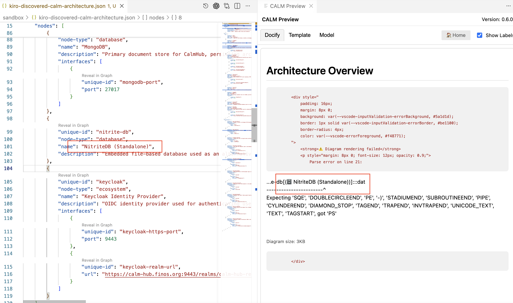
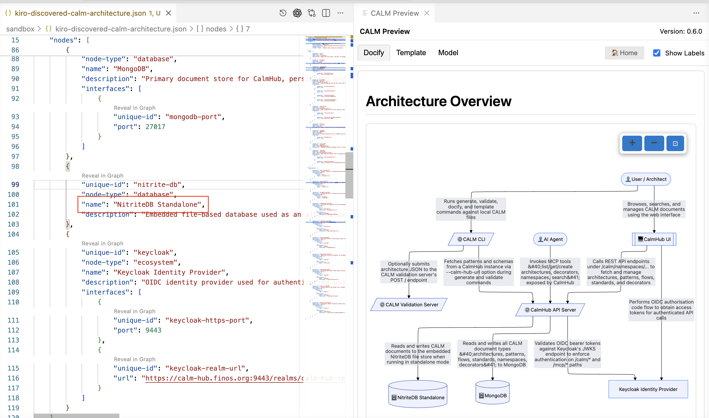

import Tabs from '@theme/Tabs';
import TabItem from '@theme/TabItem';

# Architecture Discovery Skill

## Introduction

This lesson uses the CALM AI Assistant to help draft a CALM architecture from source code.

The goal is to bootstrap an effort to create a CALM architecture, giving you an initial model that can be reviewed, refined, and expanded. This is useful when a system already exists but its architecture is incomplete, out of date, or spread across source code, configuration, deployment files, and team knowledge.

Using an AI Assistant can accelerate discovery by helping identify candidate nodes, relationships, interfaces, flows, and metadata from the implementation. It can also summarize unfamiliar codebases, highlight repeated integration patterns, and turn low-level implementation details into architecture concepts that are easier for teams to discuss.

Source code alone rarely tells the whole story. The AI Assistant may miss runtime behavior, external dependencies, business intent, security controls, operational ownership, or infrastructure that is defined outside the repository. It may also infer relationships that need human validation. Treat the generated CALM architecture as a starting point: review it with engineers and architects, validate it against the running system, and refine it with context that only the team can provide.

A full tutorial about agent skills is beyond the scope of this tutorial.  The interested reader can find a general [introduction to skills at this site](https://agentskills.io/home).

## Architecture Discovery Skill Definition

Click here to see the <a href="/calm-skills/architecture-discovery-skill.md" target="_blank">architecture discovery skill</a> and then copy to the clipboard.  Instructions in the `Skill Setup` section provides guidance on where to save the skill definition in the clipboard to the location for your specific CALM AI Assistant.

## Skill Setup

Click on the tab for you CALM AI Assistant.

<Tabs>
  <TabItem value="copilot" label="Copilot" default>

### Copilot Skill Setup

1. Create this subdirectory structure `.github/skills/calm-architecture-discovery`

2. Create a file `.github/skills/calm-architecture-discovery/SKILL.md`

3. Past copied skill definition from clipboard into `Skill.md` and save the file.

4. Restart VSCode.

For additional information see [VSCode Agent Skills](https://code.visualstudio.com/docs/copilot/customization/agent-skills).

  </TabItem>
  <TabItem value="kiro" label="KIRO">

### KIRO Skill Setup

1. Create this subdirectory structure `.kiro/skills/calm-architecture-discovery`

2. Create a file `.github/skills/calm-architecture-discovery/SKILL.md`

3. Past copied skill definition from clipboard into `Skill.md` and save the file.

4. Restart KIRO.

For additional information see [KIRO Agent Skills](https://kiro.dev/docs/skills/).

  </TabItem>
  <TabItem value="claude" label="Claude">

### Claude Skill Setup

1. Create this subdirectory structure `.claude/skills/calm-architecture-discovery`

2. Create a file `.claude/skills/calm-architecture-discovery/SKILL.md`

3. Past copied skill definition from clipboard into `Skill.md` and save the file.

For additional information see [Claude Agent Skills](https://platform.claude.com/docs/en/agents-and-tools/agent-skills/overview).

  </TabItem>
  <TabItem value="codex" label="Codex">

### Codexs Skill Setup

1. Create this subdirectory structure `.agents/skills/calm-architecture-discovery`

2. Create a file `.agents/skills/calm-architecture-discovery/SKILL.md`

3. Past copied skill definition from clipboard into `Skill.md` and save the file.

4. If you are using Codex within an IDE, restart the IDE.

For additional information see [Codex Agent Skills](https://developers.openai.com/codex/skills).

  </TabItem>
</Tabs>

## Using the Skill

The skill requires two parameters:

- `root_dir` is the top-level directory for the source code.  The CALM AI Assistant will scan all contents within this top-level directory for source code.  A single dot, i.e., "`.`" will indicate to use the current working directory as the top-level directory.
- `arch_file` specifies the file to save the discovered CALM architecture.

Click on the tab for you CALM AI Assistant.

<Tabs>
  <TabItem value="copilot" label="Copilot" default>

### Using the Copilot Skill

1. Select `CALM` for the agent mode.

2. In the chat type in `/calm-architecture-discovery <root_dir> <arch_file>`

  </TabItem>
  <TabItem value="kiro" label="KIRO">

### Using the KIRO Skill

1. Select `Vibe` Coding

2. Enable the CALM agent mode by typing in the chat prompt `#CALM.chatmode.md`

2. In the chat type in `/calm-architecture-discovery <root_dir> <arch_file>`

  </TabItem>
  <TabItem value="claude" label="Claude">

### Using the Claude Skill

  </TabItem>
  <TabItem value="codex" label="Codex">

### Using the Codex Skill

  </TabItem>
</Tabs>

## Modify the Skill

## Observed Peculiarities

### CALM Tool Preview Fails

If the discovery skill creates a node name with parenthesis, this will cause the CALM Tools Preview function to generate an error.

The fix for that is to edit the CALM architecture JSON and remove the parenthesis from the node `name` property.

## Closing Thoughts