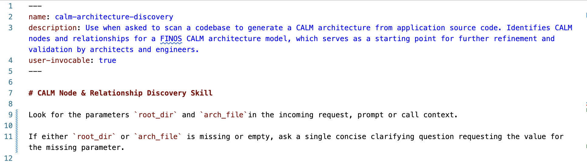

import Tabs from '@theme/Tabs';
import TabItem from '@theme/TabItem';

# Architecture Discovery Skill

## Introduction

This lesson illustrates one approach—using agent skills—to leverage the CALM AI Assistant for generating a CALM architecture from source code. It is not meant to be prescriptive; rather, it demonstrates how the Assistant, through agent skills, can help architects quickly produce an initial architecture model for a legacy application. The objective is to provide a strong starting point (typically 80–90% complete) that the architect can review, refine, and expand.

The discovered architecture will likely contain some mistakes and omissions, as source code alone rarely captures the full picture. Important details such as runtime behavior, external dependencies, business intent, security controls, operational ownership, or infrastructure defined outside the repository may be missed. The AI Assistant may also infer relationships that require human validation. Use the generated CALM architecture as a draft to accelerate your work—review it with engineers and architects, validate it against the running system, and refine it with your team's unique context and expertise.

A full tutorial about agent skills is beyond the scope of this tutorial.  The interested reader can find an [explanation of agent skills at this site](https://agentskills.io/home).

## Skill Setup

A pre-requisite is to setup up the CALM AI Assistant support.  See [here](../../working-with-calm/calm-ai-tools.md) for instructions on how to do this.

Click here to copy the <a href="/calm-skills/architecture-discovery-skill.md" target="_blank">architecture discovery skill</a> to the clipboard. Follow instructions in the next part for your specific CALM AI Assistant on where to save the skill definition in the clipboard.

Click on the tab for you CALM AI Assistant.

<Tabs>
  <TabItem value="copilot" label="Copilot" default>

### Copilot Skill Setup

1. Create this subdirectory structure `.github/skills/calm-architecture-discovery`

2. Create a file `.github/skills/calm-architecture-discovery/SKILL.md`

3. Paste copied skill definition from clipboard into `Skill.md` and save the file.

4. Restart VSCode.

For additional information see [VSCode Agent Skills](https://code.visualstudio.com/docs/copilot/customization/agent-skills).

  </TabItem>
  <TabItem value="kiro" label="KIRO">

### KIRO Skill Setup

1. Create this subdirectory structure `.kiro/skills/calm-architecture-discovery`

2. Create a file `.kiro/skills/calm-architecture-discovery/SKILL.md`

3. Paste copied skill definition from clipboard into `Skill.md` and save the file.

4. Restart KIRO.

For additional information see [KIRO Agent Skills](https://kiro.dev/docs/skills/).

  </TabItem>
  <TabItem value="claude" label="Claude">

### Claude Skill Setup

1. Create this subdirectory structure `.claude/skills/calm-architecture-discovery`

2. Create a file `.claude/skills/calm-architecture-discovery/SKILL.md`

3. Paste copied skill definition from clipboard into `Skill.md` and save the file.


For additional information see [Claude Agent Skills](https://platform.claude.com/docs/en/agents-and-tools/agent-skills/overview).

  </TabItem>
  <TabItem value="codex" label="Codex">

### Codex Skill Setup

1. Create this subdirectory structure `.agents/skills/calm-architecture-discovery`

2. Create a file `.agents/skills/calm-architecture-discovery/SKILL.md`

3. Paste copied skill definition from clipboard into `Skill.md` and save the file.

4. If you are using Codex within an IDE, restart the IDE.

For additional information see [Codex Agent Skills](https://developers.openai.com/codex/skills).

  </TabItem>
</Tabs>

After saving `Skill.md` the beginning part of the file should look like this....



:::tip
Architects are encouraged to experiment with revising the skill definition itself. By adjusting the prompts, parameters, or logic in the skill, you can influence the discovery process and tailor the generated architecture to better fit your organization's needs. Iterative refinement of the skill can lead to more accurate and useful architecture models.
:::

## Using the Skill

Within your particular CALM AI Assistant setup, designate the model you want to use with architecture discovery skill. 

:::note
During development of this tutorial, Claude Sonnet 4.6 and GPT-5.5 were used successfully.   These models support different levels of "reasoning" effort.  This tutorial used "Medium" or higher settings.  Higher reasoning models will increase run time for the discovery process.

Since other models could support discovery, the reader is encouraged to experiment with different models.
:::

The skill requires two parameters:

- `root_dir` is the top-level directory for the source code.  The CALM AI Assistant will scan all contents within this top-level directory for source code.  A single dot, i.e., "`.`" will indicate to use the current working directory as the top-level directory.
- `arch_file` specifies the file to save the discovered CALM architecture.

:::warning
If both parameters are not provided, the CALM AI Assistant will ask for values.
:::

Click on the tab for you CALM AI Assistant.

<Tabs>
  <TabItem value="copilot" label="Copilot" default>

### Using the Copilot Skill

1. Select `CALM` for the agent mode.

2. In the chat type in `/calm-architecture-discovery <root_dir> <arch_file>`

  </TabItem>
  <TabItem value="kiro" label="KIRO">

### Using the KIRO Skill

1. Select `Vibe` Coding

2. Enable the CALM agent mode by typing in the chat prompt `#CALM.chatmode.md`

2. In the chat type in `#calm-architecture-discovery <root_dir> <arch_file>`

  </TabItem>
  <TabItem value="claude" label="Claude">

### Using the Claude Skill

Start Claude CLI

1. Enable CALM support by typing in `/calm`

2. Once the CALM support is enabled, type `/calm-architecture-discovery <root_dir> <arch_file>`

  </TabItem>
  <TabItem value="codex" label="Codex">

### Using the Codex Skill

Either in command line or via VSCode Codex Chat function:

1. Enable CALM support by typing in `$calm`

2. Once the CALM support is enabled, type `$calm-architecture-discovery <root_dir> <arch_file>`

  </TabItem>
</Tabs>

## Example Discovery Run

For this example, we will use the agent skill to discover the CALM architecture for CALM itself, i.e., we will be doing discovery on the [CALM project's `architecture-as-code` repo](https://github.com/finos/architecture-as-code). 

Since the CALM project has an official CALM architecture, as a representation of our desired architecture representation.

This run uses VSCode with Github Copilot and the Claude Sonnet 4.6 Model.

### Invoke the agent skill to discover the architecture

**Prompt**: `/calm-architecture-discovery . sandbox/copilot-discovered-calm-architecture.json`

This prompt says to run architecture discovery on the current working directory ("`.`") and to save the discovered architecture in "`sandbox/copilot-discovered-calm-architecture.json`".

Skill execution time will be several minutes.  For Github Copilot, with default settings, you may be asked allow continued execution of the agent skill run and prompted to allow creating two output files:
- `sandbox/copilot-discovered-calm-architecture.json`: the discovered CALM architecture for the repo
- `sandbox/copiliot-discovered-calm-architecture-key-observations.md`: Markdown report of the key observations noted during discovery of the nodes and relationships.  This is informational.  The architect can use this help in understanding the discovered architecture.

:::warning
During the discovery process the agent may want to run OS commands to discover content.  When prompted for permission to run these commands, make sure to review the command to ensure it is not going to modify content.   Some commands will write to `/dev/null`, which is OK because it is not affecting any repo content.
:::


The following chat log was edited to remove repetitive messages.

```
GitHub Copilot: Loading FINOS CALM instructions...  

Ran terminal command:  find /Users/jim/Desktop/finos/discovery-skill-tutorial -maxdepth 1 -type d | sort


Fetched 5 resources

Now let me scan the key subdirectories for architectural evidence: 

Ran terminal command:  cat /Users/jim/Desktop/finos/discovery-skill-tutorial/package.json

Ran terminal command:  ls /Users/jim/Desktop/finos/discovery-skill-tutorial/ && cat /Users/jim/Desktop/finos/discovery-skill-tutorial/package.json 2>/dev/null || echo "NO ROOT PACKAGE.JSON"

Ran terminal command:  cat /Users/jim/Desktop/finos/discovery-skill-tutorial/calm-hub/pom.xml | grep -E "<artifactId>|<groupId>|<version>" | head -30

Ran terminal command:  ls /Users/jim/Desktop/finos/discovery-skill-tutorial/calm-hub/ && ls /Users/jim/Desktop/finos/discovery-skill-tutorial/calm-server/ && ls /Users/jim/Desktop/finos/discovery-skill-tutorial/cli/

Ran terminal command:  cat /Users/jim/Desktop/finos/discovery-skill-tutorial/calm-server/package.json
```
#### DELETED LINES
```
Ran terminal command:  ls /Users/jim/Desktop/finos/discovery-skill-tutorial/calm-ai/ 2>/dev/null && ls /Users/jim/Desktop/finos/discovery-skill-tutorial/conferences/ 2>/dev/null

Run in Terminal

Continue to iterate?
[object Object]

User: @agent Continue: "Continue to iterate?"

GitHub Copilot: Ran terminal command:  du -sh /Users/jim/Desktop/finos/discovery-skill-tutorial/calm-ai 2>/dev/null && du -sh /Users/jim/Desktop/finos/discovery-skill-tutorial/conferences 2>/dev/null

Ran terminal command:  find /Users/jim/Desktop/finos/discovery-skill-tutorial/calm-ai -type f | head -20 && echo "---" && find /Users/jim/Desktop/finos/discovery-skill-tutorial/conferences -type f | head -10

I now have comprehensive understanding of the architecture. Let me present the findings and create the output files.

---

> ⚠️ This is an initial discovery of potential CALM nodes and relationships based on static analysis of the codebase by an LLM. It may contain inaccuracies or omissions. Please review and validate each item before using it in your CALM architecture model.

Scanned the following top-level subdirectories for the CALM nodes and relationships:

- advent-of-calm
- brand
- calm
- calm-ai
- calm-hub
- calm-hub-ui
- calm-models
- calm-plugins
- calm-server
- calm-suite
- calm-widgets
- cli
- conferences
- docs
- experimental
- scripts
- shared
- template-bundles

---

## Nodes

| `unique-id` | `node-type` | `name` | `description` |
|---|---|---|---|
| `developer` | `actor` | Developer / Architect | Human developer or architect using CALM tooling to create, validate, and manage architecture models |
| `calm-cli` | `service` | CALM CLI | Command-line tool (calm) for generating, validating, and docifying CALM architectures; optionally connects to a CALM Hub instance for remote document loading |
| calm-server | `service` | CALM Validation Server | Standalone Express HTTP server exposing `GET /health` and `POST /calm/validate` endpoints on port 3000 |
| `calm-hub-backend` | `service` | CALM Hub Backend | Java/Quarkus REST API backend managing CALM artifacts (namespaces, patterns, architectures, flows, standards, ADRs) at `GET/POST /calm/namespaces/*` on port 8080 |
| calm-hub-ui | `webclient` | CALM Hub UI | React SPA for browsing CALM namespaces, patterns, architectures, flows, and standards; served as static assets from the Quarkus server in production |
| `mongodb` | `database` | MongoDB | Persistent document store for CALM Hub artifacts, used via the MongoDB Java driver on port 27017 |
| `keycloak` | `ecosystem` | Keycloak | OIDC identity provider (Keycloak) used for authentication and token validation in CALM Hub's secure deployment profile |
| `calmguard` | `service` | CALMGuard | Next.js 15 AI-powered compliance analysis platform; streams compliance findings via SSE (`POST /api/analyze`), validates CALM docs (`POST /api/calm/validate`), and generates CI/CD pipelines |
| `calm-studio-desktop` | `webclient` | CalmStudio Desktop | Tauri/SvelteKit desktop application for authoring CALM architectures with an embedded IDE and integrated MCP sidecar |
| `calmstudio-mcp` | `service` | CalmStudio MCP Server | Model Context Protocol server (`calmstudio-mcp`) enabling AI assistants to read, write, and validate CALM files; supports stdio and HTTP (port 3100) transports |
| `vscode-extension` | `service` | CALM VSCode Extension | VSCode extension for authoring, previewing (Docify), and validating CALM architecture files with tree-view navigation and diagnostics |
| `llm-providers` | `ecosystem` | LLM Providers | External AI provider APIs (Google Gemini, Anthropic Claude, OpenAI GPT, Grok/xAI) invoked by CALMGuard via the Vercel AI SDK |
| `github` | `ecosystem` | GitHub | GitHub platform API used by CALMGuard to fetch CALM architecture files from public repositories |

---

## Relationships

| `unique-id` | `relationship-type` | `source → destination` | `description` |
|---|---|---|---|
| `developer → calm-cli` | `interacts` | developer → calm-cli | Runs generate, validate, docify, and template commands using |
| `developer → calm-hub-ui` | `interacts` | developer → calm-hub-ui | Browses namespaces, patterns, architectures, and flows in |
| `developer → calmguard` | `interacts` | developer → calmguard | Uploads and analyzes CALM architectures for AI-powered compliance using |
| `developer → calm-studio-desktop` | `interacts` | developer → calm-studio-desktop | Authors and edits CALM architectures using |
| `developer → vscode-extension` | `interacts` | developer → vscode-extension | Authors, previews, and validates CALM architectures in VSCode using |
| `developer → calm-server` | `interacts` | developer → calm-server | Sends architecture validation requests directly to |
| `calm-cli → calm-hub-backend` | `connects` | calm-cli → calm-hub-backend | Loads remote CALM documents from when `--calm-hub-url` is configured |
| `calm-hub-ui → calm-hub-backend` | `connects` | calm-hub-ui → calm-hub-backend | Fetches namespaces, patterns, architectures, flows, and standards from via REST API |
| `calm-hub-ui → keycloak` | `connects` | calm-hub-ui → keycloak | Performs OIDC authentication flow against when secure mode is enabled |
| `calm-hub-backend → mongodb` | `connects` | calm-hub-backend → mongodb | Reads and writes CALM artifacts to via MongoDB Java driver |
| `calm-hub-backend → keycloak` | `connects` | calm-hub-backend → keycloak | Validates OIDC bearer tokens against when the secure Quarkus profile is active |
| `calmguard → llm-providers` | `connects` | calmguard → llm-providers | Sends CALM analysis requests to via Vercel AI SDK `generateObject` for structured agent output |
| `calmguard → github` | `connects` | calmguard → github | Fetches CALM architecture JSON files from via GitHub Contents API |
| `calmguard → calm-cli` | `connects` | calmguard → calm-cli | Spawns as a subprocess for CALM document validation (`@finos/calm-cli` is a server-external package) |
| `calm-studio-desktop → calmstudio-mcp` | `connects` | calm-studio-desktop → calmstudio-mcp | Launches and communicates with the bundled MCP sidecar binary via stdio |

---

## Key Observations

**Deployment Boundaries**
- CALM Hub Backend (JVM/Quarkus) and CALM Hub UI are separately developed packages but co-deployed: the UI's production build is copied directly into Quarkus's `META-INF/resources` directory, meaning both are served from a single process on port 8080.
- CALM Server is a completely standalone Node.js/Express process with no relationship to CALM Hub; it provides a simpler HTTP validation API without any artifact storage.
- CalmStudio is distributed as a native Tauri desktop binary; the MCP server is bundled as a compiled sidecar binary inside the Tauri app but is also separately publishable as `calmstudio-mcp`.
- CALMGuard targets Vercel deployment (Next.js App Router with 300 s timeout for SSE streaming).

**Authentication / Trust Boundaries**
- CALM Hub's security is profile-gated: the default profile has no authentication; the `secure` Quarkus profile adds Keycloak OIDC JWT validation. Both calm-hub-ui (OIDC client) and calm-hub-backend (token validator) must be configured to point at Keycloak.
- CALM Server explicitly warns in code when bound to a non-localhost address and has no authentication controls — it is not safe to expose publicly.
- CALMGuard uses LLM API keys injected via environment variables; there is no user authentication layer in the CALMGuard application itself.

**External Dependencies**
- MongoDB is the production data store for CALM Hub; an embedded NitriteDB can substitute it in standalone mode (same JVM process — not a separate node).
- Keycloak is an optional external dependency; the CALM Hub deployment is functional without it in the default profile.
- LLM Providers (Gemini as default, plus Anthropic, OpenAI, Grok) are hard runtime dependencies for CALMGuard's compliance analysis — unavailable LLM API keys will prevent analysis from running.
- GitHub API is used by CALMGuard for fetching CALM files from public repos; no authentication is required for public repos, but rate limits apply.

**Nodes Worth Drilling Into**
- **`calm-hub-backend`**: Substantial sub-architecture — ~15 REST resource classes, dual storage implementations (MongoDB / NitriteDB), OIDC access-control filter, MCP integration, and a front-controller resource for custom-ID-based access. Deserves its own architecture model.
- **`calmguard`**: Multi-agent AI system with a parallel Phase 1 (Scout + Ranger + Arsenal + Cloud Infra agents) and sequential Phase 2 (Sniper risk scorer), all streaming SSE to the dashboard. Orchestrator, agent registry, skill loader, and provider abstraction are all worth modelling.
- **`calm-studio-desktop`**: The CalmStudio monorepo (calm-studio) contains several independently publishable packages — `calm-core`, `extensions`, `calmscript`, `mcp-server`, `github-action`, `web-component`, and `vscode-extension` — each a potential sub-architecture.

---

Saving the discovered nodes and relationships to a CALM architecture model in JSON format, adhering to the CALM schema version 1.2, to `sandbox/copilot-discovered-calm-architecture.json`. 

Ran terminal command:  mkdir -p /Users/jim/Desktop/finos/discovery-skill-tutorial/sandbox

Ran terminal command:  cat > /Users/jim/Desktop/finos/discovery-skill-tutorial/sandbox/copilot-discovered-calm-architecture.json << 'CALM_EOF'
{
    "$schema": "https://calm.finos.org/release/1.2/meta/calm.json",
    "unique-id": "finos-calm-monorepo",
    "name": "FINOS Architecture as Code Monorepo",
    "description": "The FINOS CALM monorepo containing the Common Architecture Language Model specification and all associated tooling, including the CLI, validation server, CALM Hub backend and UI, CALMGuard AI compliance platform, CalmStudio desktop IDE, MCP server, and VSCode extension.",
    "nodes": [
```
#### DELETED LINES
```


        {
            "unique-id": "calm-studio-desktop → calmstudio-mcp",
            "description": "Launches and communicates with the bundled MCP sidecar binary via stdio",
            "relationship-type": {
                "connects": {
                    "source": {
                        "node": "calm-studio-desktop"
                    },
                    "destination": {
                        "node": "calmstudio-mcp",
                        "interfaces": ["calmstudio-mcp-http"]
                    }
                }
            }
        }
    ]
}
CALM_EOF
echo "Architecture file written successfully"

Saving key observations about the architecture to `sandbox/copilot-discovered-calm-architecture.key-observations.md`.  

Ran terminal command:  cat > /Users/jim/Desktop/finos/discovery-skill-tutorial/sandbox/copilot-discovered-calm-architecture.key-observations.md << 'OBS_EOF'
# Key Architectural Observations — FINOS Architecture as Code Monorepo

> Generated by CALM architecture discovery on 2026-05-09

---

## Deployment Boundaries

- **CALM Hub Backend + UI co-deployed in production.** Although `calm-hub-ui` and `calm-hub-backend` are developed as separate packages, the production build pipeline (`npm run prod` in calm-hub-ui) copies the compiled React SPA static assets directly into the Quarkus server's `META-INF/resources` directory, resulting in a single deployable process on port 8080. During development they run as separate processes.

- **CALM Server is an independent HTTP process.** The `calm-server` (Express/Node.js) is a completely separate runtime from CALM Hub. It provides only validation endpoints (`GET /health`, `POST /calm/validate`) with no artifact storage or authentication. It is explicitly documented as safe only for localhost binding.

- **CalmStudio MCP server is a dual-mode sidecar.** The `calmstudio-mcp` binary is bundled as a compiled Tauri sidecar inside the CalmStudio desktop app and launched as a subprocess (stdio), but is also separately publishable as a standalone CLI (`calmstudio-mcp --http --port 3100`).

- **CALMGuard targets Vercel cloud deployment.** The Next.js App Router is configured with `export const maxDuration = 300` for SSE streaming on Vercel Fluid Compute. It is the only component in the monorepo targeting a cloud-hosted deployment.

- **CALM CLI and CALM Server share core validation logic.** Both delegate to `@finos/calm-shared` for schema loading and validation, so they have no direct runtime dependency on each other.

---

## Authentication / Trust Boundaries

- **CALM Hub has a profile-gated security model.** The default Quarkus profile has no authentication. The `secure` profile activates Keycloak OIDC integration, requiring both the backend (token validation via `AccessControlFilter`) and the UI (OIDC login flow in `authService.tsx`) to be configured with matching Keycloak realm URLs. `AUTH_SERVICE_OIDC_ENABLE` defaults to `false` in the UI codebase.

- **CALM Server has no authentication or authorization.** Source code explicitly warns at startup when binding to a non-localhost address. It should not be exposed on a public network without an external reverse proxy or API gateway handling auth.

- **CALMGuard uses LLM API keys via environment variables.** The Vercel AI SDK provider configuration relies on `GOOGLE_GENERATIVE_AI_API_KEY`, `ANTHROPIC_API_KEY`, or `OPENAI_API_KEY` environment variables. There is no user-facing authentication layer in CALMGuard itself.

- **CALM Hub uses scoped OAuth2 access control.** Endpoints are annotated with `@PermittedScopes` (e.g., `architectures:read`, `adrs:all`), with scopes checked against the validated JWT. The scope definitions live in `CalmHubScopes.java`.

---

## External Dependencies

- **MongoDB** is the production data store for CALM Hub. It can be replaced by the embedded NitriteDB (`calm.database.mode=standalone`) which runs in-process with the JVM — not a separate deployable node. Docker Compose and Kubernetes manifests are provided in `calm-hub/local-dev/` and `calm-hub/k8s/`.

- **Keycloak** is an optional external dependency. CALM Hub is fully functional in the default (non-secure) profile without it.

- **LLM Providers** (Google Gemini as default, Anthropic Claude, OpenAI GPT, Grok/xAI) are required runtime dependencies for CALMGuard's compliance analysis pipeline. Missing API keys cause analysis agents to fail.

- **GitHub API** is used by CALMGuard's `/api/github/fetch-calm` route to retrieve CALM JSON files from public repos. No authentication token is required for public repositories, but API rate limits apply.

- **`@finos/calm-cli`** is an npm package dependency of CALMGuard and is invoked as a child process (`serverExternalPackages: ['@finos/calm-cli']` in `next.config.ts`) for CALM validation — it must be available on the server's PATH or node_modules at runtime.

---

## Nodes That Likely Have Sub-Architectures Worth Drilling Into

- **`calm-hub-backend`** — Substantial internal sub-architecture: ~15 JAX-RS resource classes, dual storage implementations (MongoDB and NitriteDB with interface segregation), OIDC security filter layer, MCP resource endpoint, a front-controller for custom-ID-based resource access, and a search layer. The domain model covers namespaces, patterns, architectures, flows, ADRs, standards, controls, interfaces, decorators, and user access. Warrants its own detailed architecture model.

- **`calmguard`** — Multi-agent AI system with an orchestrated execution model: Phase 1 runs Scout (architecture analyzer), Ranger (compliance mapper), Arsenal (CI/CD pipeline generator), and Cloud Infra generator in parallel (`Promise.all`); Phase 2 runs Sniper (risk scorer) sequentially on aggregated results. Agent definitions are YAML files; compliance knowledge is loaded from Markdown skill files at runtime. The SSE streaming architecture, Zustand state store, and LLM provider abstraction are all worth modelling independently.

- **`calm-suite/calm-studio`** — The CalmStudio monorepo contains multiple independently publishable sub-packages: `calm-core` (CALM model logic), `extensions` (plugin system), `calmscript` (DSL), `mcp-server` (MCP protocol adapter), `github-action` (CI/CD integration), `web-component` (embeddable widget), and `vscode-extension` (separate from the main `calm-plugins/vscode` extension). Each is a potential candidate for its own architecture model.

- **`calm-plugins/vscode`** — The VSCode extension uses an MVVM + Hexagonal + Mediator architecture pattern with a Zustand application store, a tree-view feature module, a Docify preview panel (Webview), editor integrations (hover, CodeLens), and a diagnostics service. It has no HTTP connections to external services but relies on `@finos/calm-shared` for validation logic.
OBS_EOF
echo "Key observations file written successfully"

Ran terminal command:  ls -la /Users/jim/Desktop/finos/discovery-skill-tutorial/sandbox/

Ran terminal command:  ls /Users/jim/Desktop/finos/discovery-skill-tutorial/sandbox/

Ran terminal command:  ls /Users/jim/Desktop/finos/discovery-skill-tutorial/sandbox && echo "done"

Ran terminal command: import os; print(os.listdir('/Users/jim/Desktop/finos/discovery-skill-tutorial/sandbox'))

Both files are confirmed written. Let me verify the JSON is valid: 

Ran terminal command: import json; data = json.load(open('/Users/jim/Desktop/finos/discovery-skill-tutorial/sandbox/copilot-discovered-calm-architecture.json')); print(f'Valid JSON. Nodes: {len(data["nodes"])}, Relationships: {len(data["relationships"])}')

CALM architecture discovery complete. Please review the discovered nodes, relationships, and key observations before using them in your CALM architecture model.

---

Both output files have been saved:
- copilot-discovered-calm-architecture.json — CALM 1.2 architecture model (13 nodes, 15 relationships)
- copilot-discovered-calm-architecture.key-observations.md — Key architectural observations

**Summary of what was found:**

The monorepo contains **4 distinct runtime services** (CLI, Validation Server, CALM Hub Backend, CALMGuard), **2 browser/desktop UIs** (CALM Hub UI, CalmStudio Desktop), **2 CLI-style services** (CalmStudio MCP, VSCode Extension), **2 databases** (MongoDB), **3 external ecosystems** (Keycloak, LLM Providers, GitHub), and **1 actor** (Developer/Architect).

The most architecturally significant finding is that **CALM Hub Backend, CALMGuard, and CalmStudio** each warrant their own detailed sub-architecture models due to their internal complexity. CALM Server and CALM Hub Backend are distinct runtimes often confused with each other — the former is unauthenticated and validation-only; the latter is the full CALM artifact registry.
```

The full <a href="/calm-discovered-artifacts/copilot-discovered-calm-architecture.json" target="_blank">unmodified discovered architecture json</a>.

The discovered <a href="/calm-discovered-artifacts/copilot-discovered-calm-architecture.key-observations.md" target="_blank">key observations</a>.


### CALM Validate the Discovered Architecture

```
$ calm validate -a sandbox/copilot-discovered-calm-architecture.json -f pretty
(node:33241) [DEP0040] DeprecationWarning: The `punycode` module is deprecated. Please use a userland alternative instead.
(Use `node --trace-deprecation ...` to show where the warning was created)
info [calm-cli]:     Using CALMHub URL from config file: http://localhost:8080
info [calmhub-document-loader]:     Configuring CALMHub document loader with base URL: http://localhost:8080
info [calm-validate]:     Formatting output as pretty
Summary
- Errors: no (0)
- Warnings: yes (1)
- Info/Hints: 0

WARN  issues:
- In copilot-discovered-calm-architecture.json (/Users/jim/Desktop/finos/discovery-skill-tutorial/sandbox/copilot-discovered-calm-architecture.json):
  WARN  architecture-nodes-must-be-referenced: Node with ID 'calm-studio-mcp-server' is not referenced by any relationships.
    path: /nodes/calm-studio-mcp-server/unique-id
    at line 101, col 26 (/Users/jim/Desktop/finos/discovery-skill-tutorial/sandbox/copilot-discovered-calm-architecture.json)
    101 |             "unique-id": "calm-studio-mcp-server",
        |                          ^^^^^^^^^^^^^^^^^^^^^^^^
```
This shows the generated architecture JSON complies with the CALM Schema.

## Review and Refine The Discovered Architecture

### Review the Discovered Architecture

As noted earlier, the discovered architecture may have inaccuracies.  The architect now has to review the discovered architecture and refine it as needed to accurately reflect state of the system.

To illustrate this process, let's assume the architect has this image in his or her mind that the discovered architecture should represent. 

<figure>
  
  <figcaption><strong>Desired Architecture Representation</strong></figcaption>
</figure>


when we compare this to the <a href="/calm-discovered-artifacts/copilot-discovered-calm-architecture.json" target="_blank">actual discovered architecture representation</a>,

<figure>
  
  <figcaption><strong>Initial Discovered Architecture</strong></figcaption>
</figure>

we make the following observations:

- Accounting for slight differences in names and descriptions, the discovered architecture contains all nodes and relationships that are found in the desired architecture representation.
- The desired architecture combines several nodes into logical groups, such as the `CALM Hub System`
- As reported by the `calm validate` output, there is a node with no relationships.
- The discovered architecture contains more nodes and relationships than expected.
  - Several of the nodes represent work-in-progress
  - `Keycloak` node is a tool used for testing

### Refine the Discovered Architecture

We now use CALM's AI Assistant to help us refine the discovered architecture with the following prompts:
- `Remove the following nodes and their related relationships: Calm Guard, OpenAI GPT, Github API, Anthropic Claude, CalmStudio, Calm Studio, CALM Studio MCP Server, CALM Server and Keycloak`
- `Add a system node called "CALM Hub System" and a composed-of relationship with container "CALM Hub Systems" and nodes: CALM Hub UI, CALM Hub, and MongoDB.`
- `Add a service node called "Visual Studio Code" and a deployed-in relationship with container "Visual Studio Code" and nodes: CALM VS Code Extension`

With these three simple prompts to CALM AI Assistant, we are able to refine the discovered architecture to its <a href="/calm-discovered-artifacts/refined-discovered-calm-architecture.json" target="_blank">desired representation</a>.

<figure>
  
  <figcaption><strong>Refined Architecture Representation</strong></figcaption>
</figure>

The architecture validation reports no errors or warnings.

```
$ calm validate -a sandbox/refined-discovered-calm-architecture.json -f pretty
(node:66947) [DEP0040] DeprecationWarning: The `punycode` module is deprecated. Please use a userland alternative instead.
(Use `node --trace-deprecation ...` to show where the warning was created)
info [calm-cli]:     Using CALMHub URL from config file: http://localhost:8080
info [calmhub-document-loader]:     Configuring CALMHub document loader with base URL: http://localhost:8080
info [calm-validate]:     Formatting output as pretty
Summary
- Errors: no (0)
- Warnings: no (0)
- Info/Hints: 0

No issues found.
```

### Additional Review and Refinement

The two prior sections involved correcting structural issues with the discovered architecture.  

Names and relationships can be revised as needed.

The architect should review lower level CALM data, such as
- Interface specifications
- Metadata

Add as needed:
- CALM Controls
- CALM Standards

Changes required for all of these can be accomplished with the help of the CALM AI Assistant.

## Skill Modifications

As noted earlier the architect should consider modifying  <a href="/calm-skills/architecture-discovery-skill.md" target="_blank">the skill</a> to account for situations unique to their organization or software development process.  Here are some sections in the skill that could be modified:

```
#### Package manifests & build files (pick what applies)
| Ecosystem | Files |
|-----------|-------|
| JavaScript / TypeScript | `package.json`, `package-lock.json`, `yarn.lock`, `pnpm-lock.yaml` |
| Java / Kotlin / Scala | `pom.xml`, `build.gradle`, `build.gradle.kts`, `settings.gradle` |
| Python | `pyproject.toml`, `setup.py`, `setup.cfg`, `requirements*.txt`, `Pipfile`, `poetry.lock` |
| C / C++ | `CMakeLists.txt`, `Makefile`, `conanfile.txt`, `vcpkg.json` |
| C# / .NET | `*.csproj`, `*.sln`, `nuget.config`, `packages.config` |
| Go | `go.mod`, `go.sum` |
| Rust | `Cargo.toml`, `Cargo.lock` |
| Ruby | `Gemfile`, `Gemfile.lock`, `*.gemspec` |
| PHP | `composer.json`, `composer.lock` |
| Swift / Objective-C | `Package.swift`, `Podfile`, `*.xcodeproj` |
| Elixir / Erlang | `mix.exs`, `rebar.config` |
```

```
#### Source code signals
- **Route / endpoint definitions**: Express `app.get/post`, FastAPI `@router`, Spring `@RestController`/`@RequestMapping`, Django `urls.py`, ASP.NET `[Route]`, Go `http.HandleFunc`, Gin `r.GET`, gRPC `.proto` files
- **Database clients**: JDBC URLs, SQLAlchemy `create_engine`, Mongoose `connect`, Entity Framework `DbContext`, GORM `Open`, Diesel schema
- **Message queues / event streams**: Kafka producers/consumers, RabbitMQ channels, SQS/SNS client instantiation, Azure Service Bus, NATS
- **HTTP clients**: `axios`, `fetch`, `requests`, `HttpClient`, `RestTemplate`, `WebClient`, `urllib`, `curl` wrappers — especially where base URLs are configured
- **Auth / identity**: OIDC/OAuth config, `passport`, `spring-security`, `django-allauth`, Keycloak adapters, JWT validation, API key headers
- **Service discovery / config**: Consul, Eureka, etcd, Zookeeper client setup; environment-injected hostnames

#### Architecture hints
- OpenAPI / Swagger specs: `openapi.yaml`, `swagger.json`, `*.oas.yaml`
- AsyncAPI specs: `asyncapi.yaml`
```

```
## IMPORTANT NOTES
- DO NOT rely on documentation or comments as primary evidence for identifying nodes and relationships.  They can be out of date or inaccurate.  Examples include `README.md`, `ARCHITECTURE.md`, code comments, and even architecture diagrams.  Instead, focus on executable code and configuration that indicates the presence of nodes and relationships.
- When identifying nodes and relationship, make sure to the node or relationship is actively used in executable code and not inferred by a reference in a comment or existence of an unused constant or variable.
- A node should be identified as a distinct architectural component only if there is evidence of it being a separate deployable unit, runtime process, command line, or external system.  For example, two services defined in the same codebase but running as separate processes would be two nodes, while two classes in the same service would not.
- DO NOT define `composed-of` and `deployed-in` relationships.  Focus on `connects` and `interacts` relationships that indicate actual communication or interaction patterns between nodes.
- For relationships, DO NOT capture protocols, this has been deprecated.
- When forming the unique-id for relationships, use format `source-node-id → destination-node-id` to clearly indicate direction of the relationship.
- DO NOT write the nodes and relationships to a CALM architecture model to a file.
- Present information about the nodes and relationships as stated in the `Output Format` section.
```

The above are only suggestions.  The architect should feel free to modify any part of the skill definition to meet his or her needs.

## Observed Peculiarities

### Multiple discovery runs

The

### CALM Tool Preview Fails

If the discovery skill creates a node name with parenthesis, this will cause the CALM Tools Preview function to generate an error.


The fix for that is to edit the CALM architecture JSON and remove the parenthesis from the node `name` property.


### Continue Execution Message (ADD Content)


### Write to /dev/null (ADD Content)
)

### Fetch local Gitub Copilot Chat Cache (ADD Content)


## Key Takeaways

Here are the key takeaways from this architecture discovery skill tutorial:

1. **AI-Assisted Architecture Discovery Accelerates Modeling**  
Using agent skills with the CALM AI Assistant can quickly generate an initial architecture model from source code, providing a strong starting point for architects. While the output may not be perfect, it significantly reduces manual effort and helps teams focus on refinement rather than starting from scratch.

2. **Review, Refine, and Validate the Output**  
The discovered architecture is a draft and may contain mistakes or omissions. Use the CALM AI Assistant to make corrections to nodes and relationships.  Remember to validate the generated model using the CALM CLI (`calm validate`). 

3. **Skill Definition Is Customizable for Your Organization**  
Architects are encouraged to experiment with and revise the skill definition. By adjusting prompts, parameters, and logic—including package detection and source code signals—the discovery process can be tailored to better fit organizational needs and technology stacks.

4. **Skill Setup Is Platform-Specific but Straightforward**  
Setting up the architecture discovery skill involves creating a specific directory and file structure depending on the AI assistant platform (Copilot, KIRO, Claude, or Codex). Clear instructions are provided for each, making it easy to get started.

5. **Common Pitfalls and Peculiarities Are Documented**  
The tutorial highlights known issues, such as problems with node names containing parentheses causing preview errors, and provides practical fixes. This helps users avoid common mistakes and ensures smoother adoption of the tool.

These takeaways summarize the main lessons and best practices for using and refining the CALM architecture discovery skill.