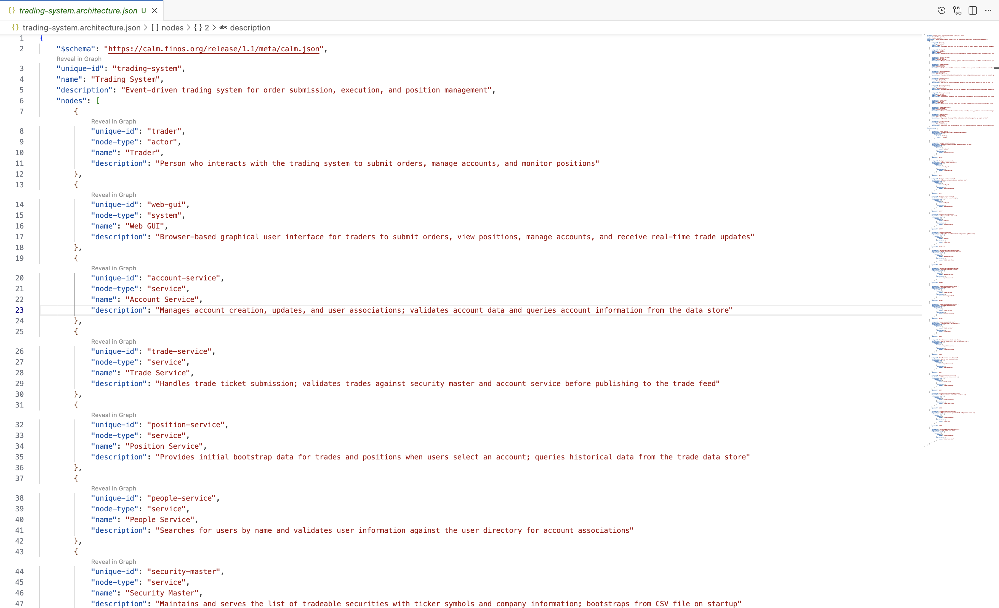
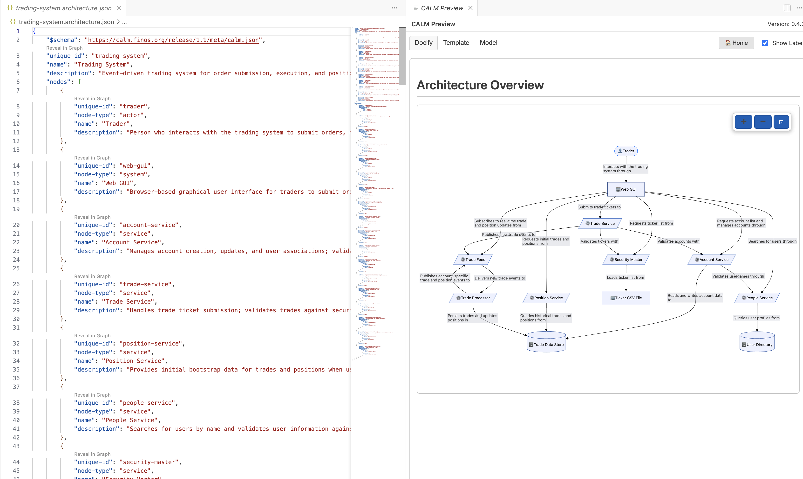
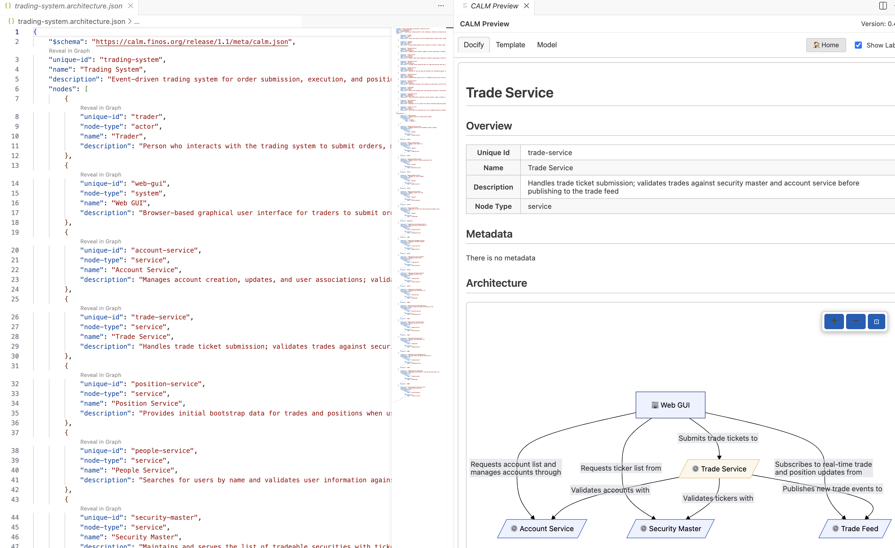
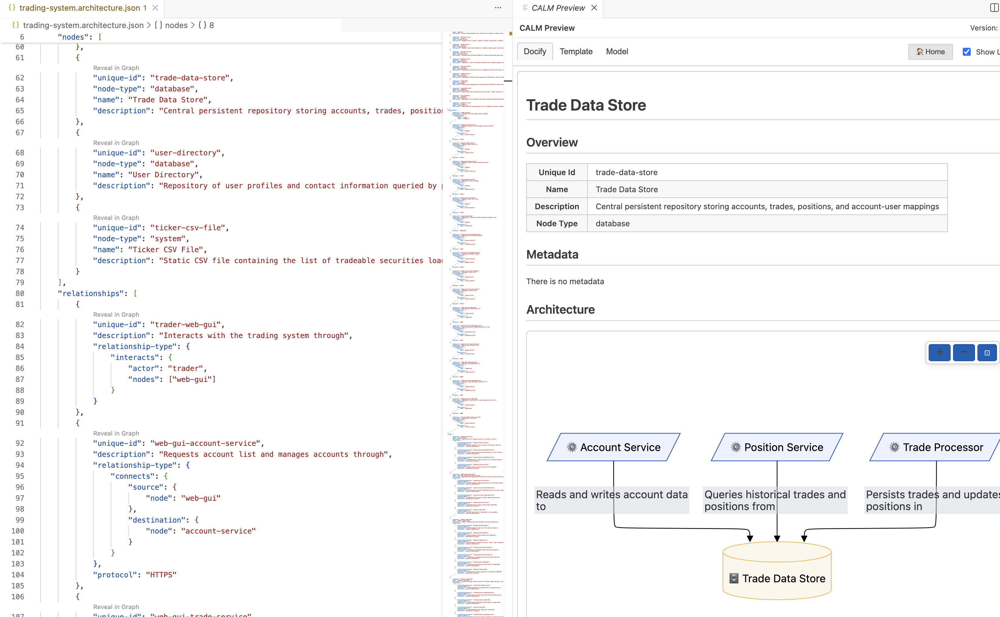
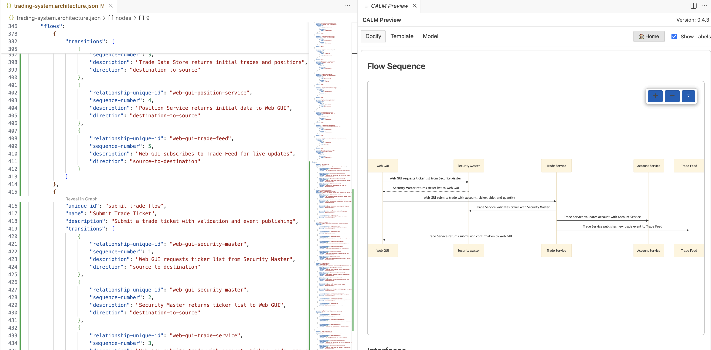
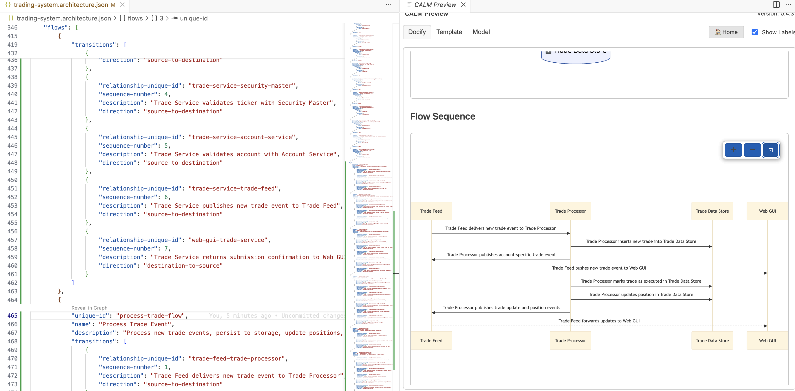
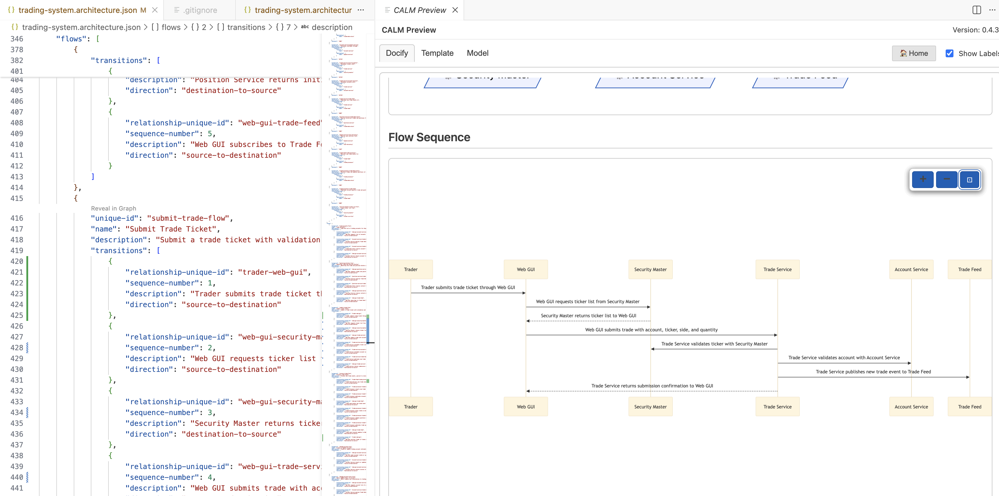
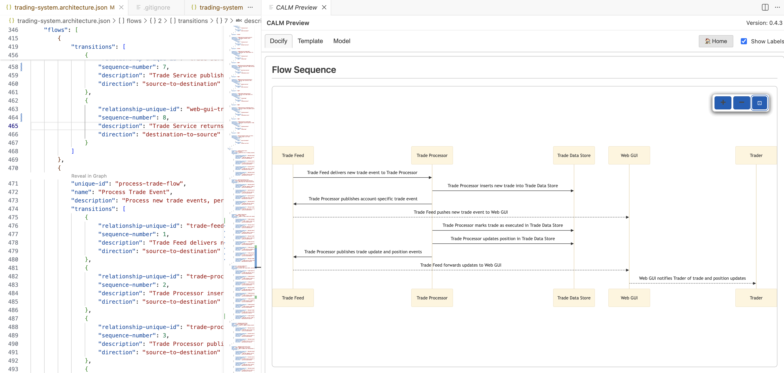

## Create a minimal CALM architecture file

To start off, we will create a minimal CALM architecture file.

**Prompt to AI Assistant**
```text
create a minimal CALM architecture file called trading-system.architecture.json 
with no nodes or relationships
```

**Response from AI Assistant**
```text
Loading FINOS CALM instructions...

Let me read the CALM tool prompts to understand the current guidance. 

Ran terminal command:  cat "/Users/jim/Desktop/calm-demos/build-calm-architecture/.github/chatmodes/calm-prompts/architecture-creation.md"

Ran terminal command:  cat "/Users/jim/Desktop/calm-demos/build-calm-architecture/.github/chatmodes/calm-prompts/calm-cli-instructions.md"

I'm ready to assist with CALM architectures. Let me create the minimal architecture file for you. 

Ran terminal command:  cat > "/Users/jim/Desktop/calm-demos/build-calm-architecture/trading-system.architecture.json" << 'EOF'
{
    "$schema": "https://calm.finos.org/release/1.1/meta/calm.json",
    "unique-id": "trading-system",
    "name": "Trading System",
    "description": "A minimal trading system architecture",
    "nodes": [],
    "relationships": []
}
EOF


Now let me validate the architecture file to ensure it's compliant with CALM v1.1: 

Ran terminal command:  calm validate -a trading-system.architecture.json

Perfect! Created trading-system.architecture.json with the minimal required structure and validated successfully. The file includes:

- `$schema`: Reference to CALM v1.1 schema
- `unique-id`: "trading-system"
- `name`: "Trading System"
- `description`: A minimal description
- `nodes`: Empty array (ready for nodes to be added)
- `relationships`: Empty array (ready for relationships to be added)

The validation confirms no errors or warnings.
```

## Analyze business design to identify candidate nodes for the CALM architecture definition

**Prompt to AI Assistant**
```text
identify candidate CALM nodes with type for an event driven architecture for the provided 
business design.  Use only information found in the business design provided.  List each 
node with its type and a short description.
## Core Business Functions 

### Trading Operations

**Order Submission.** Users submit buy and sell orders for securities, specifying quantities 
and other required trade details. This capability forms the primary interaction between users 
and the trading system.

**Account Selection.** Before executing trades, users select the trading account against which 
the transaction will be executed, ensuring that orders are associated with the correct portfolio 
and entitlements.

**Position Management.** The system tracks current holdings and quantities for each security 
within an account, maintaining an up-to-date view of positions as trades are executed and settled.

**Trade History.** A complete audit trail of all executed trades is maintained, allowing users 
and administrators to review historical activity for reporting, compliance, and analysis purposes.

---

### Account Administration

**Account Management.** The platform supports creating new trading accounts and updating 
existing accounts, allowing administrators to manage account lifecycle and configuration.

**User Association.** Multiple users can be linked to accounts to provide appropriate 
access and entitlements, enabling collaboration and shared account management.

**Account Inquiry.** Users can view account details and see which users are associated 
with each account, providing transparency into ownership and permissions.

---

### Reference Information

**Security Master.** The system maintains a list of tradeable securities, including stock 
tickers and associated company information, ensuring that trading operations reference 
consistent and validated instrument data.

**User Directory.** User profiles and contact information are stored in a centralized directory, 
supporting authentication, search, and account association workflows.

**Trade Data Store.** A central repository stores trading accounts, trades, and related data, 
providing persistent storage and enabling queries by downstream services.

---

### Real-time Information

**Trade Updates.** Users receive immediate notifications when trades execute, allowing them 
to monitor activity without manual refresh.

**Position Updates.** Account positions automatically refresh as trades settle, ensuring 
that holdings reflect the most recent state.

**Trade Status.** The system allows users to monitor the lifecycle of a trade from submission 
through execution and settlement, providing transparency into processing stages.

---

## Business Workflows 

### 1: Load List of Accounts

In this workflow, the Web GUI requests the list of accounts from the Account Service. The Account Service 
queries the Trade Data Store to retrieve all accounts, receives the result set, and then returns the 
list to the Web GUI for display. 

---

### 2: Bootstrapping the Trade and Position Blotter

To initialize the blotter, the Web GUI requests trades and positions for a selected account 
from the Position Service. The Position Service queries the Trade Data Store and returns the 
initial dataset. After initialization, the Web GUI subscribes to the Trade Feed so that live 
trade and position updates are published and displayed in real time. 

---

### 3: Submitting a Trade Ticket

When submitting a trade, the Web GUI first retrieves the list of valid tickers from the Security Master. 
The user submits a trade request containing account, ticker, side, and quantity to the Trade Service. 
The Trade Service validates the ticker with the Security Master and validates the account with the 
Account Service. After validation, the Trade Service publishes a new trade event to the Trade Feed 
and returns a completion response to the Web GUI. 

---

### 4: Trade Processing

Trade processing begins when the Trade Feed delivers a new trade event to the Trade Processor. 
The processor inserts the trade into the Trade Data Store and publishes an account-specific 
trade event. The Web GUI receives this event through the Trade Feed. The Trade Processor 
then marks the trade as executed, updates or inserts the corresponding position, and publishes 
additional trade and position updates, which are forwarded to the Web GUI. 

---

### 5: Add or Update Account

In this workflow, the Web GUI sends an account creation or update request to the Account Service. 
The Account Service writes the new or updated account information to the Trade Data Store and 
returns a success or failure response to the Web GUI. 

---

### 6: Add or Update Users to Account

To associate users with an account, the Web GUI first retrieves the current list of 
associated people from the Account Service, which queries the Trade Data Store. The GUI 
then searches for users through the People Service, which queries the User Directory and 
returns matching records. After a user is selected, the Web GUI requests that the 
Account Service add the user to the account. The Account Service validates the user and 
updates the account-user mapping in the Trade Data Store, returning a success or failure response. 

---

### 7: Security Master Bootstrap

During startup, the Security Master loads a ticker list from a CSV file. This file 
supplies the initial set of securities maintained by the service. When the Web GUI later 
requests the ticker list, the Security Master returns the loaded data. 

---

## Business Entities

### Core Domain Objects

**Account.** An account is a container for trades and positions and is 
uniquely identified so that transactions and holdings can be tracked accurately.

**Trade.** A trade represents a buy or sell transaction and includes 
details such as security, quantity, price, and timestamp.

**Position.** A position represents the current aggregate holding of 
a specific security within an account, calculated from executed trades.

**Security.** A security is a tradeable instrument, such as a stock, 
identified by a ticker symbol and associated company information.

**User.** A user is a person who can be associated with accounts and granted trading access.

---

### Business Relationships

Users and accounts have a many-to-many relationship, allowing multiple users 
to access the same account and a user to be linked to multiple accounts. 
Accounts contain many trades and positions, and each trade references exactly 
one account and one security. Positions aggregate trades for the same 
security within an account to provide a consolidated view of holdings. 
```

**Response from AI Assitant**
```text
Based on the business design, here are the candidate CALM nodes for this event-driven architecture:

## Application/Service Nodes

1. **web-gui** (Type: `service`)
   - User-facing interface for trading operations, account management, and viewing positions

2. **trade-service** (Type: `service`)
   - Handles trade submission, validates tickets against security master and account service

3. **account-service** (Type: `service`)
   - Manages account lifecycle, user associations, and account queries

4. **position-service** (Type: `service`)
   - Provides position and trade data for blotter initialization

5. **people-service** (Type: `service`)
   - Manages user search and validation against the user directory

6. **security-master** (Type: `service`)
   - Maintains tradeable securities list, loads from CSV, validates tickers

7. **trade-processor** (Type: `service`)
   - Processes trade events, updates data store, publishes trade and position updates

## Data Store Nodes

8. **trade-data-store** (Type: `database`)
   - Central repository for accounts, trades, positions, and account-user mappings

9. **user-directory** (Type: `database`)
   - Stores user profiles and contact information

10. **ticker-csv-file** (Type: `data-store`)
    - CSV file containing initial list of tradeable securities

## Event/Messaging Nodes

11. **trade-feed** (Type: `message-broker`)
    - Publishes and delivers real-time trade events, position updates, and trade status notifications

## Actor Nodes

12. **trader** (Type: `actor`)
    - External user who submits orders, manages accounts, and monitors positions

These nodes capture all the components mentioned in the business design that participate in the event-driven workflows described.
```

_Note_: Reviewing content is a guardrail to help ensure the AI Assistant does not stray from the architect intent.  

## Review candiate relationships defined in the business design


**Prompt to AI Assistant**
```text
What relationships are found in the business design.
```


**Response from AI Assistant**
```text
Based on the business design, here are the relationships identified:

## Service-to-Service Relationships

1. **web-gui → account-service** - Requests account lists, creates/updates accounts, manages user associations
2. **web-gui → position-service** - Requests trades and positions for blotter initialization
3. **web-gui → security-master** - Retrieves valid ticker lists for trade submission
4. **web-gui → trade-service** - Submits trade requests
5. **web-gui → people-service** - Searches for users to associate with accounts
6. **trade-service → security-master** - Validates tickers during trade submission
7. **trade-service → account-service** - Validates accounts during trade submission
8. **people-service → user-directory** - Queries user profiles and contact information
9. **account-service → trade-data-store** - Queries and writes account data, account-user mappings
10. **position-service → trade-data-store** - Queries trades and positions
11. **trade-processor → trade-data-store** - Inserts trades, updates positions
12. **security-master → ticker-csv-file** - Loads initial ticker list during bootstrap

## Event-Driven Relationships

13. **trade-service → trade-feed** - Publishes new trade events after validation
14. **trade-feed → trade-processor** - Delivers new trade events for processing
15. **trade-processor → trade-feed** - Publishes account-specific trade events and position updates
16. **trade-feed → web-gui** - Delivers real-time trade and position updates via subscription

## User Interaction Relationships

17. **trader → web-gui** - Users interact with the GUI to submit orders, manage accounts, view positions

These relationships capture all the interactions described in the business workflows and core functions.

```

_Note_: Reviewing content is a guardrail to help ensure the AI Assistant does not stray from the architect intent.  


## Create the baseline node and relationship definitions for the CALM architecture

**Prompt to AI Assistant**
```text
update the calm architecture file trading-system.architecture.json with 
nodes and relationships.
```

**Response from AI Assistant**
```text
Ran terminal command:  cat "/Users/jim/Desktop/calm-demos/build-calm-architecture/.github/chatmodes/calm-prompts/node-creation.md"

Ran terminal command:  cat "/Users/jim/Desktop/calm-demos/build-calm-architecture/.github/chatmodes/calm-prompts/relationship-creation.md"

Now let me update the architecture file with all the nodes and relationships based on the business design: 

Using "Replace String in File"

Now let me validate the updated architecture: 

Ran terminal command:  calm validate -a trading-system.architecture.json -f pretty

Perfect! Updated trading-system.architecture.json with:

**12 Nodes:**
- 1 actor (trader)
- 7 services (account-service, trade-service, position-service, people-service, security-master, trade-processor, trade-feed)
- 2 databases (trade-data-store, user-directory)
- 2 systems (web-gui, ticker-csv-file)

**18 Relationships:**Searched codebase for "CALM node creation examples unique-id name description node-type", 14 results

Searched codebase for "CALM relationship creation examples unique-id relationship-type parties", 15 results

Now I'll update the trading-system.architecture.json file with all the nodes and relationships identified from the business design. 

Using "Replace String in File"

Now I'll validate the updated architecture file: 

Ran terminal command:  calm validate -a /Users/jim/Desktop/calm-demos/build-calm-architecture/trading-system.architecture.json -f pretty

Perfect! I've successfully updated trading-system.architecture.json with:

**12 Nodes:**
- 1 actor (trader)
- 1 webclient (web-gui)
- 7 services (trade-service, account-service, position-service, people-service, security-master, trade-processor, trade-feed)
- 1 database (trade-data-store)
- 1 ldap (user-directory)
- 1 data-asset (ticker-csv-file)

**17 Relationships:**
- 1 interacts relationship (trader → web-gui)
- 16 connects relationships covering all service-to-service, service-to-data, and event-driven communication patterns

The architecture has been validated successfully with no errors or warnings.

Made changes.
```

_Note_:  Whenever an update is made to the architecture file, the `calm validate` command should be used to ensure syntatic correctness.  If the AI Assistant does not run it, the architect should request it to be run.

### Excerpt of the CALM Architecture JSON



## Using CALM Tool VSCode extenstion, review parts of the architecture representation

### Preview of the Overall Architecture


### Preview of Trade Service


### Preview of Trade Data Store


## Commit Architecture to GIT repo

Another good practice is to commit the architecture json file after signficant updates.   The AI Assistant can help you with this task.

**Prompt to AI Assistant**
```text
git commit the architecture file with message "initial version"
```

**Response from AI Assistant**
```text
Ran terminal command:  git add trading-system.architecture.json && git commit -m "initial version"

Committed successfully. The trading-system.architecture.json file has been added to the repository with commit message "initial version".
```

## Add process flows to the architecture definition

**Prompt to AI Assistant**
```text
list candidate CALM flows described in the business design.
```

**Response from AI Assistant**
```text
Based on the business design, here are the candidate CALM flows:

## Business Workflows

1. **load-accounts-flow**
   - Load List of Accounts workflow
   - Web GUI → Account Service → Trade Data Store → return account list

2. **bootstrap-blotter-flow**
   - Bootstrapping the Trade and Position Blotter
   - Web GUI requests initial data from Position Service → Trade Data Store, then subscribes to Trade Feed for live updates

3. **submit-trade-flow**
   - Submitting a Trade Ticket
   - Web GUI retrieves tickers from Security Master → User submits trade to Trade Service → validates with Security Master and Account Service → publishes to Trade Feed → returns response

4. **process-trade-flow**
   - Trade Processing
   - Trade Feed delivers event to Trade Processor → inserts into Trade Data Store → publishes trade event → Web GUI receives update → marks executed → updates position → publishes updates to Web GUI

5. **manage-account-flow**
   - Add or Update Account
   - Web GUI sends account request to Account Service → writes to Trade Data Store → returns response

6. **manage-account-users-flow**
   - Add or Update Users to Account
   - Web GUI retrieves users from Account Service → searches via People Service → User Directory → selects user → Account Service adds user to account → updates Trade Data Store

7. **bootstrap-security-master-flow**
   - Security Master Bootstrap
   - Security Master loads ticker list from CSV file → Web GUI requests ticker list → returns data

These flows capture all seven business workflows described in the business design document.
```

**Prompt to AI Assistant**
```text
list process flows with each transition listed out
```

**Response from AI Assistant**
```text
Here are the process flows with detailed transitions:

## 1. load-accounts-flow
1. **web-gui-account-service** (seq 1): Web GUI requests list of accounts from Account Service
2. **account-service-trade-data-store** (seq 2): Account Service queries Trade Data Store for all accounts
3. **account-service-trade-data-store** (seq 3, reverse): Trade Data Store returns account list to Account Service
4. **web-gui-account-service** (seq 4, reverse): Account Service returns account list to Web GUI

## 2. bootstrap-blotter-flow
1. **web-gui-position-service** (seq 1): Web GUI requests trades and positions for selected account
2. **position-service-trade-data-store** (seq 2): Position Service queries Trade Data Store
3. **position-service-trade-data-store** (seq 3, reverse): Trade Data Store returns initial dataset
4. **web-gui-position-service** (seq 4, reverse): Position Service returns data to Web GUI
5. **trade-feed-web-gui** (seq 5): Web GUI subscribes to Trade Feed for live updates

## 3. submit-trade-flow
1. **web-gui-security-master** (seq 1): Web GUI retrieves list of valid tickers
2. **web-gui-security-master** (seq 2, reverse): Security Master returns ticker list
3. **web-gui-trade-service** (seq 3): User submits trade request (account, ticker, side, quantity)
4. **trade-service-security-master** (seq 4): Trade Service validates ticker
5. **trade-service-account-service** (seq 5): Trade Service validates account
6. **trade-service-trade-feed** (seq 6): Trade Service publishes new trade event
7. **web-gui-trade-service** (seq 7, reverse): Trade Service returns completion response

## 4. process-trade-flow
1. **trade-feed-trade-processor** (seq 1): Trade Feed delivers new trade event
2. **trade-processor-trade-data-store** (seq 2): Trade Processor inserts trade
3. **trade-processor-trade-feed** (seq 3): Trade Processor publishes account-specific trade event
4. **trade-feed-web-gui** (seq 4): Trade Feed forwards event to Web GUI
5. **trade-processor-trade-data-store** (seq 5): Trade Processor marks trade as executed and updates position
6. **trade-processor-trade-feed** (seq 6): Trade Processor publishes trade and position updates
7. **trade-feed-web-gui** (seq 7): Trade Feed forwards updates to Web GUI

## 5. manage-account-flow
1. **web-gui-account-service** (seq 1): Web GUI sends account creation/update request
2. **account-service-trade-data-store** (seq 2): Account Service writes account information
3. **web-gui-account-service** (seq 3, reverse): Account Service returns success/failure response

## 6. manage-account-users-flow
1. **web-gui-account-service** (seq 1): Web GUI retrieves current list of associated people
2. **account-service-trade-data-store** (seq 2): Account Service queries Trade Data Store
3. **web-gui-people-service** (seq 3): Web GUI searches for users
4. **people-service-user-directory** (seq 4): People Service queries User Directory
5. **people-service-user-directory** (seq 5, reverse): User Directory returns matching records
6. **web-gui-people-service** (seq 6, reverse): People Service returns results to Web GUI
7. **web-gui-account-service** (seq 7): Web GUI requests to add user to account
8. **account-service-trade-data-store** (seq 8): Account Service validates user and updates mapping
9. **web-gui-account-service** (seq 9, reverse): Account Service returns success/failure response

## 7. bootstrap-security-master-flow
1. **security-master-ticker-csv-file** (seq 1): Security Master loads ticker list from CSV during startup
2. **web-gui-security-master** (seq 2): Web GUI requests ticker list
3. **web-gui-security-master** (seq 3, reverse): Security Master returns loaded data

```

_Note_: Reviewing content is a guardrail to help ensure the AI Assistant does not stray from the architect intent.  

**Prompt to AI Assistant**
```text
add flows to the trading-system.architecture.json
```

**Response from AI Assistant**
```text
Searched codebase for "CALM flow creation schema transitions sequence-number direction source-to-destination", 20 results

Using "Replace String in File"

Now I'll validate the architecture file with the flows: 

Ran terminal command:  calm validate -a /Users/jim/Desktop/calm-demos/build-calm-architecture/trading-system.architecture.json -f pretty

Perfect! I've successfully added 7 flows to the trading system architecture:

1. **load-accounts-flow** (4 transitions) - Retrieve and display account list
2. **bootstrap-blotter-flow** (5 transitions) - Initialize blotter with data and subscribe to updates
3. **submit-trade-flow** (7 transitions) - Submit and validate trade orders
4. **process-trade-flow** (7 transitions) - Process trade events and update positions
5. **manage-account-flow** (3 transitions) - Create or update accounts
6. **manage-account-users-flow** (11 transitions) - Associate users with accounts
7. **bootstrap-security-master-flow** (3 transitions) - Load and serve ticker data

All flows reference existing relationships in the architecture and have been validated successfully with no errors or warnings.

Made changes.
```

## Commit addition of process flow to GIT repo

**Prompt to AI Assistant**
```text
git commit architecture file with message "add initial flow definitions"
```

**Response from AI Assistant**
```text
Ran terminal command:  git add trading-system.architecture.json && git commit -m "add initial flow definitions"

Committed successfully with message "add initial flow definitions".
```

## Review process flows with CALM Tool VSCode extesion

_Note_: For purposes of this tutorial, only two process flows are reviewed.  In actual work, all process flows should be reviewed for completeness and accuracy.

### Review Submit Trade Process Flow


### Review Process Trade Flow


Based on this review the architect determines the `Trader` node is missing from this flows and requests the AI Assistant to add the missing node.


**Prompt to AI Assistant**
```text
add Trader node to submit-trade-flow where Trader interacts with the webgui to submit 
the trade ticket. add Trader to the process-trade-flow where the Trader receives 
notification from the webgui at the end to receive trade and position updates. 
Do not update architecture file.  I want review and approve changes.
```

**Response from AI Assistant**
```text
Based on the business design, here are the proposed changes to add the Trader actor to the flows:

## submit-trade-flow Changes

Add a new transition at the **beginning** of the flow:

json
{
    "relationship-unique-id": "trader-web-gui",
    "sequence-number": 1,
    "description": "Trader interacts with Web GUI to submit trade ticket"
}


This would shift all existing transitions down by 1 (current sequence 1 becomes 2, etc.).

The updated flow would have **8 transitions** (currently has 7):
1. Trader → Web GUI (NEW)
2. Web GUI → Security Master (get tickers)
3. Security Master → Web GUI (return tickers)
4. Web GUI → Trade Service (submit trade)
5. Trade Service → Security Master (validate ticker)
6. Trade Service → Account Service (validate account)
7. Trade Service → Trade Feed (publish event)
8. Trade Service → Web GUI (return response)

## process-trade-flow Changes

Add a new transition at the **end** of the flow:

json
{
    "relationship-unique-id": "trader-web-gui",
    "sequence-number": 8,
    "description": "Web GUI notifies Trader of trade execution and position updates",
    "direction": "destination-to-source"
}


The updated flow would have **8 transitions** (currently has 7):
1-7. (existing transitions unchanged)
8. Web GUI → Trader (NEW - notification of updates)

**Note:** The `trader-web-gui` relationship uses `interacts` type, which doesn't have explicit source/destination. For consistency with CALM semantics, the direction indicates the information flow.

Would you like me to proceed with these changes?
```

The updated process flows look good, so the architect tells the AI Assistant that the proposed changes should be accepted.

**Prompt to AI Assistant**
```text
I accept the proposed changes
```

**Response from AI Assistant**
```text
Using "Multi-Replace String in Files"

Ran terminal command:  calm validate -a /Users/jim/Desktop/calm-demos/build-calm-architecture/trading-system.architecture.json -f pretty

Changes applied successfully and validated with no errors:

- **submit-trade-flow**: Now has 8 transitions (added Trader interaction at sequence 1)
- **process-trade-flow**: Now has 8 transitions (added Trader notification at sequence 8)

Made changes.
```

## Review updated process flows with CALM Tool VSCode Extension

The `Trader` node is now present in both flows.

### Updated Submit Trade Process Flow


### Updated Process Trade Flow



## Commit the architecture definition with revised process flow to GIT Repo

At this point the architect has completed the initial definition of the architecture.

**Prompt to AI Assistant**
```text
git commit architecture file with mesasge "revised trade-submit and process-trade flows"
```

**Response from AI Assistant**
```text
Ran terminal command:  git add trading-system.architecture.json && git commit -m "revised trade-submit and process-trade flows"

Committed successfully with message "revised trade-submit and process-trade flows".
```

## Summary 

At this point we have a baseline architecture defined and reviewed by an architect that reflects the business design.  The next step is to enhance the architecture with technical and other key information.