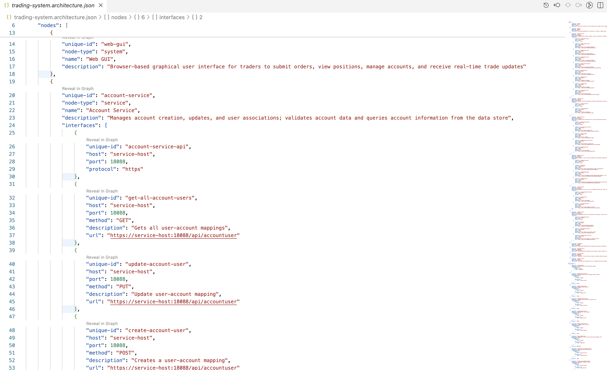
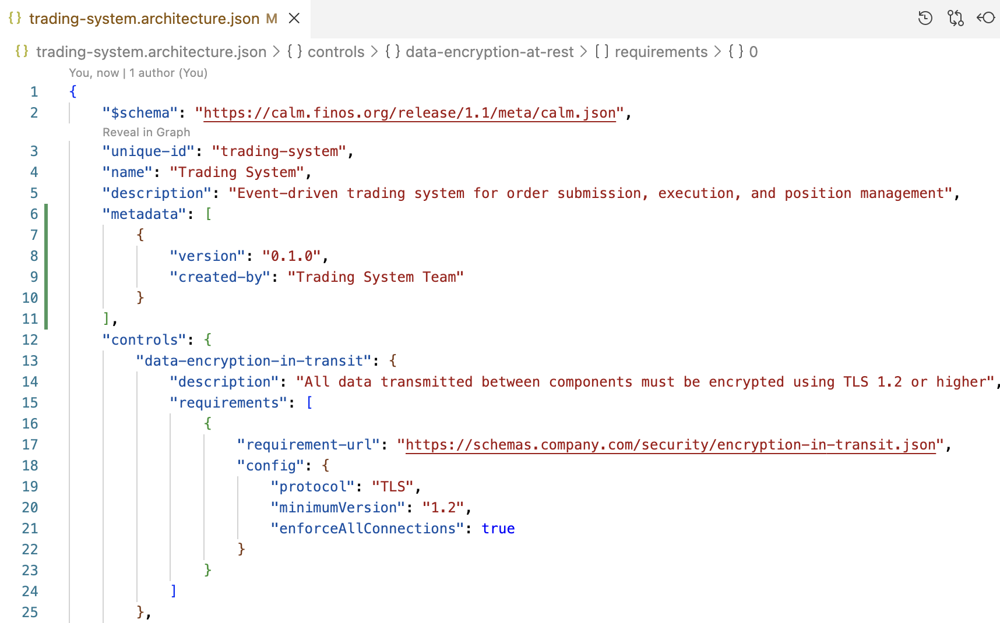

## Add inteface specifications for RESTful Services

We will now enhance the trading system architecture definition by adding interface definitions for the RESTful services.  Here are the specifications by serivce.

### REST API End Point specifications

#### Account Service Interfaces

- unique-id: account-service-api, host: service-host, port: 18088, protocol: https
- unique-id: get-all-account-users, host: service-host, port: 18088, method: GET, description: Gets all user-account mappings, url: https://service-host:18088/api/accountuser
- unique-id: update-account-user, host: service-host, port: 18088, method: PUT, description: Update user-account mapping, url: https://service-host:18088/api/accountuser
- unique-id: create-account-user, host: service-host, port: 18088, method: POST, description: Creates a user-account mapping, url: https://service-host:18088/api/accountuser
- unique-id: get-account-user-by-id, host: service-host, port: 18088, method: GET, description: Gets an account-user mapping, url: https://service-host:18088/api/accountuser/{accountId}
- unique-id: get-all-account, host: service-host, port: 18088, method: GET, description: Retrieves all accounts, url: https://service-host:18088/api/account
- unique-id: update-account, host: service-host, port: 18088, method: PUT, description: Updates an account, url: https://service-host:18088/api/account
- unique-id: create-account, host: service-host, port: 18088, method: POST, description: Creates an account, url: https://service-host:18088/api/account
- unique-id: get-account-by-id, host: service-host, port: 18088, method: GET, description: Gets an account by ID, url: https://service-host:18088/api/account/{accountId}

#### Position Service Interfaces

- unique-id: position-service-api, host: service-host, port: 18090, protocol: https
- unique-id: get-trades-by-account-id, host: service-host, port: 18090, method: GET, description: Get trades by account ID, url: https://service-host:18090/api/trades/{accountId}
- unique-id: get-all-trades, host: service-host, port: 18090, method: GET, description: Get all trades, url: https://service-host:18090/api/trades
- unique-id: get-positions-by-account-id, host: service-host, port: 18090, method: GET, description: Get positions by account ID, url: https://service-host:18090/api/positions/{accountId}
- unique-id: get-all-positions, host: service-host, port: 18090, method: GET, description: Get all positions, url: https://service-host:18090/api/positions

#### Trade Service Interfaces

- unique-id: trade-service-api, host: service-host, port: 18092, protocol: https
- unique-id: create-trade-order, host: service-host, port: 18092, method: POST, description: Create a trade order, url: https://service-host:18092/api/trade

#### Trade Processor Interfaces

- unique-id: trade-processor-api, host: service-host, port: 18091, protocol: https
- unique-id: health, host: service-host, port: 18091, method: GET, description: Simple Healthcheck Endpoint, url: https://service-host:18091/api/health
- unique-id: get-trades-by-account, host: service-host, port: 18091, method: GET, description: Gets trades for a specific account, url: https://service-host:18091/api/trades
- unique-id: get-positions-by-account, host: service-host, port: 18091, method: GET, description: Gets all Positions for a specific account, url: https://service-host:18091/api/positions

#### People Service Interfaces

- unique-id: people-service-api, host: service-host, port: 18089, protocol: https
- unique-id: get-person, host: service-host, port: 18089, method: GET, description: Get a person from directory by logon or employee ID, url: https://service-host:18089/api/People/GetPerson
- unique-id: get-matching-people, host: service-host, port: 18089, method: GET, description: Get all the people from the directory whose logonId or full name contain the search text, url: https://service-host:18089/api/People/GetMatchingPeople
- unique-id: validate-person, host: service-host, port: 18089, method: GET, description: Validate a person against the firmwide directory without returning any attributes, url: https://service-host:18089/api/People/ValidatePerson

#### Reference Data Service Interfaces

- unique-id: reference-data-service-api, host: service-host, port: 18085, protocol: https
- unique-id: get-all-stocks, host: service-host, port: 18085, method: GET, description: Get all securities, url: https://service-host:18085/api/stocks
- unique-id: get-stock-by-ticker, host: service-host, port: 18085, method: GET, description: Get a single security by ticker, url: https://service-host:18085/api/stocks/{tickerSymbol}


We accomplish this by copy/paste the REST specifications into the following prompt.

**Prompt to AI Assistant**
```text
add the following interface definitions to the respective services.
#### Account Service Interfaces

- unique-id: account-service-api, host: service-host, port: 18088, protocol: https
- unique-id: get-all-account-users, host: service-host, port: 18088, method: GET, description: Gets all user-account mappings, url: https://service-host:18088/api/accountuser
- unique-id: update-account-user, host: service-host, port: 18088, method: PUT, description: Update user-account mapping, url: https://service-host:18088/api/accountuser
- unique-id: create-account-user, host: service-host, port: 18088, method: POST, description: Creates a user-account mapping, url: https://service-host:18088/api/accountuser
- unique-id: get-account-user-by-id, host: service-host, port: 18088, method: GET, description: Gets an account-user mapping, url: https://service-host:18088/api/accountuser/{accountId}
- unique-id: get-all-account, host: service-host, port: 18088, method: GET, description: Retrieves all accounts, url: https://service-host:18088/api/account
- unique-id: update-account, host: service-host, port: 18088, method: PUT, description: Updates an account, url: https://service-host:18088/api/account
- unique-id: create-account, host: service-host, port: 18088, method: POST, description: Creates an account, url: https://service-host:18088/api/account
- unique-id: get-account-by-id, host: service-host, port: 18088, method: GET, description: Gets an account by ID, url: https://service-host:18088/api/account/{accountId}

#### Position Service Interfaces

- unique-id: position-service-api, host: service-host, port: 18090, protocol: https
- unique-id: get-trades-by-account-id, host: service-host, port: 18090, method: GET, description: Get trades by account ID, url: https://service-host:18090/api/trades/{accountId}
- unique-id: get-all-trades, host: service-host, port: 18090, method: GET, description: Get all trades, url: https://service-host:18090/api/trades
- unique-id: get-positions-by-account-id, host: service-host, port: 18090, method: GET, description: Get positions by account ID, url: https://service-host:18090/api/positions/{accountId}
- unique-id: get-all-positions, host: service-host, port: 18090, method: GET, description: Get all positions, url: https://service-host:18090/api/positions

#### Trade Service Interfaces

- unique-id: trade-service-api, host: service-host, port: 18092, protocol: https
- unique-id: create-trade-order, host: service-host, port: 18092, method: POST, description: Create a trade order, url: https://service-host:18092/api/trade

#### Trade Processor Interfaces

- unique-id: trade-processor-api, host: service-host, port: 18091, protocol: https
- unique-id: health, host: service-host, port: 18091, method: GET, description: Simple Healthcheck Endpoint, url: https://service-host:18091/api/health
- unique-id: get-trades-by-account, host: service-host, port: 18091, method: GET, description: Gets trades for a specific account, url: https://service-host:18091/api/trades
- unique-id: get-positions-by-account, host: service-host, port: 18091, method: GET, description: Gets all Positions for a specific account, url: https://service-host:18091/api/positions

#### People Service Interfaces

- unique-id: people-service-api, host: service-host, port: 18089, protocol: https
- unique-id: get-person, host: service-host, port: 18089, method: GET, description: Get a person from directory by logon or employee ID, url: https://service-host:18089/api/People/GetPerson
- unique-id: get-matching-people, host: service-host, port: 18089, method: GET, description: Get all the people from the directory whose logonId or full name contain the search text, url: https://service-host:18089/api/People/GetMatchingPeople
- unique-id: validate-person, host: service-host, port: 18089, method: GET, description: Validate a person against the firmwide directory without returning any attributes, url: https://service-host:18089/api/People/ValidatePerson

#### Reference Data Service Interfaces

- unique-id: reference-data-service-api, host: service-host, port: 18085, protocol: https
- unique-id: get-all-stocks, host: service-host, port: 18085, method: GET, description: Get all securities, url: https://service-host:18085/api/stocks
- unique-id: get-stock-by-ticker, host: service-host, port: 18085, method: GET, description: Get a single security by ticker, url: https://service-host:18085/api/stocks/{tickerSymbol}

```

**Response from AI Assistant**
```text
Loading FINOS CALM instructions...

Let me first read the CALM instruction files to understand the current guidance. 

Searched codebase for "read CALM instruction files architecture creation node relationship interface metadata control flow pattern documentation standards", 22 results

Ran terminal command:  find /Users/jim/Desktop/calm-demos/build-calm-architecture/.github/chatmodes/calm-prompts -type f -name "*.md" 2>/dev/null | head -20

I've loaded all the CALM instruction files and I'm ready to assist with CALM architectures.

Now I'll add the interface definitions to the respective services in your trading system architecture. I can see you have several services that need interfaces defined:

1. Account Service
2. Position Service
3. Trade Service
4. Trade Processor
5. People Service
6. Security Master (Reference Data Service)

Let me add these interfaces to each corresponding node: 

Using "Multi-Replace String in Files"

All interface definitions have been successfully added to the respective services. Let me validate the architecture to ensure everything is correct: 

Ran terminal command:  calm validate -a trading-system.architecture.json

Perfect! The architecture has been successfully updated and validated. I've added all the interface definitions to the respective services:

✅ **Account Service** - 9 interfaces (API base + 8 endpoints)
✅ **Position Service** - 5 interfaces (API base + 4 endpoints)
✅ **Trade Service** - 2 interfaces (API base + 1 endpoint)
✅ **Trade Processor** - 4 interfaces (API base + 3 endpoints)
✅ **People Service** - 4 interfaces (API base + 3 endpoints)
✅ **Security Master** - 3 interfaces (API base + 2 endpoints)

The CALM validation confirms there are no errors or warnings. All interfaces follow the `interface-type` approach with flexible properties (`unique-id`, `host`, `port`, `protocol`, `method`, `url`, `description`).

Made changes.
```

Let's look at how the architecture JSON file was updated with the interface definitions.



## Commit architecture file with interface definition to GIT repo

Since the CALM validation passes and a review of the architecture JSON file shows the interface definitions were added, we'll commit the updated architecture file to the GIT repo.

**Prompt to AI Assistant**
```text
git commit architecture file with message "add interface definition for REST services"
```

**Response from AI Assistant**
```text
Ran terminal command:  git add trading-system.architecture.json && git commit -m "add interface definition for REST services"

Done! The architecture file has been committed with the message "add interface definition for REST services". The commit shows 222 insertions and 6 deletions, reflecting all the interface definitions added to the six services.
```

## Add Control Specification

**Prompt to AI Assistant**
```text
add at the overall architecture level, two controls:
* data is encrypted in-transit
* data is encrypted at rest
```

**Response from AI Assistant**
```text
Using "Replace String in File"

Ran terminal command:  calm validate -a trading-system.architecture.json

Perfect! I've added two architecture-level controls:

1. **data-encryption-in-transit** - Requires TLS 1.2+ for all data transmission between components
2. **data-encryption-at-rest** - Requires AES-256 encryption for all stored data

The architecture validates successfully with no errors or warnings. These controls apply to the entire system and all its components.

Made changes.
```

The architecture JSON with control specifications.


_Note_: The values shown in the `requirements` list are illustrative only.  In actual work, the architect should use their organization's approved information.  This information can be provided as part of the prompt or can be manually updated in the JSON file.

## Commit architecture file with controls definition to GIT repo

Since the CALM validation passes and a review of the architecture JSON file shows the controls definitions were added, we'll commit the updated architecture file to the GIT repo.

**Prompt to AI Assistant**
```text
git commit architecture file with message "add architecture controls definition"
```

**Response from AI Assistant**
```text
Ran terminal command:  git add trading-system.architecture.json && git commit -m "add architecture controls definition"

Committed! The architecture file with the two encryption controls has been saved with the message "add architecture controls definition".
```

## Add architecture and node level metadata

For the architecture level, let's add metadata about the version and team responsible for the architecture.

**Prompt to AI Assistant**
```text
add following metadata at the architecture level:
* "version" : "0.1.0"
* "created-by" : "Trading System Team"
```

**Response from AI Assistant**
```text
I'll add the metadata to your architecture document. 

Searched codebase for "trading-system.architecture.json metadata architecture level", 23 results

Now let me read the current architecture file to see its structure: 

Ran terminal command:  head -30 /Users/jim/Desktop/calm-demos/build-calm-architecture/trading-system.architecture.json

Using "Replace String in File"

Now let me validate the architecture to ensure the change is correct: 

Ran terminal command:  calm validate -a trading-system.architecture.json

Perfect! The metadata has been successfully added to the architecture level with:
- **version**: "0.1.0"
- **created-by**: "Trading System Team"

The validation confirms the architecture is valid with no errors or warnings.

Made changes.
```

Screenshot of the metadata added to the architecture json file.




For the nodes, we will add a data classification metadata.

**Prompt to AI Assistant**
```text
For all nodes except `Trader` and `User Directory` add metadata "data-classification" : "Private"
For `User Directory` node add metadata "data-classification" : "PII"
Show me the proposed changes.  I want to review and approve any changes.
```

**Response from AI Assistant**
```text
I'll examine the current architecture and show you the proposed changes for adding data classification metadata to the nodes. 

Ran terminal command:  cat /Users/jim/Desktop/calm-demos/build-calm-architecture/trading-system.architecture.json | jq '.nodes[] | {id: ."unique-id", name: .name, current_metadata: .metadata}'

Now let me get a sample of the node structure to show you the exact changes: 

Ran terminal command:  cat /Users/jim/Desktop/calm-demos/build-calm-architecture/trading-system.architecture.json | jq '.nodes[0:3]'

Perfect! Now I can show you the proposed changes. Here's what will be added to each node:

## Proposed Changes Summary

### Nodes that will get `"data-classification": "Private"` (10 nodes):
1. **Web GUI** - system
2. **Account Service** - service
3. **Trade Service** - service
4. **Position Service** - service
5. **People Service** - service
6. **Security Master** - service
7. **Trade Processor** - service
8. **Trade Feed** - service
9. **Trade Data Store** - database
10. **Ticker CSV File** - system

### Node that will get `"data-classification": "PII"` (1 node):
11. **User Directory** - system

### Node with NO changes (1 node):
12. **Trader** - actor (no metadata added)

---

## Example of Changes

**Before** (e.g., Web GUI node):
```json
{
  "unique-id": "web-gui",
  "node-type": "system",
  "name": "Web GUI",
  "description": "Browser-based graphical user interface..."
}
```

**After** (Web GUI node):
```json
{
  "unique-id": "web-gui",
  "node-type": "system",
  "name": "Web GUI",
  "description": "Browser-based graphical user interface...",
  "metadata": [
    {
      "data-classification": "Private"
    }
  ]
}
```

**User Directory** (PII classification):
```json
{
  "unique-id": "user-directory",
  "node-type": "system",
  "name": "User Directory",
  "description": "...",
  "metadata": [
    {
      "data-classification": "PII"
    }
  ]
}
```

---

**Would you like me to proceed with these changes?** Please confirm and I'll apply them to the architecture file.
```

**Prompt to AI Assistant**
```text
yes
```

**Response from AI Assistant**
```text
Ran terminal command:  cat /Users/jim/Desktop/calm-demos/build-calm-architecture/trading-system.architecture.json

Using "Multi-Replace String in Files"

Perfect! I've successfully added the data classification metadata to all the requested nodes. Let me verify the changes: 

Ran terminal command:  cat /Users/jim/Desktop/calm-demos/build-calm-architecture/trading-system.architecture.json | jq '.nodes[] | {id: ."unique-id", name: .name, data_classification: .metadata[0]."data-classification"}'

✅ **Changes successfully applied!**

**Summary:**
- **Trader** - No metadata added (as requested)
- **User Directory** - `data-classification: "PII"` ✓
- **All other 10 nodes** - `data-classification: "Private"` ✓

All data classification metadata has been added correctly to your trading system architecture.

Made changes.
```

After making the change, the AI Assistant did not validate the integrity of the architecture file.  We explicitly ask the AI Assistant to validate the architecture file.

**Prompt to AI Assistant**
```text
validate the architecture file
```

**Response from AI Assistant**
```text
Ran terminal command:  calm validate -a /Users/jim/Desktop/calm-demos/build-calm-architecture/trading-system.architecture.json

✅ **Architecture validation successful!**

The trading-system.architecture.json file is valid with:
- No schema validation errors
- No warnings
- All metadata additions conform to the CALM 1.1 specification
```

## Commit metadata changes to the GIT Repo

With the architectue file validate with the metadata changes, commit the changes to the GIT repo.

**Prompt to AI Assistant**
```text
git commit with message "add architecture and node metadata"
```

**Response from AI Assistant**
```text
Ran terminal command:  git add trading-system.architecture.json && git commit -m "add architecture and node metadata"

✅ Committed successfully! The changes to trading-system.architecture.json (66 insertions, 5 deletions) have been committed with message "add architecture and node metadata".
```

## Summary

In this portion of the tutorial we have enhanced the architecture definition with technical information, i.e., endpoint specifications, Controls, and metadata.

In the next section we look at two methods for communicating the content of the architecture.