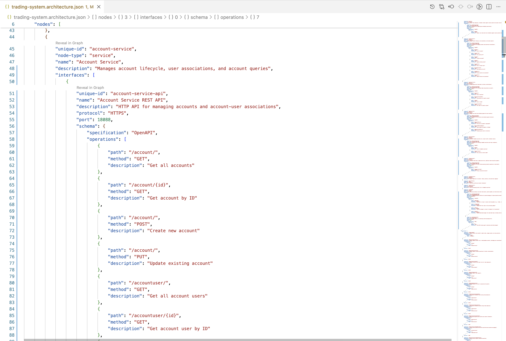
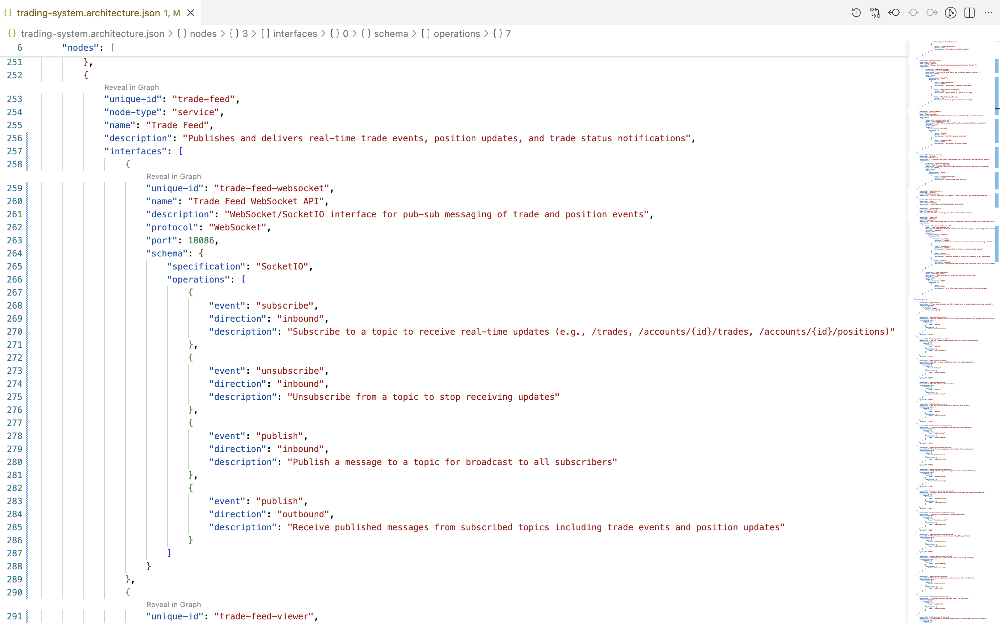
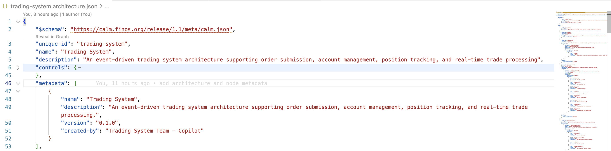

_Note_: Responses from the AI Assistant were lightly editted for readbility.

## Add inteface specifications for Services

We will now enhance the trading system architecture definition by adding interface definitions for the services.

## Identify application endpoints

Using the AI Assistant identify all the nodes that are services.  

**Prompt to AI Assistant**
```text
what are the nodes that are services
```

_Note_: The `trading-syste.achicture.json` file is added to the context for this prompt.

**Response from AI Assistant**
```text
Looking at the CALM architecture file, here are the nodes with `node-type: "service"`:

1. **Trade Service** - Handles trade submission, validates tickets against security master and account service
2. **Account Service** - Manages account lifecycle, user associations, and account queries
3. **Position Service** - Provides position and trade data for blotter initialization
4. **People Service** - Manages user search and validation against the user directory
5. **Security Master** - Maintains tradeable securities list, loads from CSV, validates tickers
6. **Trade Processor** - Processes trade events, updates data store, publishes trade and position updates
7. **Trade Feed** - Publishes and delivers real-time trade events, position updates, and trade status notifications

These 7 services form the core processing layer of the trading system architecture, 
sitting between the web GUI and the data storage/directory components.
```

We will now ask the AI Assistant to review the application source code to pull out the endpoint information for each of the services.

**Prompt to AI Assistant**
```text
for each of the services listed, identify the service endpoints in the #codebase.  
For each enpoint, extract the following:
-description
-path
-method
-port

If you are unable to find endpoint information for that service in the code, 
respond "Unable to find endpoint information"
```

_Note_: It is a good practice to be explicit with how the AI Assistant should respond if information is not present.  Othewerise the AI Assistant may hallucinate incorrect information.

**Response from AI Assistant**
```text
Searched codebase for "for each of the services listed, identify the service endpoints in the #codebase.  For each enpoint, extract the following:
-description
-path
-method
-port

If you are unable to find endpoint information for that service in the code, respond "Unable to find endpoint information"", 26 results

I'll search the codebase for endpoint information for each service.       

Searched codebase for "Trade Service API endpoints routes controller REST methods paths", 20 results

Searched codebase for "Account Service API endpoints routes controller REST methods paths", 16 results

Searched codebase for "Position Service API endpoints routes controller REST methods paths", 22 results

Searched codebase for "People Service API endpoints routes controller REST methods paths", 15 results

Searched codebase for "Security Master reference data API endpoints routes controller REST methods paths", 25 results

Searched codebase for "Trade Processor API endpoints routes controller REST methods paths", 23 results

Searched codebase for "Trade Feed API endpoints routes controller WebSocket paths", 24 results

Let me search for specific port configurations and README files for each service to get complete endpoint information.  

Searched codebase for "service port 18088 18089 18090 18091 18092 18085 18086 configuration environment variable", 27 results

Searched codebase for "openapi.json swagger spec API documentation endpoint paths", 21 results

Based on my search of the codebase, here are the service endpoints I found:


## **1. Trade Service**
**Port:** 18092

| Description | Path | Method |
|-------------|------|--------|
| Submit a new trade order | `/trade/` | POST |

---

## **2. Account Service**
**Port:** 18088

| Description | Path | Method |
|-------------|------|--------|
| Get all accounts | `/account/` | GET |
| Get account by ID | `/account/{id}` | GET |
| Create account | `/account/` | POST |
| Update account | `/account/` | PUT |
| Get all account users | `/accountuser/` | GET |
| Get account user by ID | `/accountuser/{id}` | GET |
| Create account user | `/accountuser/` | POST |
| Update account user | `/accountuser/` | PUT |

---

## **3. Position Service**
**Port:** 18090

| Description | Path | Method |
|-------------|------|--------|
| Get all positions | `/positions/` | GET |
| Get positions by account ID | `/positions/{accountId}` | GET |
| Get all trades | `/trades/` | GET |
| Get trades by account ID | `/trades/{accountId}` | GET |

---

## **4. People Service**
**Port:** 18089

| Description | Path | Method |
|-------------|------|--------|
| Get a person by logonId or employeeId | `/People/GetPerson` | GET |
| Get matching people by search text | `/People/GetMatchingPeople` | GET |
| Validate a person | `/People/ValidatePerson` | GET |

---

## **5. Security Master (Reference Data Service)**
**Port:** 18085

| Description | Path | Method |
|-------------|------|--------|
| Get all stocks | `/stocks` | GET |
| Get stock by ticker | `/stocks/{ticker}` | GET |

---

## **6. Trade Processor**
**Port:** 18091

| Description | Path | Method |
|-------------|------|--------|
| Process trade order | `/tradeservice/order` | POST |

*Note: This service primarily operates via the trade feed message bus (WebSocket/SocketIO) and 
this REST endpoint appears to be for testing/alternate invocation.*

---

## **7. Trade Feed**
**Port:** 18086

This service uses **WebSocket/SocketIO** for publish-subscribe messaging pattern rather than traditional REST endpoints. It provides:
- WebSocket connection for real-time trade and position updates
- Publish/Subscribe topics for trades and positions
- GET `/` - HTML viewer page for monitoring messages
```

### REST API Endpoint specifications

Since there are two types of endpoints: REST and WebSocket, we will first create CALM interface specfications 
for the RESTful services.

**Prompt to AI Assistant**
```text
Except for the "Trade Feed" service node propose endpoint CALM interface specifications for the node.  
Show the recommendation.  I want to review and approve the change.
```

**Response from AI Assistant**
````text
Based on the endpoints I found in the codebase, here are my proposed CALM interface specifications for each service node (excluding Trade Feed):

## **1. Trade Service**
```json
{
  "unique-id": "trade-service",
  "node-type": "service",
  "name": "Trade Service",
  "description": "Handles trade submission, validates tickets against security master and account service",
  "interfaces": [
    {
      "unique-id": "trade-service-api",
      "name": "Trade Service REST API",
      "description": "HTTP API for submitting and validating trade orders",
      "protocol": "HTTPS",
      "port": 18092,
      "schema": {
        "specification": "OpenAPI",
        "operations": [
          {
            "path": "/trade/",
            "method": "POST",
            "description": "Submit a new trade order with validation against security master and account service"
          }
        ]
      }
    }
  ]
}
```

## **2. Account Service**

```json
{
  "unique-id": "account-service",
  "node-type": "service",
  "name": "Account Service",
  "description": "Manages account lifecycle, user associations, and account queries",
  "interfaces": [
    {
      "unique-id": "account-service-api",
      "name": "Account Service REST API",
      "description": "HTTP API for managing accounts and account-user associations",
      "protocol": "HTTPS",
      "port": 18088,
      "schema": {
        "specification": "OpenAPI",
        "operations": [
          {
            "path": "/account/",
            "method": "GET",
            "description": "Get all accounts"
          },
          {
            "path": "/account/{id}",
            "method": "GET",
            "description": "Get account by ID"
          },
          {
            "path": "/account/",
            "method": "POST",
            "description": "Create new account"
          },
          {
            "path": "/account/",
            "method": "PUT",
            "description": "Update existing account"
          },
          {
            "path": "/accountuser/",
            "method": "GET",
            "description": "Get all account users"
          },
          {
            "path": "/accountuser/{id}",
            "method": "GET",
            "description": "Get account user by ID"
          },
          {
            "path": "/accountuser/",
            "method": "POST",
            "description": "Create account user association"
          },
          {
            "path": "/accountuser/",
            "method": "PUT",
            "description": "Update account user association"
          }
        ]
      }
    }
  ]
}
```

## **3. Position Service**

```json
{
  "unique-id": "position-service",
  "node-type": "service",
  "name": "Position Service",
  "description": "Provides position and trade data for blotter initialization",
  "interfaces": [
    {
      "unique-id": "position-service-api",
      "name": "Position Service REST API",
      "description": "HTTP API for retrieving trades and positions by account",
      "protocol": "HTTPS",
      "port": 18090,
      "schema": {
        "specification": "OpenAPI",
        "operations": [
          {
            "path": "/positions/",
            "method": "GET",
            "description": "Get all positions"
          },
          {
            "path": "/positions/{accountId}",
            "method": "GET",
            "description": "Get positions for specific account"
          },
          {
            "path": "/trades/",
            "method": "GET",
            "description": "Get all trades"
          },
          {
            "path": "/trades/{accountId}",
            "method": "GET",
            "description": "Get trades for specific account"
          }
        ]
      }
    }
  ]
}
```

## **4. People Service**

```json
{
  "unique-id": "people-service",
  "node-type": "service",
  "name": "People Service",
  "description": "Manages user search and validation against the user directory",
  "interfaces": [
    {
      "unique-id": "people-service-api",
      "name": "People Service REST API",
      "description": "HTTP API for user search and validation against directory",
      "protocol": "HTTPS",
      "port": 18089,
      "schema": {
        "specification": "OpenAPI",
        "operations": [
          {
            "path": "/People/GetPerson",
            "method": "GET",
            "description": "Get person by logonId or employeeId"
          },
          {
            "path": "/People/GetMatchingPeople",
            "method": "GET",
            "description": "Search people by logonId or fullName"
          },
          {
            "path": "/People/ValidatePerson",
            "method": "GET",
            "description": "Validate person exists in directory"
          }
        ]
      }
    }
  ]
}
```

## **5. Security Master (Reference Data)**

```json
{
  "unique-id": "security-master",
  "node-type": "service",
  "name": "Security Master",
  "description": "Maintains tradeable securities list, loads from CSV, validates tickers",
  "interfaces": [
    {
      "unique-id": "security-master-api",
      "name": "Security Master REST API",
      "description": "HTTP API for retrieving tradeable securities and ticker validation",
      "protocol": "HTTPS",
      "port": 18085,
      "schema": {
        "specification": "OpenAPI",
        "operations": [
          {
            "path": "/stocks",
            "method": "GET",
            "description": "Get all tradeable securities"
          },
          {
            "path": "/stocks/{ticker}",
            "method": "GET",
            "description": "Get security by ticker symbol"
          }
        ]
      }
    }
  ]
}
```

## **6. Trade Processor**

```json
{
  "unique-id": "trade-processor",
  "node-type": "service",
  "name": "Trade Processor",
  "description": "Processes trade events, updates data store, publishes trade and position updates",
  "interfaces": [
    {
      "unique-id": "trade-processor-api",
      "name": "Trade Processor REST API",
      "description": "HTTP API for direct trade processing (primarily operates via trade feed)",
      "protocol": "HTTPS",
      "port": 18091,
      "schema": {
        "specification": "OpenAPI",
        "operations": [
          {
            "path": "/tradeservice/order",
            "method": "POST",
            "description": "Process trade order directly"
          }
        ]
      }
    }
  ]
}
```

---

**Summary**: These interface specifications add the `interfaces` property to each service node, 
documenting their REST APIs with port numbers, protocols, and detailed operation paths. All port 
numbers and endpoints are based on actual code in the repository.

**Please review and approve if you'd like me to add these interfaces to the architecture file.**
````

The architect spot checks the proposed interface specifications against the application source code and the proposal looks good.

**Prompt to AI Assistant**
```text
I approve the interfaces, please add to the architecture file
```

**Response from AI Assistant**
```text
Replacing 36 lines with 215 lines in [](file:trading-system.architecture.json)

Done! I've successfully added the interface specifications to all six service nodes in the architecture file:

✅ **Trade Service** - 1 POST endpoint on port 18092
✅ **Account Service** - 8 endpoints (GET/POST/PUT) on port 18088
✅ **Position Service** - 4 GET endpoints on port 18090
✅ **People Service** - 3 GET endpoints on port 18089
✅ **Security Master** - 2 GET endpoints on port 18085
✅ **Trade Processor** - 1 POST endpoint on port 18091

The Trade Feed service was left unchanged as requested. Each interface specification includes the protocol (HTTPS), port number, and detailed operation information with paths, methods, and descriptions based on the actual endpoints found in the codebase.

Made changes.
```

Since an update was made to the architecture file, we need to validate that the updates conform to the CALM schema.  If there any issues, it is better to catch problems early.

**Prompt to AI Assistant**
```text
validate the architecture file
```

**Response from AI Assistant**
```text
Ran terminal command:  calm validate -a trading-system.architecture.json -f pretty

✅ **Validation successful!** 

The architecture file passes validation with:
- **0 errors**
- **0 warnings**  
- **0 info/hints**

The CALM architecture file is valid and conforms to the CALM 1.1 schema.
```

The RESTful interface specfications pass validation, we can now commit the changes to the repo.

**Prompt to AI Assistant**
```text
commit the interface updates with message "add interface specification for REST services"
```

**Response from AI Assistant**
```text
Ran terminal command:  git add trading-system.architecture.json && git commit -m "add interface specification for REST services"

✅ **Committed successfully!**

- **Commit:** 5abc08e
- **Changes:** 1 file changed, 809 insertions
- **Message:** "add interface specification for REST services"

The interface specifications for all six REST services have been committed to the repository.
```

### Trade Feed Sevice interface specification

Let's now focus on the Trade Feed WebSocket/SocketIO interface.

**Prompt to AI Assistant**
```text
For the "Trade Feed" service, propose a CALM interface specfication. Display the propsal. 
I want to review and approve any changes.
```

**Response from AI Assistant**
````text
Based on the Trade Feed service code, here's my proposed CALM interface specification:

## **Trade Feed Service Interface Proposal**

```json
{
  "unique-id": "trade-feed",
  "node-type": "service",
  "name": "Trade Feed",
  "description": "Publishes and delivers real-time trade events, position updates, and trade status notifications",
  "interfaces": [
    {
      "unique-id": "trade-feed-websocket",
      "name": "Trade Feed WebSocket API",
      "description": "WebSocket/SocketIO interface for pub-sub messaging of trade and position events",
      "protocol": "WebSocket",
      "port": 18086,
      "schema": {
        "specification": "SocketIO",
        "operations": [
          {
            "event": "subscribe",
            "direction": "inbound",
            "description": "Subscribe to a topic to receive real-time updates (e.g., /trades, /accounts/{id}/trades, /accounts/{id}/positions)"
          },
          {
            "event": "unsubscribe",
            "direction": "inbound",
            "description": "Unsubscribe from a topic to stop receiving updates"
          },
          {
            "event": "publish",
            "direction": "inbound",
            "description": "Publish a message to a topic for broadcast to all subscribers"
          },
          {
            "event": "publish",
            "direction": "outbound",
            "description": "Receive published messages from subscribed topics including trade events and position updates"
          }
        ]
      }
    },
    {
      "unique-id": "trade-feed-viewer",
      "name": "Trade Feed Viewer",
      "description": "HTML interface for monitoring real-time message flow",
      "protocol": "HTTPS",
      "port": 18086,
      "schema": {
        "specification": "HTML",
        "operations": [
          {
            "path": "/",
            "method": "GET",
            "description": "Serve HTML viewer page for monitoring trade feed messages"
          }
        ]
      }
    }
  ]
}
```

---

## **Key Points:**

1. **Two interfaces** are defined:
   - **WebSocket interface** for the pub-sub messaging system (primary functionality)
   - **HTTP interface** for the viewer HTML page

2. **WebSocket operations** include both inbound (client actions) and outbound (server messages) events

3. **Common topic patterns** mentioned in description:
   - `/trades` - new trade events
   - `/accounts/{id}/trades` - account-specific trade updates  
   - `/accounts/{id}/positions` - account-specific position updates

4. **Protocol** is WebSocket (using SocketIO library)

5. **Port** is 18086 for both interfaces

---

**Please review and let me know if you approve this interface specification for the Trade Feed service, 
or if you'd like any modifications.**
````

**Prompt to AI Assistant**
```text
I approve change, add to architecture file and validate the updated architecture file
```

**Response from AI Assistant**
```text
Replacing 6 lines with 57 lines in [](file:trading-system.architecture.json)


Ran terminal command:  calm validate -a trading-system.architecture.json -f pretty

✅ **Changes applied and validated successfully!**

**Added to Trade Feed service:**
- **WebSocket interface** (port 18086) with 4 SocketIO operations:
  - Subscribe to topics (inbound)
  - Unsubscribe from topics (inbound)
  - Publish messages (inbound)
  - Receive published messages (outbound)
  
- **Viewer interface** (port 18086) with HTTP GET endpoint for monitoring page

**Validation results:**
- **0 errors**
- **0 warnings**
- **0 info/hints**

The architecture file now has complete interface specifications for all 7 services and passes CALM 1.1 schema validation.

Made changes.
```

**Prompt to AI Assistant**
```text
commit change to architecture file with message "add Trade Feed websocket interface specification"
```

**Response from AI Assistant**
```
Ran terminal command:  git add trading-system.architecture.json && git commit -m "add Trade Feed websocket interface specification"

✅ **Committed successfully!**

- **Commit:** b5742af
- **Changes:** 1 file changed, 52 insertions(+), 1 deletion(-)
- **Message:** "add Trade Feed websocket interface specification"

The Trade Feed WebSocket and viewer interface specifications have been committed to the repository.
```

Let's look at how the architecture JSON file was updated with the interface definitions.

**REST Example**


**WebSocket Example**



## Add Control Specification

**Prompt to AI Assistant**
```text
Add architecture level controls for:

Encryption in Transit
- All data transmitted between system components must be encrypted.
- Use TLS with a minimum version of 1.3.
- Use modern cipher suites suitable for strong encryption.
- Certificates must be validated.
- Mutual TLS is recommended for internal service-to-service communication.

Encryption at Rest
- All stored data must be encrypted at rest.
- Use strong encryption equivalent to AES-256.
- Encryption keys must be managed using a hardware-backed or managed key system.
- Keys should be rotated regularly (for example, every 90 days).
- This applies to:
  - Databases
  - File systems
  - Object storage
  - Backups
```

**Response from AI Assistant**
```text
I'll add architecture-level controls for encryption in transit and encryption at rest to your trading system architecture. 

Replacing 6 lines with 46 lines in [](file:trading-system.architecture.json)

Ran terminal command:  calm validate -a trading-system.architecture.json

Architecture-level controls have been successfully added to trading-system.architecture.json. The controls include:

**Encryption in Transit**
- TLS 1.3 minimum version
- Modern cipher suites (TLS_AES_256_GCM_SHA384, TLS_CHACHA20_POLY1305_SHA256, TLS_AES_128_GCM_SHA256)
- Required certificate validation
- Recommended mutual TLS for service-to-service communication

**Encryption at Rest**  
- AES-256 encryption algorithm
- Hardware-backed key management
- 90-day key rotation period
- Applies to databases, file systems, object storage, and backups

The architecture validates successfully with no errors or warnings. To regenerate the HTML documentation with these controls, run:

Made changes.
```

The architecture JSON with control specifications.


_Note_: The values shown in the `requirements` list are illustrative only.  In actual work, the architect should use their organization's approved information.  This information can be provided as part of the prompt or can be manually updated in the JSON file.

## Commit architecture file with controls definition to GIT repo

Since the CALM validation passes and a review of the architecture JSON file shows the controls definitions were added, we'll commit the updated architecture file to the GIT repo.

**Prompt to AI Assistant**
```text
git commit architecture file with message "add architecture controls definition"
```

**Response from AI Assistant**
```text
Ran terminal command:  git add trading-system.architecture.json && git commit -m "add architecture controls definition"

Committed successfully on branch (commit `4dacbf9`). The architecture file with the new encryption controls has been saved.
```

## Add architecture and node level metadata

For the architecture level, let's add metadata about the version and team responsible for the architecture.

**Prompt to AI Assistant**
```text
add following metadata at the architecture level:
* "name": "Trading System"
* "description": "An event-driven trading system architecture supporting order submission, account management, position tracking, and real-time trade processing."
* "version" : "0.1.0"
* "created-by" : "Trading System Team - Copilot"
```

**Response from AI Assistant**
```text
Replacing 6 lines with 12 lines in [](file:trading-system.architecture.json)

Ran terminal command:  calm validate -a trading-system.architecture.json

Architecture-level metadata added successfully. The architecture validates with no errors or warnings.

Made changes.
```

Screenshot of the metadata added to the architecture json file.




For the nodes, we will add a data classification metadata.

**Prompt to AI Assistant**
```text
For all nodes except `Trader` and `User Directory` add metadata "data-classification" : "Private"
For `User Directory` node add metadata "data-classification" : "PII"
Show me the proposed changes.  I want to review and approve any changes.
```

**Response from AI Assistant**
````text
I'll show you the proposed metadata additions for each node:

## Proposed Changes

### Nodes with NO changes:
- **trader** - No metadata added (as requested)

### Nodes receiving `"data-classification": "Private"`:
1. **web-gui** (Web GUI)
2. **trade-service** (Trade Service)
3. **account-service** (Account Service)
4. **position-service** (Position Service)
5. **people-service** (People Service)
6. **security-master** (Security Master)
7. **trade-processor** (Trade Processor)
8. **trade-data-store** (Trade Data Store)
9. **ticker-csv-file** (Ticker CSV File)
10. **trade-feed** (Trade Feed)

### Nodes receiving `"data-classification": "PII"`:
- **user-directory** (User Directory)

## Example of how it will look:

**Before (web-gui):**
```json
{
    "unique-id": "web-gui",
    "node-type": "webclient",
    "name": "Web GUI",
    "description": "User-facing interface for trading operations, account management, and viewing positions"
}
```

**After (web-gui):**
```json
{
    "unique-id": "web-gui",
    "node-type": "webclient",
    "name": "Web GUI",
    "description": "User-facing interface for trading operations, account management, and viewing positions",
    "metadata": {
        "data-classification": "Private"
    }
}
```

**After (user-directory):**
```json
{
    "unique-id": "user-directory",
    "node-type": "ldap",
    "name": "User Directory",
    "description": "Stores user profiles and contact information",
    "metadata": {
        "data-classification": "PII"
    }
}
```

Would you like me to proceed with these changes?
````

**Prompt to AI Assistant**
```text
yes
```

**Response from AI Assistant**
```text
Replacing 66 lines with 99 lines in [](file:trading-system.architecture.json)

Ran terminal command:  calm validate -a trading-system.architecture.json

Successfully added data classification metadata to all nodes:
- 10 nodes with `"data-classification": "Private"`
- 1 node (user-directory) with `"data-classification": "PII"`
- trader node unchanged (as requested)

The architecture validates successfully with no errors or warnings.

Made changes.
```

## Commit metadata changes to the GIT Repo

With the architectue file validate with the metadata changes, commit the changes to the GIT repo.

**Prompt to AI Assistant**
```text
git commit with message "add architecture and node metadata"
```

**Response from AI Assistant**
```text
Ran terminal command:  git add trading-system.architecture.json && git commit -m "add architecture and node metadata"

Committed successfully on branch (commit `8393257`). The changes include architecture-level and node-level metadata additions.
```

## Summary

In this portion of the tutorial we have enhanced the architecture definition with technical information, i.e., endpoint specifications, Controls, and metadata.

Here is the <a href="/calm-example/trading-system.architecture.json" target="_blank">completed CALM Architecture</a>

In the next section we look at two methods for communicating the content of the architecture.