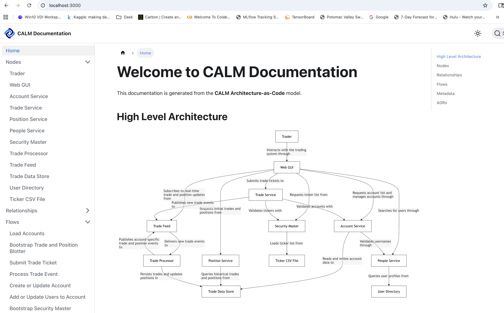
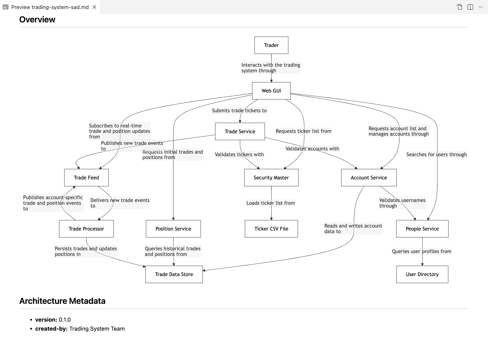
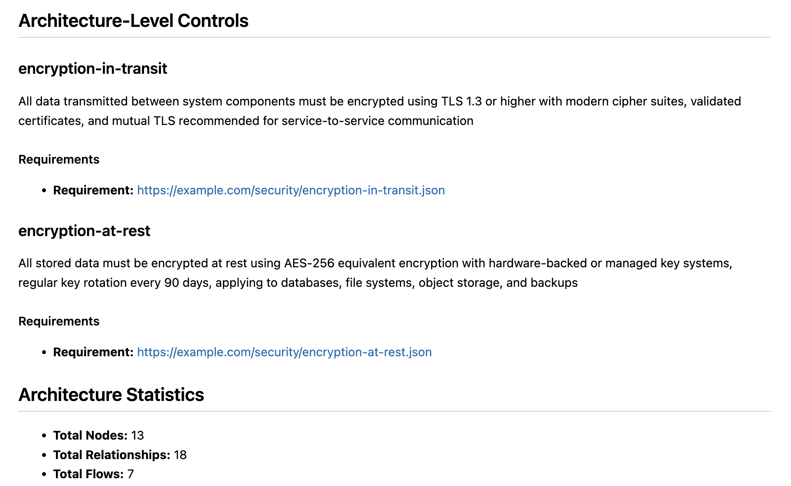
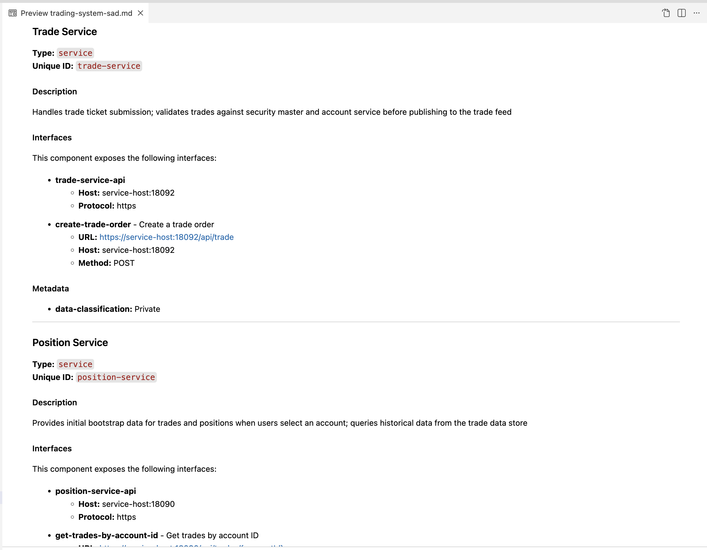
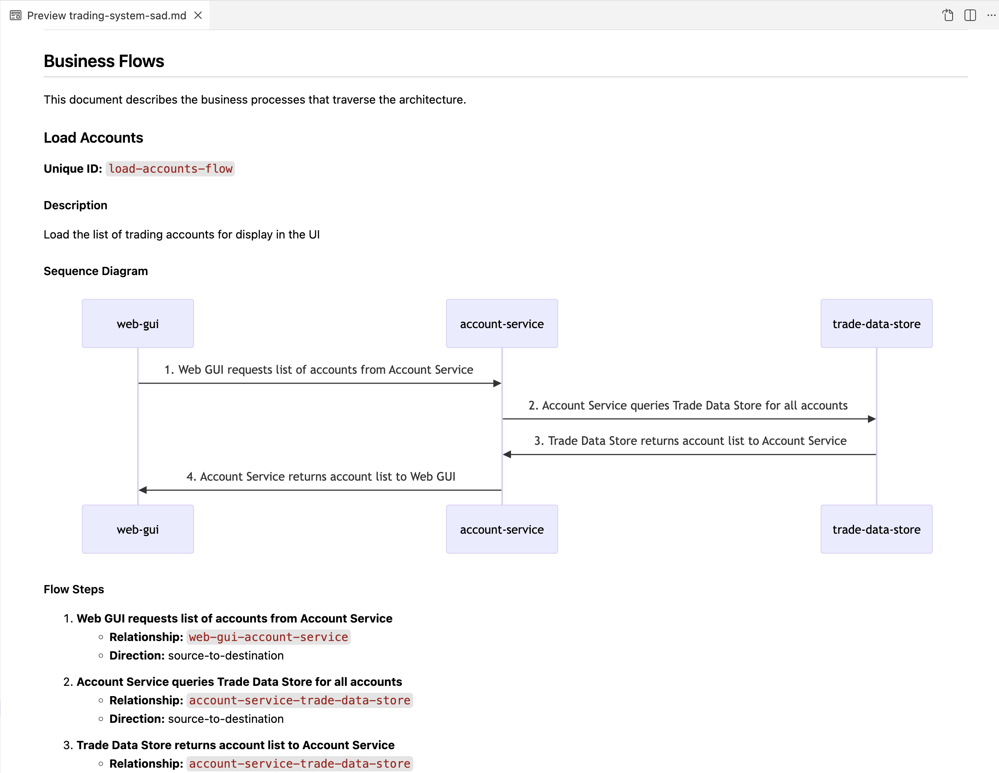

_Note_: Responses from the AI Assistant were lightly edited for readability.

We demonstrate two ways to generate viewable architecture documentation.  The first method generates content that is viewable via a web browser.  The second approach uses CALM templating functions to generate a custom view of the architecture

## Method 1: Create viewable web content

Here are going to use the AI Assistant to create architecture documentation that viewable via a web browser.

**Prompt to AI Assistant**
```text
create web viewable architecture documentation in folder docs/html
```

**Response from AI Assistant**
```text
Loading FINOS CALM instructions... 

Searched codebase for "CALM architecture documentation creation HTML web viewable", 9 results

Ran terminal command:  cat .github/chatmodes/calm-prompts/architecture-creation.md

Ran terminal command:  cat .github/chatmodes/calm-prompts/documentation-creation.md

Ran terminal command:  cat .github/chatmodes/calm-prompts/calm-cli-instructions.md | grep -A 30 "## Docify Command"

Ran terminal command:  ls -la calm-demos/build-calm-architecture/

Ran terminal command:  which calm

Ready to assist with CALM architectures! I'll now create web-viewable HTML documentation for your trading system architecture. 

Ran terminal command:  mkdir -p calm-demos/build-calm-architecture/docs/html

Ran terminal command:  calm docify -a trading-system.architecture.json -o docs/html --verbose

Perfect! The documentation has been generated. Now let me check what was created and set up the viewing environment: 

Ran terminal command:  ls -la calm-demos/build-calm-architecture/docs/html/

Ran terminal command:  cd calm-demos/build-calm-architecture/docs/html && npm install

Ran terminal command:  npm start

Ran terminal command:  cat calm-demos/build-calm-architecture/docs/html/package.json

Ran terminal command:  cd calm-demos/build-calm-architecture/docs/html && npx docusaurus start

Excellent! I've successfully created web-viewable HTML architecture documentation in the html folder. Here's what was accomplished:

## Created Documentation

✅ **Location**: html

✅ **Technology**: Docusaurus-based documentation site

✅ **Generated Content**:
- Architecture overview
- Node documentation
- Relationship documentation  
- Flow documentation (5 flows):
  - Submit Trade Flow
  - Process Trade Event
  - Create or Update Account
  - Add or Update Users to Account
  - Bootstrap Security Master

✅ **Web Server**: Running at **http://localhost:3000/**

## What You Can Do Now

You can:
1. **View the documentation** by opening http://localhost:3000/ in your browser
2. **Build static HTML** for deployment: `cd docs/html && npm run build`
3. **Deploy the built site** from the `docs/html/build` folder to any web server

The documentation includes interactive navigation, search functionality, and full visualization 
of your trading system architecture with all nodes, relationships, and business flows.

```

Open a browser to `http://localhost:3000`.  You should see a web page similar to this 

## Method 2: Custom View of the architecture

This method uses CALM's templating function to create a custom markdown view of the architecture.  A detailed discussion of CALM templating and how to create one is beyond the scope of this tutorial.  

In this section we will show how to generate the custom view given that a template already exists.  For this exercise we are using this <a href="/calm-template/solution-architecture-document.md" target="_blank">custom template</a>.

To reproduce this example, download the template file and save it as `solution-architecture-document.md`.   Now run the following command

```shell
$ calm docify -a trading-system.architecture.json \
  -o trading-system-sad.md \
  -t solution-architecture-document.md
```

This should generate output similar to the following and create a file called `trading-system-sad.md`.
```text
info [_TemplateProcessor]:     Using SelfProvidedTemplateLoader for single template file
[WidgetEngine] ⚠️ Helper 'lookup' is already registered. Skipping registration.
info [_TemplateProcessor]:     ✅ Output directory exists: calm-demos/build-calm-architecture
warn [_TemplateProcessor]:     ⚠️ Output directory is not empty. Any files not overwritten will remain untouched.
info [_TemplateProcessor]:     ℹ️ No transformer specified in index.json. Will use TemplateDefaultTransformer.
info [_TemplateProcessor]:     🔁 No transformer provided. Using TemplateDefaultTransformer.
info [_HttpReferenceResolver]:     Fetching reference via HTTP: https://schemas.company.com/security/encryption-in-transit.json
info [_CompositeReferenceResolver]:     HTTP resolution failed for https://schemas.company.com/security/encryption-in-transit.json with Error: HTTP request failed for https://schemas.company.com/security/encryption-in-transit.json: getaddrinfo ENOTFOUND schemas.company.com
Failed to dereference Resolvable: https://schemas.company.com/security/encryption-in-transit.json Composite resolver: Unable to resolve reference https://schemas.company.com/security/encryption-in-transit.json
info [_HttpReferenceResolver]:     Fetching reference via HTTP: https://schemas.company.com/security/encryption-at-rest.json
info [_CompositeReferenceResolver]:     HTTP resolution failed for https://schemas.company.com/security/encryption-at-rest.json with Error: HTTP request failed for https://schemas.company.com/security/encryption-at-rest.json: getaddrinfo ENOTFOUND schemas.company.com
Failed to dereference Resolvable: https://schemas.company.com/security/encryption-at-rest.json Composite resolver: Unable to resolve reference https://schemas.company.com/security/encryption-at-rest.json
info [_TemplateEngine]:     ✅ Compiled 1 Templates
info [_TemplateEngine]:     🔧 Registering Handlebars Helpers...
info [_TemplateEngine]:     ✅ Registered helper: eq
info [_TemplateEngine]:     ✅ Registered helper: lookup
info [_TemplateEngine]:     ✅ Registered helper: json
info [_TemplateEngine]:     ✅ Registered helper: instanceOf
info [_TemplateEngine]:     ✅ Registered helper: kebabToTitleCase
info [_TemplateEngine]:     ✅ Registered helper: kebabCase
info [_TemplateEngine]:     ✅ Registered helper: isObject
info [_TemplateEngine]:     ✅ Registered helper: isArray
info [_TemplateEngine]:     ✅ Registered helper: join
info [_TemplateEngine]:     
🔹 Starting Template Generation...
info [_TemplateEngine]:     ✅ Generated: calm-demos/build-calm-architecture/trading-system-sad.md
info [_TemplateEngine]:     
✅ Template Generation Completed!
info [_TemplateProcessor]:     
✅ Template Generation Completed!
```

---

These are screenshots of portions of the generated markdown document.

### Overall Architecture with metadata


### Architecture Controls and Statistics


### Example Node information


### Example Process Flow information


---

This is the fully generated custom <a href="/calm-example/trading-system-sad.md" target="_blank">Solution Architecture Markdown Document</a> based on the custom template.


## Summary

In this section of the tutorial we showed two different methods for generating human readable architecture content.

The next and final section will summarize key takeaways from this Practioner's tutorial.


