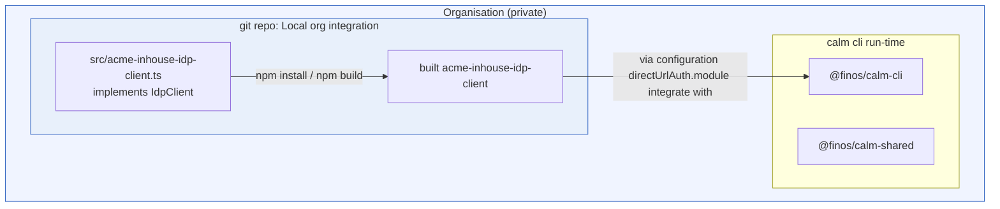

<!-- TODO: expand this placeholder with the full write-up. -->

This page walks through a local test environment for the CALM CLI's `directUrlAuth` plugin, focused on the `start-webserver-mixedenv` setup.

## Test Environment Setup

<!-- TODO: describe the start-webserver-mixedenv test environment. -->

## CALM Architecture

<!-- TODO: link to the CALM architecture for this setup. -->

[CALM Architecture]()

## Sample Code

<!-- TODO: link to the directUrlAuth plugin sample source code. -->

[Sample Code]()

## Testing Instructions

<!-- TODO: fill in the steps for using this setup to test the directUrlAuth plugin. -->

1. TODO
2. TODO
3. TODO
