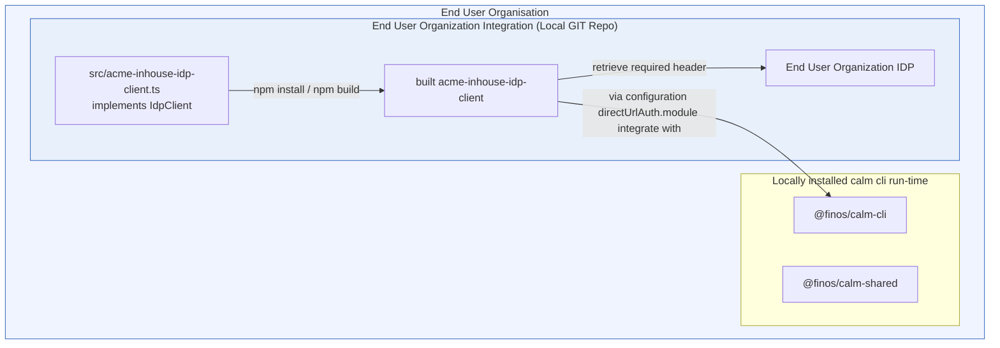

The diagram illustrates a standard integration pattern in which an organization supplies its own identity-aware auth module to the CALM runtime. The organization develops a local implementation of the Identity Provider (IdP) client, builds it into a deployable module, and configures the CALM CLI to load that module as the direct URL auth handler. At runtime, CALM invokes the module for authenticated direct URL access, and the module obtains the necessary authorization header by communicating with the organization’s identity provider.

This pattern keeps authentication logic outside the core CLI and allows each organization to adapt the direct URL flow to its own IdP and security requirements while preserving a consistent integration point with CALM.




This page walks through a local test environment for the CALM CLI's `directUrlAuth` plugin, focused on the `start-webserver-mixedenv` setup.

## Overview of the Authentication Plugin

Authentication/Authorization: This plugin returns a bearer token to the CLI that will add it as the HTTP Authorization header (Authorization: Bearer \<token\>). The token can be used to authenticate the request and/or determine authorization.

`directUrlAuthModule` should be a local `.js` file that `export default`s a class. The CLI loads it once and instantiates it as:

```ts
new DefaultExport(configPath?)
```

So the class interface is effectively:

```ts
interface DirectUrlAuthPlugin {
  getAuthHeaders(url: string, requestBody: unknown): Promise<Record<string, string>>;
}
```

What each part means:

- `getAuthHeaders(url, requestBody)` is required.
  It’s called for each protected direct URL fetch and must return the HTTP headers to attach to the request.
- The constructor may accept an optional `configPath: string | undefined`.
  If the user sets `directUrlAuthConfigPath` in `~/.calm.json`, the CLI passes that value into the class constructor.
- `directUrlAuthAuthenticatedHosts` is required. The CLI calls the module only for URLs whose hostname is in this list, and adds those hosts to the effective direct URL allowlist.
- TLS trust is not configurable through the module.
  Use standard Node runtime settings such as `NODE_EXTRA_CA_CERTS` or `NODE_TLS_REJECT_UNAUTHORIZED` if the process needs non-default trust behavior.

A minimal example:

```js

export default class MyDirectUrlAuth {
  constructor(configPath) {
    this.configPath = configPath;
  }

  async getAuthHeaders(url, requestBody) {
    if (!url.startsWith(AUTHORIZED_URL)) {
        return {};
    }

    // code to generate Bearer token

    return {
      Authorization: "Bearer my-token"
    };
  }
}
```

:::note
If the end user organization writes the plugin in TypeScript,it must be complied to JavaScript because the plugin module must be a `.js` file, not TypeScript source directly, because the CLI loads it with dynamic import at runtime.
:::


## Test Environment Setup

<!-- TODO: describe the start-webserver-mixedenv test environment. -->

## CALM Architecture

<!-- TODO: link to the CALM architecture for this setup. -->

[CALM Architecture]()

## Sample Code

<!-- TODO: link to the directUrlAuth plugin sample source code. -->

[Sample Code]()

## Testing Instructions

<!-- TODO: fill in the steps for using this setup to test the directUrlAuth plugin. -->

1. TODO
2. TODO
3. TODO
