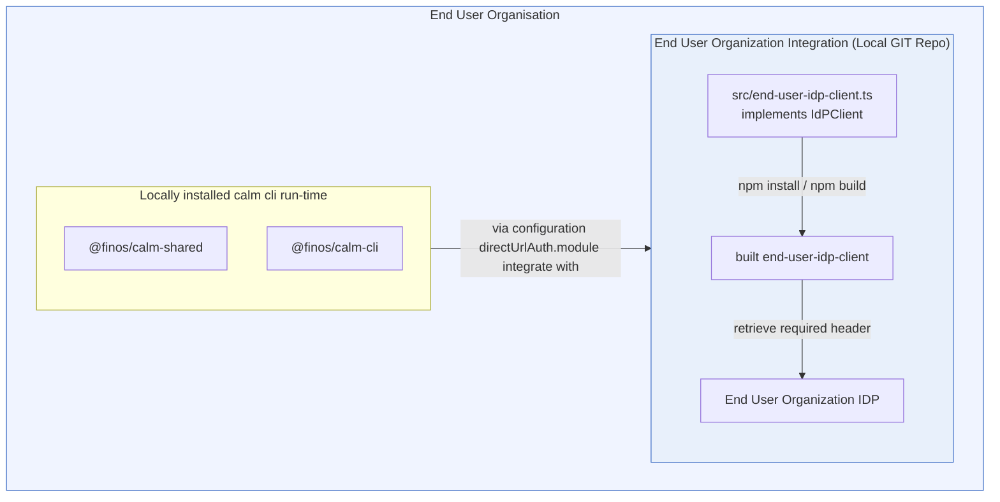

The diagram illustrates a standard integration pattern in which an organization supplies its own identity-aware auth module to the CALM runtime. The organization develops a local implementation of the Identity Provider (IdP) client, builds it into a deployable module, and configures the CALM CLI to load that module as the direct URL auth handler. At runtime, CALM invokes the module for authenticated direct URL access, and the module obtains the necessary header by communicating with the organization’s identity provider.

This pattern keeps authentication logic outside the core CLI and allows each organization to adapt the direct URL flow to its own IdP and security requirements while preserving a consistent integration point with CALM.




## Overview of the Authentication Plugin

:::warning
The following information is provided as-is, with no warranty or support.  The end user organization is solely responsible for security or correctness of the plugin implementation.
:::

Authentication/Authorization: This plugin returns a bearer token to the CLI that will add it as the HTTP Authorization header (Authorization: Bearer \<token\>). The token can be used to authenticate the request and/or determine authorization.

### A minimal example:

```js

export default class DirectUrlAuthPlugin {
  constructor(configPath) {
    this.configPath = configPath;
  }

  async getAuthHeaders(url, requestBody) {
    if (!url.startsWith(AUTHORIZED_URL)) {
        return {};
    }

    // code to generate Bearer token

    return {
      Authorization: "Bearer my-token"
    };
  }
}
```

What each part means:

- `getAuthHeaders(url, requestBody)` is required.
  It’s called for each protected direct URL fetch and must return the HTTP headers to attach to the request.
- The constructor may accept an optional `configPath: string | undefined`.
  If the user sets `directUrlAuthConfigPath` in `~/.calm.json`, the CLI passes that value into the class constructor.
- `directUrlAuthAuthenticatedHosts` is required. The CLI calls the module only for URLs whose hostname is in this list, and adds those hosts to the effective direct URL allowlist.
- TLS trust is not configurable through the module.
  Use standard Node runtime settings such as `NODE_EXTRA_CA_CERTS` or `NODE_TLS_REJECT_UNAUTHORIZED` if the process needs non-default trust behavior.


### Illustrative Code
:::note
The following are for illustrative purposes only.  The end user organization must adapt or modify as needed to meet their specific needs.
:::


#### Assumed Infrastructure

This illustrative code example assumes the following infrastructure services are available:

* A centralized secrets management service (aka Vault service) containing the client secret. The authentication module must have authorized access to retrieve the secret for the configured secret path.
* An identity provider or OAuth 2.0 token service that accepts the client credentials grant and returns an `access_token`. The token service must trust the client identifier and the secret returned by Vault.
* A protected document service that accepts the bearer token in the `Authorization` header and serves the direct URLs listed in `directUrlAuthAuthenticatedHosts`.

#### How the Module Works

The module is loaded by the CALM CLI when direct URL authentication is configured. The CLI dynamically imports the JavaScript module, creates an instance, and passes `directUrlAuthConfigPath` as the constructor argument. The module stores this path and reads the configuration file when it first needs to create an access token.

The runtime flow is:

* CALM calls `getAuthHeaders` before fetching a protected direct URL.
* The module returns an `Authorization: Bearer <token>` header.
* If the cached token is still valid, the module reuses it.
* Otherwise, the module reads the local configuration file and requests the client secret from Vault.
* The module sends the client credentials to the token endpoint.
* The returned access token and expiry time are cached for later requests.

The local configuration file contains the token endpoint, client identifier, Vault endpoint, Vault token, secret path, and optional secret field name. The client secret is retrieved from Vault at runtime instead of being stored in the local configuration file. The module caches both the configuration read and the Vault request so concurrent document requests do not repeat the same work.

The module uses Node's built-in `http` and `https` clients for both Vault and token requests. It accepts only HTTP and HTTPS endpoints, sends a `GET` request for the Vault secret, and sends a form-encoded `POST` request to the token endpoint. Non-2xx responses, invalid JSON, missing token fields, invalid URLs, and missing configuration values cause the module to reject with an error.

The CLI invokes the module only for hosts listed in `directUrlAuthAuthenticatedHosts`. The module is responsible for obtaining the credentials and returning headers; the CLI remains responsible for deciding which direct URLs are eligible for authentication and attaching the returned headers to the document request.

#### Directory structure

Assuming the following directory structure and configuration files with the following TypeScript source code is in the `src/` directory: 

```
direct-url-auth-plugin/
├── package.json
├── tsconfig.json
└── src/
    └── directurl-auth-plugin.ts
```


####  Direct URL Authentication Plugin

:::note
If the end user organization writes the plugin in TypeScript,it must be complied to JavaScript because the plugin module must be a `.js` file, not TypeScript source directly, because the CLI loads it with dynamic import at runtime.
:::


`direct-url-auth-plugin.ts`
```typescript
import * as http from 'node:http';
import * as https from 'node:https';
import { readFile } from 'node:fs/promises';

// Local settings for the token endpoint and the Vault location of the client secret.
type AuthConfig = {
    tokenUrl: string;
    clientId: string;
    vaultUrl: string;
    vaultToken: string;
    vaultSecretPath: string;
    vaultSecretField?: string;
};

// The token service returns the access token and its lifetime in seconds.
type TokenResponse = {
    access_token?: string;
    expires_in?: number;
};

// This matches the nested data shape returned by a Vault KV v2 secret request.
type VaultSecretResponse = {
    data?: {
        data?: Record<string, unknown>;
    };
};

// The plugin keeps the token and its expiry time to avoid unnecessary token requests.
type CachedToken = {
    accessToken: string;
    expiresAtEpochMs: number;
};


// Normalize unknown thrown values so request errors can include a readable message.
function getErrorMessage(error: unknown): string {
    return error instanceof Error ? error.message : String(error);
}

// Supplies bearer headers for protected direct URL requests made by CALM.
export default class DirectUrlAuthPlugin {
    private readonly configPath: string;
    private configPromise?: Promise<AuthConfig>;
    private cachedToken?: CachedToken;
    private clientSecretPromise?: Promise<string>;

    constructor(configPath?: string) {
        // The CLI passes directUrlAuthConfigPath here when it instantiates the module.
        if (!configPath) {
            throw new Error('Direct URL auth configPath is required');
        }

        this.configPath = configPath;
    }

    async getAuthHeaders(url: string, _requestBody: unknown): Promise<Record<string, string>> {
        // CALM calls this method before fetching a protected direct URL.
        return {
            Authorization: `Bearer ${await this.getAccessToken()}`
        };
    }

    private async getAccessToken(): Promise<string> {
        // Reuse a valid token so each document request does not require a new token request.
        if (this.cachedToken && Date.now() < this.cachedToken.expiresAtEpochMs - 60_000) {
            return this.cachedToken.accessToken;
        }

        const config = await this.getConfig();
        const body = new URLSearchParams();
        body.set('client_id', config.clientId);
        body.set('client_secret', await this.getClientSecret(config));
        body.set('grant_type', 'client_credentials');

        const tokenResponse = await this.requestToken(config, body);

        if (!tokenResponse.access_token) {
            throw new Error(`Direct URL auth token response from ${config.tokenUrl} did not include access_token`);
        }

        const expiresInSeconds = tokenResponse.expires_in ?? 300;
        this.cachedToken = {
            accessToken: tokenResponse.access_token,
            expiresAtEpochMs: Date.now() + (expiresInSeconds * 1000)
        };

        return this.cachedToken.accessToken;
    }

    private async getConfig(): Promise<AuthConfig> {
        // Cache the in-flight load so concurrent requests share one config read.
        if (!this.configPromise) {
            this.configPromise = this.loadConfig(this.configPath);
        }

        return this.configPromise;
    }

    private async getClientSecret(config: AuthConfig): Promise<string> {
        // Cache the in-flight Vault request and keep the secret out of the auth config file.
        if (!this.clientSecretPromise) {
            this.clientSecretPromise = this.loadClientSecret(config);
        }

        return this.clientSecretPromise;
    }

    private async loadConfig(configPath: string): Promise<AuthConfig> {
        // This file contains endpoints and lookup metadata, not the client secret itself.
        let text: string;
        try {
            text = await readFile(configPath, 'utf8');
        } catch (error) {
            throw new Error(`Failed to read direct URL auth config at ${configPath}: ${getErrorMessage(error)}`);
        }

        let config: AuthConfig;
        try {
            config = JSON.parse(text) as AuthConfig;
        } catch (error) {
            throw new Error(`Failed to parse direct URL auth config at ${configPath}: ${getErrorMessage(error)}`);
        }

        if (!config.tokenUrl || !config.clientId || !config.vaultUrl || !config.vaultToken || !config.vaultSecretPath) {
            throw new Error(
                `Direct URL auth config at ${configPath} must include tokenUrl, clientId, vaultUrl, vaultToken, and vaultSecretPath`
            );
        }

        return config;
    }

    private async loadClientSecret(config: AuthConfig): Promise<string> {
        const fieldName = config.vaultSecretField ?? 'clientSecret';
        // Read the client secret from Vault only when the token request needs it.
        const vaultResponse = await this.requestVaultSecret(config);
        const secretValue = vaultResponse.data?.data?.[fieldName];

        if (typeof secretValue !== 'string' || !secretValue) {
            throw new Error(
                `Vault secret at ${config.vaultSecretPath} did not include string field '${fieldName}'`
            );
        }

        return secretValue;
    }

    private getEndpoint(urlText: string, label: string): URL {
        try {
            return new URL(urlText);
        } catch (error) {
            throw new Error(`Invalid direct URL auth ${label} '${urlText}': ${getErrorMessage(error)}`);
        }
    }

    private async requestVaultSecret(config: AuthConfig): Promise<VaultSecretResponse> {
        const vaultBaseUrl = this.getEndpoint(config.vaultUrl, 'vaultUrl');
        const vaultUrl = new URL(`/v1/${config.vaultSecretPath.replace(/^\/+/, '')}`, vaultBaseUrl);

        return await this.requestJson<VaultSecretResponse>(
            vaultUrl,
            {
                accept: 'application/json',
                'x-vault-token': config.vaultToken,
            },
            `Vault secret request to ${vaultUrl.toString()}`
        );
    }

    private async requestToken(config: AuthConfig, body: URLSearchParams): Promise<TokenResponse> {
        const tokenUrl = this.getEndpoint(config.tokenUrl, 'tokenUrl');
        const requestBody = body.toString();

        return await this.requestJson<TokenResponse>(
            tokenUrl,
            {
                accept: 'application/json',
                'content-type': 'application/x-www-form-urlencoded',
                'content-length': Buffer.byteLength(requestBody).toString(),
            },
            `Direct URL auth token request to ${config.tokenUrl}`,
            requestBody
        );
    }

    private async requestJson<T>(
        endpoint: URL,
        headers: Record<string, string>,
        description: string,
        requestBody?: string
    ): Promise<T> {
        // Use Node's HTTP clients so the example has no external runtime dependency.
        const transport = endpoint.protocol === 'https:' ? https : endpoint.protocol === 'http:' ? http : undefined;

        if (!transport) {
            throw new Error(`${description} failed: unsupported protocol ${endpoint.protocol}`);
        }

        return await new Promise<T>((resolvePromise, rejectPromise) => {
            const request = transport.request(endpoint, {
                method: requestBody ? 'POST' : 'GET',
                headers,
            }, (response) => {
                let responseBody = '';
                response.setEncoding('utf8');
                response.on('data', (chunk: string) => {
                    responseBody += chunk;
                });
                response.on('end', () => {
                    // Treat non-2xx responses as failures before attempting to parse the body.
                    if (!response.statusCode || response.statusCode < 200 || response.statusCode >= 300) {
                        rejectPromise(
                            new Error(`${description} failed: ${response.statusCode ?? 'unknown'} ${response.statusMessage ?? ''}`.trim())
                        );
                        return;
                    }

                    try {
                        resolvePromise(JSON.parse(responseBody) as T);
                    } catch (error) {
                        rejectPromise(new Error(`${description} failed: response was not valid JSON: ${getErrorMessage(error)}`));
                    }
                });
            });

            request.on('error', (error) => {
                rejectPromise(new Error(`${description} failed: ${error.message}`));
            });

            if (requestBody) {
                request.write(requestBody);
            }
            request.end();
        });
    }
}

```

#### Configuration Files

`package.json`
```json
{
  "name": "direct-url-auth-plugin",
  "private": true,
  "type": "module",
  "scripts": {
        "build": "tsc -p tsconfig.json"
  },
  "devDependencies": {
    "@types/node": "^26.0.0",
    "typescript": "^5.9.2"
  }
}
```

`tsconfig.json`
```json
{
  "compilerOptions": {
    "target": "ES2022",
    "module": "NodeNext",
    "moduleResolution": "NodeNext",
    "rootDir": "src",
    "outDir": "dist",
    "types": [
      "node"
    ],
    "strict": true
  },
  "include": [
    "src/**/*.ts"
  ]
}
```

#### Build the javascript module
Example command to build the javascript module
```
npm install

npm run build
```

#### Illustrative directUrlAuth configuration

~/.calm.json

```json
{
  "directUrlAuthModule": "/path/to/direct-url-auth-plugin/dist/direct-url-auth-plugin.js",
  "directUrlAuthConfigPath": "/path/to/direct-url-auth-plugin/direct-url-auth.config.json",
  "directUrlAuthAuthenticatedHosts": [
    "internal-calm.example.org"
  ]

}
```

Or the equivalent environment-variable configuration is:

```sh
export CALM_DIRECT_URL_AUTH_MODULE="/path/to/direct-url-auth-plugin/dist/direct-url-auth-plugin.js"
export CALM_DIRECT_URL_AUTH_CONFIG_PATH="/path/to/direct-url-auth-plugin/direct-url-auth.config.json"
export CALM_DIRECT_URL_AUTH_AUTHENTICATED_HOSTS="internal-calm.example.org"
```

Multiple authenticated hosts must be separated by commas:

```sh
export CALM_DIRECT_URL_AUTH_AUTHENTICATED_HOSTS="schemas.example.com,documents.example.org"
```

