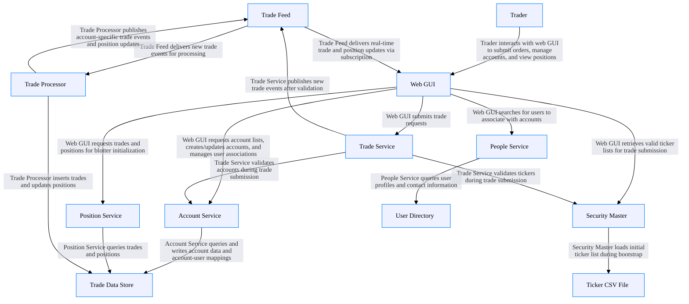
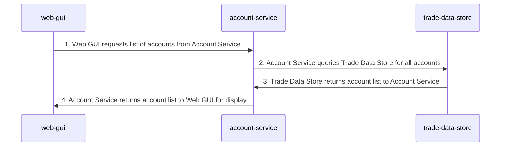
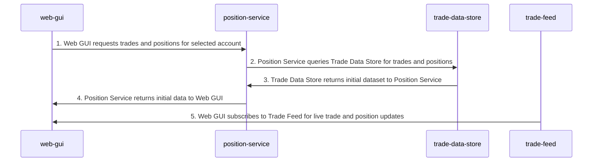
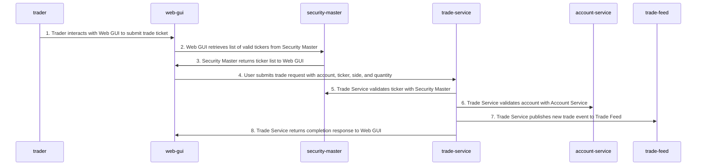
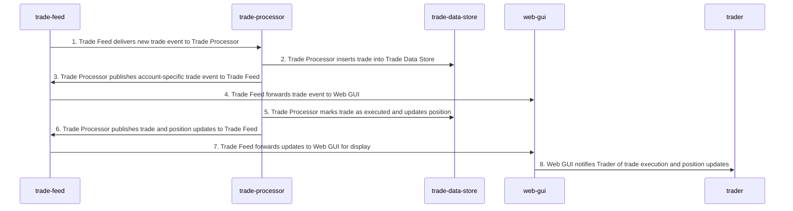
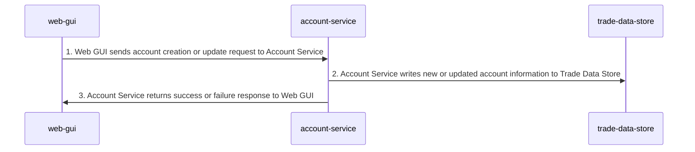
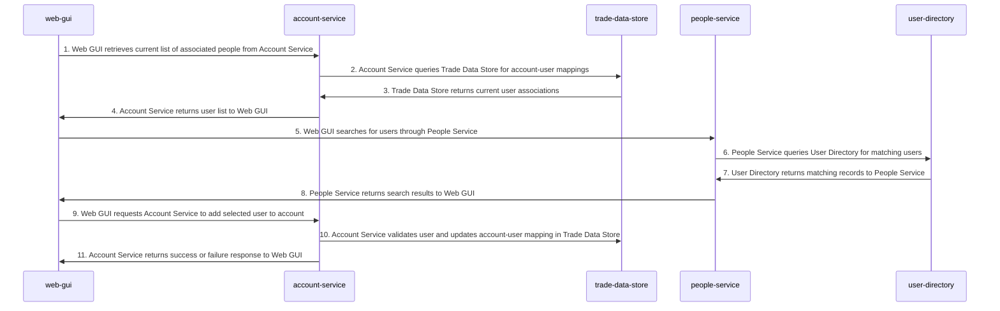
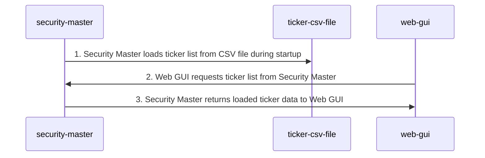

# 

## Overview

## Architecture Metadata

- **version:** 0.1.0
- **created-by:** Trading System Team - Copilot

## Architecture-Level Controls

### encryption-in-transit

All data transmitted between system components must be encrypted using TLS 1.3 or higher with modern cipher suites, validated certificates, and mutual TLS recommended for service-to-service communication

#### Requirements
- **Requirement:** https://schemas.company.com/security/encryption-in-transit.json

### encryption-at-rest

All stored data must be encrypted at rest using AES-256 equivalent encryption with hardware-backed or managed key systems, regular key rotation every 90 days, applying to databases, file systems, object storage, and backups

#### Requirements
- **Requirement:** https://schemas.company.com/security/encryption-at-rest.json

## Architecture Statistics

- **Total Nodes:** 12
- **Total Relationships:** 17
- **Total Flows:** 7

## Components by Type

### Trader

**Type:** `actor`  
**Unique ID:** `trader`

#### Description
External user who submits orders, manages accounts, and monitors positions

This component exposes the following interfaces:

---

### Web GUI

**Type:** `webclient`  
**Unique ID:** `web-gui`

#### Description
User-facing interface for trading operations, account management, and viewing positions

This component exposes the following interfaces:

#### Metadata

- **data-classification:** Private

---

### Trade Service

**Type:** `service`  
**Unique ID:** `trade-service`

#### Description
Handles trade submission, validates tickets against security master and account service

This component exposes the following interfaces:

#### Interfaces

This component exposes the following interfaces:

- **Trade Service REST API** (`trade-service-api`)
  - **Protocol:** HTTPS / **Port:** 18092
  - **Description:** HTTP API for submitting and validating trade orders
  - **Schema:** OpenAPI
    - **Operations**
      - `POST /trade/` — Submit a new trade order with validation against security master and account service

#### Metadata

- **data-classification:** Private

---

### Account Service

**Type:** `service`  
**Unique ID:** `account-service`

#### Description
Manages account lifecycle, user associations, and account queries

This component exposes the following interfaces:

#### Interfaces

This component exposes the following interfaces:

- **Account Service REST API** (`account-service-api`)
  - **Protocol:** HTTPS / **Port:** 18088
  - **Description:** HTTP API for managing accounts and account-user associations
  - **Schema:** OpenAPI
    - **Operations**
      - `GET /account/` — Get all accounts
      - `GET /account/{id}` — Get account by ID
      - `POST /account/` — Create new account
      - `PUT /account/` — Update existing account
      - `GET /accountuser/` — Get all account users
      - `GET /accountuser/{id}` — Get account user by ID
      - `POST /accountuser/` — Create account user association
      - `PUT /accountuser/` — Update account user association

#### Metadata

- **data-classification:** Private

---

### Position Service

**Type:** `service`  
**Unique ID:** `position-service`

#### Description
Provides position and trade data for blotter initialization

This component exposes the following interfaces:

#### Interfaces

This component exposes the following interfaces:

- **Position Service REST API** (`position-service-api`)
  - **Protocol:** HTTPS / **Port:** 18090
  - **Description:** HTTP API for retrieving trades and positions by account
  - **Schema:** OpenAPI
    - **Operations**
      - `GET /positions/` — Get all positions
      - `GET /positions/{accountId}` — Get positions for specific account
      - `GET /trades/` — Get all trades
      - `GET /trades/{accountId}` — Get trades for specific account

#### Metadata

- **data-classification:** Private

---

### People Service

**Type:** `service`  
**Unique ID:** `people-service`

#### Description
Manages user search and validation against the user directory

This component exposes the following interfaces:

#### Interfaces

This component exposes the following interfaces:

- **People Service REST API** (`people-service-api`)
  - **Protocol:** HTTPS / **Port:** 18089
  - **Description:** HTTP API for user search and validation against directory
  - **Schema:** OpenAPI
    - **Operations**
      - `GET /People/GetPerson` — Get person by logonId or employeeId
      - `GET /People/GetMatchingPeople` — Search people by logonId or fullName
      - `GET /People/ValidatePerson` — Validate person exists in directory

#### Metadata

- **data-classification:** Private

---

### Security Master

**Type:** `service`  
**Unique ID:** `security-master`

#### Description
Maintains tradeable securities list, loads from CSV, validates tickers

This component exposes the following interfaces:

#### Interfaces

This component exposes the following interfaces:

- **Security Master REST API** (`security-master-api`)
  - **Protocol:** HTTPS / **Port:** 18085
  - **Description:** HTTP API for retrieving tradeable securities and ticker validation
  - **Schema:** OpenAPI
    - **Operations**
      - `GET /stocks` — Get all tradeable securities
      - `GET /stocks/{ticker}` — Get security by ticker symbol

#### Metadata

- **data-classification:** Private

---

### Trade Processor

**Type:** `service`  
**Unique ID:** `trade-processor`

#### Description
Processes trade events, updates data store, publishes trade and position updates

This component exposes the following interfaces:

#### Interfaces

This component exposes the following interfaces:

- **Trade Processor REST API** (`trade-processor-api`)
  - **Protocol:** HTTPS / **Port:** 18091
  - **Description:** HTTP API for direct trade processing (primarily operates via trade feed)
  - **Schema:** OpenAPI
    - **Operations**
      - `POST /tradeservice/order` — Process trade order directly

#### Metadata

- **data-classification:** Private

---

### Trade Data Store

**Type:** `database`  
**Unique ID:** `trade-data-store`

#### Description
Central repository for accounts, trades, positions, and account-user mappings

This component exposes the following interfaces:

#### Metadata

- **data-classification:** Private

---

### User Directory

**Type:** `ldap`  
**Unique ID:** `user-directory`

#### Description
Stores user profiles and contact information

This component exposes the following interfaces:

#### Metadata

- **data-classification:** PII

---

### Ticker CSV File

**Type:** `data-asset`  
**Unique ID:** `ticker-csv-file`

#### Description
CSV file containing initial list of tradeable securities

This component exposes the following interfaces:

#### Metadata

- **data-classification:** Private

---

### Trade Feed

**Type:** `service`  
**Unique ID:** `trade-feed`

#### Description
Publishes and delivers real-time trade events, position updates, and trade status notifications

This component exposes the following interfaces:

#### Interfaces

This component exposes the following interfaces:

- **Trade Feed WebSocket API** (`trade-feed-websocket`)
  - **Protocol:** WebSocket / **Port:** 18086
  - **Description:** WebSocket/SocketIO interface for pub-sub messaging of trade and position events
  - **Schema:** SocketIO
    - **Operations**
      - `subscribe` (inbound) — Subscribe to a topic to receive real-time updates (e.g., /trades, /accounts/{id}/trades, /accounts/{id}/positions)
      - `unsubscribe` (inbound) — Unsubscribe from a topic to stop receiving updates
      - `publish` (inbound) — Publish a message to a topic for broadcast to all subscribers
      - `publish` (outbound) — Receive published messages from subscribed topics including trade events and position updates
- **Trade Feed Viewer** (`trade-feed-viewer`)
  - **Protocol:** HTTPS / **Port:** 18086
  - **Description:** HTML interface for monitoring real-time message flow
  - **Schema:** HTML
    - **Operations**
      - `GET /` — Serve HTML viewer page for monitoring trade feed messages

#### Metadata

- **data-classification:** Private

---

## Business Flows

This document describes the business processes that traverse the  architecture.

### Load List of Accounts

**Unique ID:** `load-accounts-flow`

#### Description
Web GUI retrieves and displays the list of all trading accounts

#### Sequence Diagram

#### Flow Steps

1. **Web GUI requests list of accounts from Account Service**
   - **Relationship:** `web-gui-account-service`
   - **Direction:** source-to-destination
2. **Account Service queries Trade Data Store for all accounts**
   - **Relationship:** `account-service-trade-data-store`
   - **Direction:** source-to-destination
3. **Trade Data Store returns account list to Account Service**
   - **Relationship:** `account-service-trade-data-store`
   - **Direction:** destination-to-source
4. **Account Service returns account list to Web GUI for display**
   - **Relationship:** `web-gui-account-service`
   - **Direction:** destination-to-source

---

### Bootstrap Trade and Position Blotter

**Unique ID:** `bootstrap-blotter-flow`

#### Description
Initialize the blotter with current trades and positions, then subscribe to live updates

#### Sequence Diagram

#### Flow Steps

1. **Web GUI requests trades and positions for selected account**
   - **Relationship:** `web-gui-position-service`
   - **Direction:** source-to-destination
2. **Position Service queries Trade Data Store for trades and positions**
   - **Relationship:** `position-service-trade-data-store`
   - **Direction:** source-to-destination
3. **Trade Data Store returns initial dataset to Position Service**
   - **Relationship:** `position-service-trade-data-store`
   - **Direction:** destination-to-source
4. **Position Service returns initial data to Web GUI**
   - **Relationship:** `web-gui-position-service`
   - **Direction:** destination-to-source
5. **Web GUI subscribes to Trade Feed for live trade and position updates**
   - **Relationship:** `trade-feed-web-gui`
   - **Direction:** source-to-destination

---

### Submit Trade Ticket

**Unique ID:** `submit-trade-flow`

#### Description
User submits a trade order with validation against security master and account service

#### Sequence Diagram

#### Flow Steps

1. **Trader interacts with Web GUI to submit trade ticket**
   - **Relationship:** `trader-web-gui`
   - **Direction:** source-to-destination
2. **Web GUI retrieves list of valid tickers from Security Master**
   - **Relationship:** `web-gui-security-master`
   - **Direction:** source-to-destination
3. **Security Master returns ticker list to Web GUI**
   - **Relationship:** `web-gui-security-master`
   - **Direction:** destination-to-source
4. **User submits trade request with account, ticker, side, and quantity**
   - **Relationship:** `web-gui-trade-service`
   - **Direction:** source-to-destination
5. **Trade Service validates ticker with Security Master**
   - **Relationship:** `trade-service-security-master`
   - **Direction:** source-to-destination
6. **Trade Service validates account with Account Service**
   - **Relationship:** `trade-service-account-service`
   - **Direction:** source-to-destination
7. **Trade Service publishes new trade event to Trade Feed**
   - **Relationship:** `trade-service-trade-feed`
   - **Direction:** source-to-destination
8. **Trade Service returns completion response to Web GUI**
   - **Relationship:** `web-gui-trade-service`
   - **Direction:** destination-to-source

---

### Process Trade Event

**Unique ID:** `process-trade-flow`

#### Description
Trade Processor handles new trade events, updates database, and publishes position updates

#### Sequence Diagram

#### Flow Steps

1. **Trade Feed delivers new trade event to Trade Processor**
   - **Relationship:** `trade-feed-trade-processor`
   - **Direction:** source-to-destination
2. **Trade Processor inserts trade into Trade Data Store**
   - **Relationship:** `trade-processor-trade-data-store`
   - **Direction:** source-to-destination
3. **Trade Processor publishes account-specific trade event to Trade Feed**
   - **Relationship:** `trade-processor-trade-feed`
   - **Direction:** source-to-destination
4. **Trade Feed forwards trade event to Web GUI**
   - **Relationship:** `trade-feed-web-gui`
   - **Direction:** source-to-destination
5. **Trade Processor marks trade as executed and updates position**
   - **Relationship:** `trade-processor-trade-data-store`
   - **Direction:** source-to-destination
6. **Trade Processor publishes trade and position updates to Trade Feed**
   - **Relationship:** `trade-processor-trade-feed`
   - **Direction:** source-to-destination
7. **Trade Feed forwards updates to Web GUI for display**
   - **Relationship:** `trade-feed-web-gui`
   - **Direction:** source-to-destination
8. **Web GUI notifies Trader of trade execution and position updates**
   - **Relationship:** `trader-web-gui`
   - **Direction:** destination-to-source

---

### Add or Update Account

**Unique ID:** `manage-account-flow`

#### Description
Create a new trading account or update existing account information

#### Sequence Diagram

#### Flow Steps

1. **Web GUI sends account creation or update request to Account Service**
   - **Relationship:** `web-gui-account-service`
   - **Direction:** source-to-destination
2. **Account Service writes new or updated account information to Trade Data Store**
   - **Relationship:** `account-service-trade-data-store`
   - **Direction:** source-to-destination
3. **Account Service returns success or failure response to Web GUI**
   - **Relationship:** `web-gui-account-service`
   - **Direction:** destination-to-source

---

### Add or Update Users to Account

**Unique ID:** `manage-account-users-flow`

#### Description
Associate users with trading accounts by searching the user directory and updating mappings

#### Sequence Diagram

#### Flow Steps

1. **Web GUI retrieves current list of associated people from Account Service**
   - **Relationship:** `web-gui-account-service`
   - **Direction:** source-to-destination
2. **Account Service queries Trade Data Store for account-user mappings**
   - **Relationship:** `account-service-trade-data-store`
   - **Direction:** source-to-destination
3. **Trade Data Store returns current user associations**
   - **Relationship:** `account-service-trade-data-store`
   - **Direction:** destination-to-source
4. **Account Service returns user list to Web GUI**
   - **Relationship:** `web-gui-account-service`
   - **Direction:** destination-to-source
5. **Web GUI searches for users through People Service**
   - **Relationship:** `web-gui-people-service`
   - **Direction:** source-to-destination
6. **People Service queries User Directory for matching users**
   - **Relationship:** `people-service-user-directory`
   - **Direction:** source-to-destination
7. **User Directory returns matching records to People Service**
   - **Relationship:** `people-service-user-directory`
   - **Direction:** destination-to-source
8. **People Service returns search results to Web GUI**
   - **Relationship:** `web-gui-people-service`
   - **Direction:** destination-to-source
9. **Web GUI requests Account Service to add selected user to account**
   - **Relationship:** `web-gui-account-service`
   - **Direction:** source-to-destination
10. **Account Service validates user and updates account-user mapping in Trade Data Store**
   - **Relationship:** `account-service-trade-data-store`
   - **Direction:** source-to-destination
11. **Account Service returns success or failure response to Web GUI**
   - **Relationship:** `web-gui-account-service`
   - **Direction:** destination-to-source

---

### Security Master Bootstrap

**Unique ID:** `bootstrap-security-master-flow`

#### Description
Load ticker list from CSV file during startup and provide it to the Web GUI

#### Sequence Diagram

#### Flow Steps

1. **Security Master loads ticker list from CSV file during startup**
   - **Relationship:** `security-master-ticker-csv-file`
   - **Direction:** source-to-destination
2. **Web GUI requests ticker list from Security Master**
   - **Relationship:** `web-gui-security-master`
   - **Direction:** source-to-destination
3. **Security Master returns loaded ticker data to Web GUI**
   - **Relationship:** `web-gui-security-master`
   - **Direction:** destination-to-source

---

