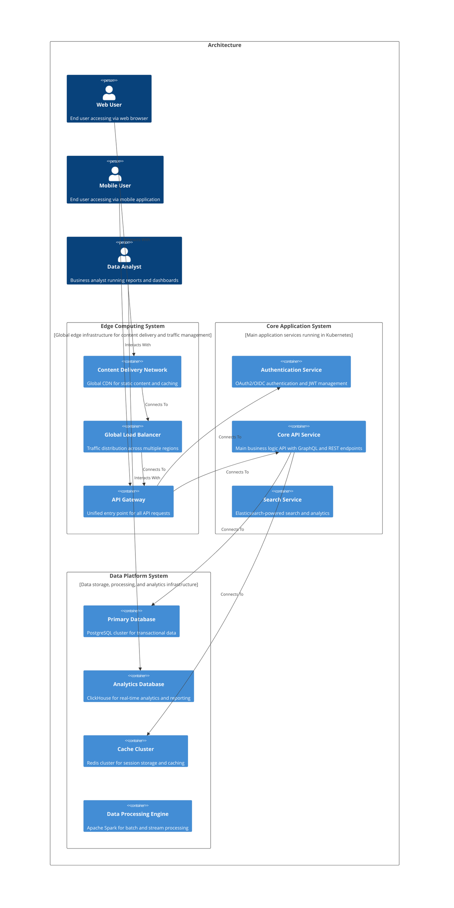

```mermaid
C4Deployment

    Deployment_Node(deployment, "Architecture", ""){
        Deployment_Node(edge-system, "Edge Computing System", "Global edge infrastructure for content delivery and traffic management"){
            Container(cdn, "Content Delivery Network", "", "Global CDN for static content and caching")
            Container(load-balancer, "Global Load Balancer", "", "Traffic distribution across multiple regions")
            Container(api-gateway, "API Gateway", "", "Unified entry point for all API requests")
        }
        Deployment_Node(core-system, "Core Application System", "Main application services running in Kubernetes"){
            Container(auth-service, "Authentication Service", "", "OAuth2/OIDC authentication and JWT management")
            Container(api-service, "Core API Service", "", "Main business logic API with GraphQL and REST endpoints")
            Container(search-service, "Search Service", "", "Elasticsearch-powered search and analytics")
        }
        Deployment_Node(data-system, "Data Platform System", "Data storage, processing, and analytics infrastructure"){
            Container(primary-db, "Primary Database", "", "PostgreSQL cluster for transactional data")
            Container(analytics-db, "Analytics Database", "", "ClickHouse for real-time analytics and reporting")
            Container(cache-cluster, "Cache Cluster", "", "Redis cluster for session storage and caching")
            Container(data-processor, "Data Processing Engine", "", "Apache Spark for batch and stream processing")
        }
        Person(web-user, "Web User", "End user accessing via web browser")
        Person(mobile-user, "Mobile User", "End user accessing via mobile application")
        Person(data-analyst, "Data Analyst", "Business analyst running reports and dashboards")
    }

    Rel(web-user,cdn,"Interacts With")
    Rel(mobile-user,api-gateway,"Interacts With")
    Rel(data-analyst,analytics-db,"Interacts With")
    Rel(cdn,load-balancer,"Connects To")
    Rel(load-balancer,api-gateway,"Connects To")
    Rel(api-gateway,auth-service,"Connects To")
    Rel(api-gateway,api-service,"Connects To")
    Rel(api-service,cache-cluster,"Connects To")
    Rel(api-service,primary-db,"Connects To")

    UpdateLayoutConfig($c4ShapeInRow="3", $c4BoundaryInRow="2")
```