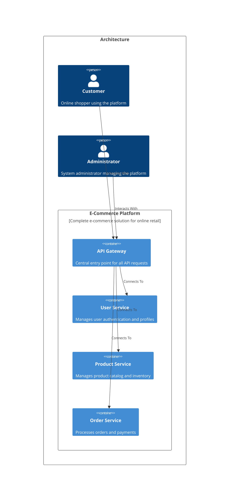

```mermaid
C4Deployment

    Deployment_Node(deployment, "Architecture", ""){
        Deployment_Node(web-system, "E-Commerce Platform", "Complete e-commerce solution for online retail"){
            Container(api-gateway, "API Gateway", "", "Central entry point for all API requests")
            Container(user-service, "User Service", "", "Manages user authentication and profiles")
            Container(product-service, "Product Service", "", "Manages product catalog and inventory")
            Container(order-service, "Order Service", "", "Processes orders and payments")
        }
        Person(customer, "Customer", "Online shopper using the platform")
        Person(admin, "Administrator", "System administrator managing the platform")
    }

    Rel(customer,api-gateway,"Interacts With")
    Rel(admin,api-gateway,"Interacts With")
    Rel(api-gateway,user-service,"Connects To")
    Rel(api-gateway,product-service,"Connects To")
    Rel(api-gateway,order-service,"Connects To")

    UpdateLayoutConfig($c4ShapeInRow="3", $c4BoundaryInRow="2")
```