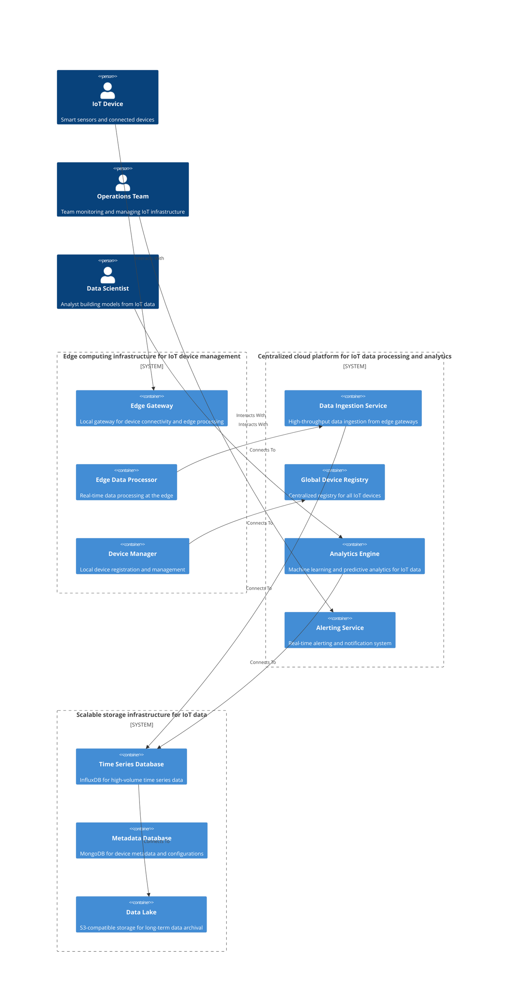

```mermaid
C4Container
        System_Boundary("IoT Edge System","Edge computing infrastructure for IoT device management"){
                Container(edge-gateway,"Edge Gateway","","Local gateway for device connectivity and edge processing")
                Container(edge-processor,"Edge Data Processor","","Real-time data processing at the edge")
                Container(device-manager,"Device Manager","","Local device registration and management")
        }

        System_Boundary("IoT Cloud Platform","Centralized cloud platform for IoT data processing and analytics"){
                Container(cloud-ingestion,"Data Ingestion Service","","High-throughput data ingestion from edge gateways")
                Container(device-registry,"Global Device Registry","","Centralized registry for all IoT devices")
                Container(analytics-engine,"Analytics Engine","","Machine learning and predictive analytics for IoT data")
                Container(alerting-service,"Alerting Service","","Real-time alerting and notification system")
        }

        System_Boundary("Data Storage System","Scalable storage infrastructure for IoT data"){
                Container(timeseries-db,"Time Series Database","","InfluxDB for high-volume time series data")
                Container(metadata-db,"Metadata Database","","MongoDB for device metadata and configurations")
                Container(data-lake,"Data Lake","","S3-compatible storage for long-term data archival")
        }


        Person(iot-device,"IoT Device","Smart sensors and connected devices")

        Person(operator,"Operations Team","Team monitoring and managing IoT infrastructure")

        Person(data-scientist,"Data Scientist","Analyst building models from IoT data")


    Rel(iot-device,edge-gateway,"Interacts With")
    Rel(operator,alerting-service,"Interacts With")
    Rel(data-scientist,analytics-engine,"Interacts With")
    Rel(edge-processor,cloud-ingestion,"Connects To")
    Rel(device-manager,device-registry,"Connects To")
    Rel(cloud-ingestion,timeseries-db,"Connects To")
    Rel(analytics-engine,timeseries-db,"Connects To")
    Rel(timeseries-db,data-lake,"Connects To")

UpdateLayoutConfig($c4ShapeInRow="2", $c4BoundaryInRow="0")
```