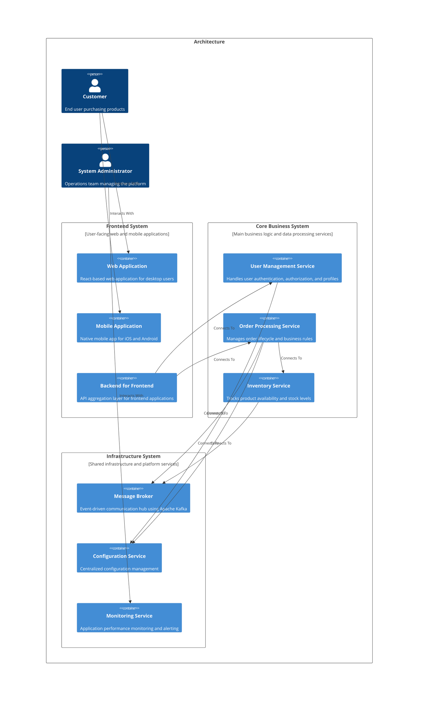

```mermaid
C4Deployment

    Deployment_Node(deployment, "Architecture", ""){
        Deployment_Node(frontend-system, "Frontend System", "User-facing web and mobile applications"){
            Container(web-app, "Web Application", "", "React-based web application for desktop users")
            Container(mobile-app, "Mobile Application", "", "Native mobile app for iOS and Android")
            Container(bff, "Backend for Frontend", "", "API aggregation layer for frontend applications")
        }
        Deployment_Node(business-system, "Core Business System", "Main business logic and data processing services"){
            Container(user-service, "User Management Service", "", "Handles user authentication, authorization, and profiles")
            Container(order-service, "Order Processing Service", "", "Manages order lifecycle and business rules")
            Container(inventory-service, "Inventory Service", "", "Tracks product availability and stock levels")
        }
        Deployment_Node(infra-system, "Infrastructure System", "Shared infrastructure and platform services"){
            Container(message-broker, "Message Broker", "", "Event-driven communication hub using Apache Kafka")
            Container(config-service, "Configuration Service", "", "Centralized configuration management")
            Container(monitoring-service, "Monitoring Service", "", "Application performance monitoring and alerting")
        }
        Person(customer, "Customer", "End user purchasing products")
        Person(admin, "System Administrator", "Operations team managing the platform")
    }

    Rel(customer,web-app,"Interacts With")
    Rel(customer,mobile-app,"Interacts With")
    Rel(admin,monitoring-service,"Interacts With")
    Rel(bff,user-service,"Connects To")
    Rel(bff,order-service,"Connects To")
    Rel(order-service,inventory-service,"Connects To")
    Rel(order-service,message-broker,"Connects To")
    Rel(inventory-service,message-broker,"Connects To")
    Rel(user-service,config-service,"Connects To")
    Rel(order-service,config-service,"Connects To")

    UpdateLayoutConfig($c4ShapeInRow="3", $c4BoundaryInRow="2")
```