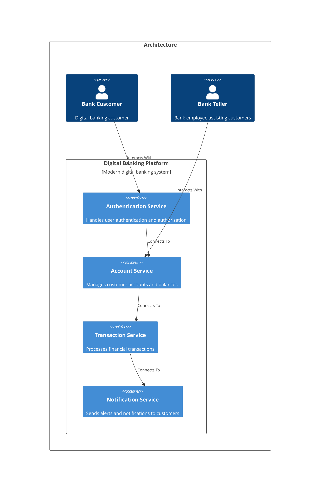

```mermaid
C4Deployment

    Deployment_Node(deployment, "Architecture", ""){
        Deployment_Node(banking-system, "Digital Banking Platform", "Modern digital banking system"){
            Container(auth-service, "Authentication Service", "", "Handles user authentication and authorization")
            Container(account-service, "Account Service", "", "Manages customer accounts and balances")
            Container(transaction-service, "Transaction Service", "", "Processes financial transactions")
            Container(notification-service, "Notification Service", "", "Sends alerts and notifications to customers")
        }
        Person(bank-customer, "Bank Customer", "Digital banking customer")
        Person(bank-teller, "Bank Teller", "Bank employee assisting customers")
    }

    Rel(bank-customer,auth-service,"Interacts With")
    Rel(bank-teller,account-service,"Interacts With")
    Rel(auth-service,account-service,"Connects To")
    Rel(account-service,transaction-service,"Connects To")
    Rel(transaction-service,notification-service,"Connects To")

    UpdateLayoutConfig($c4ShapeInRow="3", $c4BoundaryInRow="2")
```