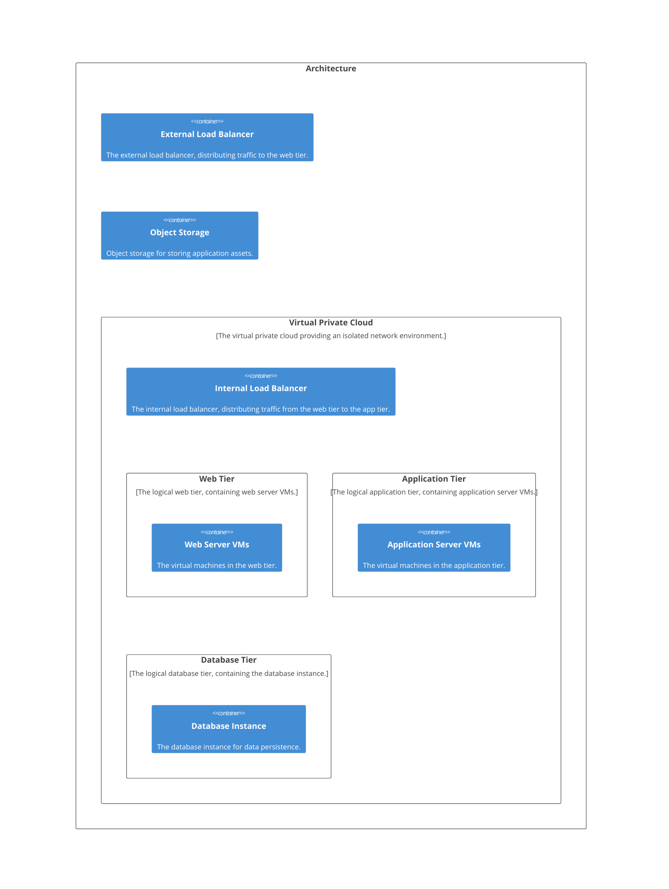

```mermaid
C4Deployment

    Deployment_Node(deployment, "Architecture", ""){
        Deployment_Node(vpc, "Virtual Private Cloud", "The virtual private cloud providing an isolated network environment."){
            Deployment_Node(web-tier, "Web Tier", "The logical web tier, containing web server VMs."){
                Container(web-server-vms, "Web Server VMs", "", "The virtual machines in the web tier.")
            }
            Deployment_Node(app-tier, "Application Tier", "The logical application tier, containing application server VMs."){
                Container(app-server-vms, "Application Server VMs", "", "The virtual machines in the application tier.")
            }
            Deployment_Node(db-tier, "Database Tier", "The logical database tier, containing the database instance."){
                Container(database-instance, "Database Instance", "", "The database instance for data persistence.")
            }
            Container(internal-lb, "Internal Load Balancer", "", "The internal load balancer, distributing traffic from the web tier to the app tier.")
        }
        Container(external-lb, "External Load Balancer", "", "The external load balancer, distributing traffic to the web tier.")
        Container(object-storage, "Object Storage", "", "Object storage for storing application assets.")
    }


    UpdateLayoutConfig($c4ShapeInRow="3", $c4BoundaryInRow="2")
```