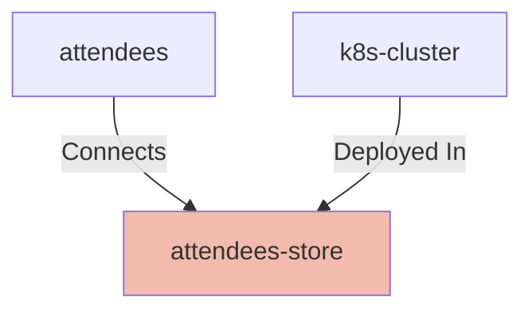

## Details

| Field               | Value                    |
|---------------------|--------------------------|
| **Unique ID**       | attendees-store                   |
| **Node Type**       | database             |
| **Name**            | Attendees Store                 |
| **Description**     | Persistent storage for attendees          |
| **Data Classification** |  |
| **Run As**          |                 |

## Interfaces
    | Unique ID | Host | Port | Url |
    |-----------|------|------|-----|
        | database-image |  |  |  |
        | database-port |  | -1 |  |

## Related Nodes

## Controls
    _No controls defined._

## Metadata
  _No Metadata defined._
