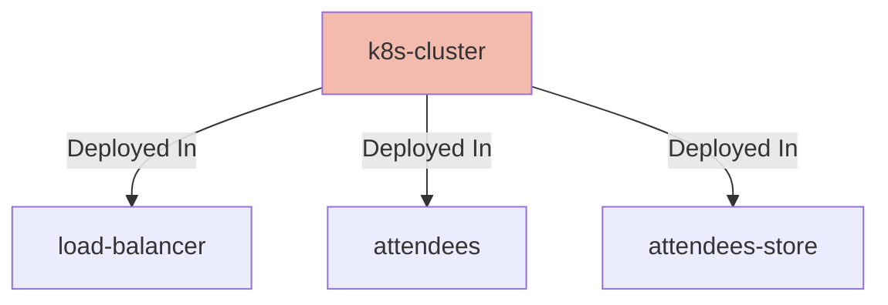

## Details

| Field               | Value                    |
|---------------------|--------------------------|
| **Unique ID**       | k8s-cluster                   |
| **Node Type**       | system             |
| **Name**            | Kubernetes Cluster                 |
| **Description**     | Kubernetes Cluster with network policy rules enabled          |
| **Data Classification** |  |
| **Run As**          |                 |

## Interfaces
    _No interfaces defined._

## Related Nodes

## Controls
    _No controls defined._

## Metadata
  _No Metadata defined._
