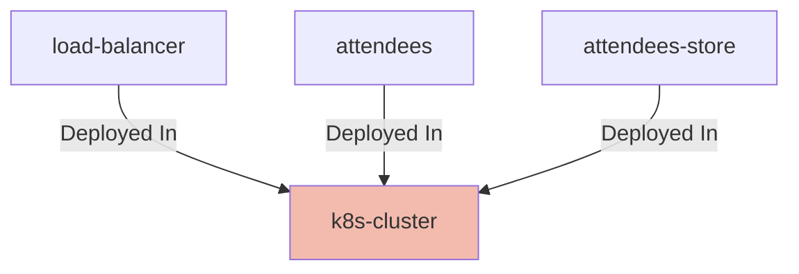

# Kubernetes Cluster

## Details

    <table>
        <tbody>
        <tr>
            <th>Unique Id</th>
            <td>k8s-cluster</td>
        </tr>
        <tr>
            <th>Name</th>
            <td>Kubernetes Cluster</td>
        </tr>
        <tr>
            <th>Description</th>
            <td>Kubernetes Cluster with network policy rules enabled</td>
        </tr>
        <tr>
            <th>Node Type</th>
            <td>system</td>
        </tr>
        </tbody>
    </table>

## Interfaces

No interfaces defined.

## Related Nodes

## Controls
_No controls defined._

## Metadata

No metadata defined.

