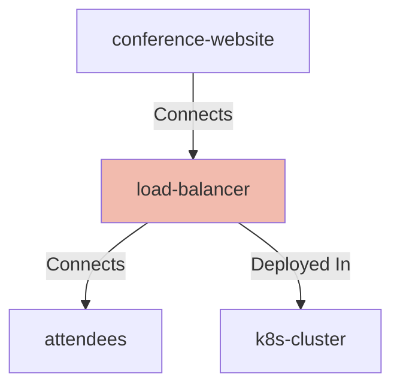

# Load Balancer

## Details

    <table>
        <tbody>
        <tr>
            <th>Unique Id</th>
            <td>load-balancer</td>
        </tr>
        <tr>
            <th>Name</th>
            <td>Load Balancer</td>
        </tr>
        <tr>
            <th>Description</th>
            <td>The attendees service, or a placeholder for another application</td>
        </tr>
        <tr>
            <th>Node Type</th>
            <td>network</td>
        </tr>
        </tbody>
    </table>

## Interfaces

    <table>
        <thead>
        <tr>
            <th>Unique Id</th>
            <th>Host</th>
            <th>Port</th>
        </tr>
        </thead>
        <tbody>
        <tr>
            <td>load-balancer-host-port</td>
            <td>[[ HOST ]]</td>
            <td>-1</td>
        </tr>
        </tbody>
    </table>

## Related Nodes

## Controls
_No controls defined._

## Metadata

No metadata defined.

