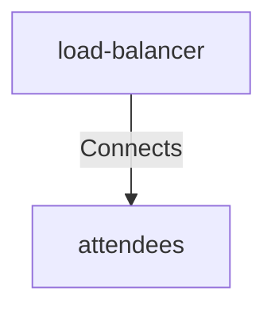

# Load Balancer Attendees Service

## Details

    <table>
        <tbody>
        <tr>
            <th>Unique Id</th>
            <td>load-balancer-attendees-service</td>
        </tr>
        <tr>
            <th>Description</th>
            <td>Forward</td>
        </tr>
        <tr>
            <th>Protocol</th>
            <td>mTLS</td>
        </tr>
        </tbody>
    </table>

## Related Nodes

## Controls
_No controls defined._

## Metadata

No metadata defined.

