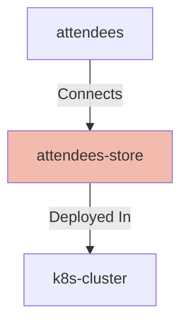

# Attendees Store

## Details

    <table>
        <tbody>
        <tr>
            <th>Unique Id</th>
            <td>attendees-store</td>
        </tr>
        <tr>
            <th>Name</th>
            <td>Attendees Store</td>
        </tr>
        <tr>
            <th>Description</th>
            <td>Persistent storage for attendees</td>
        </tr>
        <tr>
            <th>Node Type</th>
            <td>database</td>
        </tr>
        </tbody>
    </table>

## Interfaces

    <table>
        <thead>
        <tr>
            <th>Unique Id</th>
            <th>Host</th>
            <th>Port</th>
        </tr>
        </thead>
        <tbody>
        <tr>
            <td>database-image</td>
            <td></td>
            <td></td>
        </tr>
        <tr>
            <td>database-port</td>
            <td></td>
            <td>5432</td>
        </tr>
        </tbody>
    </table>

## Related Nodes

## Controls
_No controls defined._

## Metadata

No metadata defined.

