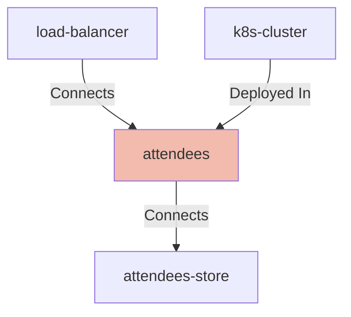

## Details

| Field               | Value                    |
|---------------------|--------------------------|
| **Unique ID**       | attendees                   |
| **Node Type**       | service             |
| **Name**            | Attendees Service                 |
| **Description**     | The attendees service, or a placeholder for another application          |
| **Data Classification** |  |
| **Run As**          |                 |

## Interfaces
    | Unique ID | Host | Port | Url |
    |-----------|------|------|-----|
        | attendees-image |  |  |  |
        | attendees-port |  | 8080 |  |

## Related Nodes

## Controls
    _No controls defined._

## Metadata
  _No Metadata defined._
