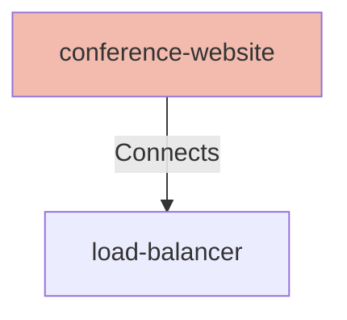

# Conference Website

## Details

    <table>
        <tbody>
        <tr>
            <th>Unique Id</th>
            <td>conference-website</td>
        </tr>
        <tr>
            <th>Name</th>
            <td>Conference Website</td>
        </tr>
        <tr>
            <th>Description</th>
            <td>Website to sign up for a conference</td>
        </tr>
        <tr>
            <th>Node Type</th>
            <td>webclient</td>
        </tr>
        </tbody>
    </table>

## Interfaces

    <table>
        <thead>
        <tr>
            <th>Key</th>
            <th>Value</th>
        </tr>
        </thead>
        <tbody>
        <tr>
            <td><b>Unique Id</b></td>
            <td>
                <table class="nested-table">
                        <tbody>
                        <tr>
                            <td><b>Value</b></td>
                            <td>
                                conference-website-url
                                    </td>
                        </tr>
                        <tr>
                            <td><b>Unique Id</b></td>
                            <td>
                                unique-id
                                    </td>
                        </tr>
                        </tbody>
                    </table>
            </td>
        </tr>
        <tr>
            <td><b>Url</b></td>
            <td>
                <table class="nested-table">
                        <tbody>
                        <tr>
                            <td><b>Value</b></td>
                            <td>
                                https://calm.finos.org/amazing-website
                                    </td>
                        </tr>
                        <tr>
                            <td><b>Unique Id</b></td>
                            <td>
                                url
                                    </td>
                        </tr>
                        </tbody>
                    </table>
            </td>
        </tr>
        </tbody>
    </table>

## Related Nodes

## Controls
_No controls defined._

## Metadata

No metadata defined.

