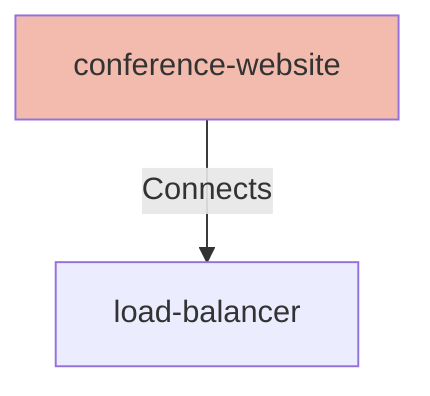

## Details

| Field               | Value                    |
|---------------------|--------------------------|
| **Unique ID**       | conference-website                   |
| **Node Type**       | webclient             |
| **Name**            | Conference Website                 |
| **Description**     | Website to sign up for a conference          |
| **Data Classification** |  |
| **Run As**          |                 |

## Interfaces
    | Unique ID | Host | Port | Url |
    |-----------|------|------|-----|
        | conference-website-url |  |  | https://calm.finos.org/amazing-website |

## Related Nodes

## Controls
    _No controls defined._

## Metadata
  _No Metadata defined._
