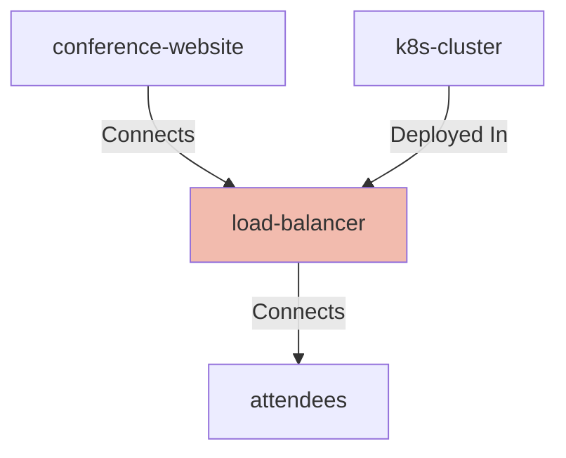

## Details

| Field               | Value                    |
|---------------------|--------------------------|
| **Unique ID**       | load-balancer                   |
| **Node Type**       | network             |
| **Name**            | Load Balancer                 |
| **Description**     | The attendees service, or a placeholder for another application          |
| **Data Classification** |  |
| **Run As**          |                 |

## Interfaces
    | Unique ID | Host | Port | Url |
    |-----------|------|------|-----|
        | load-balancer-host-port | localhost | 80 |  |

## Related Nodes

## Controls
    _No controls defined._

## Metadata
  _No Metadata defined._
